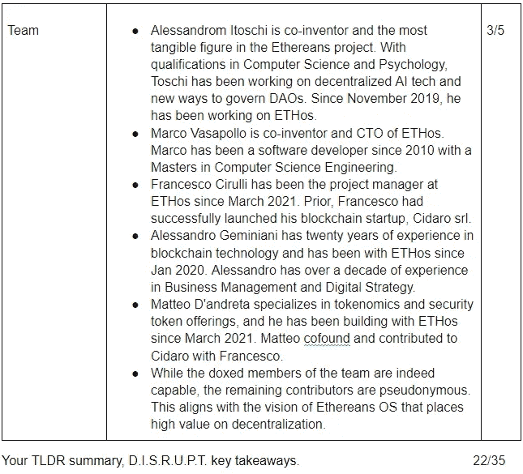
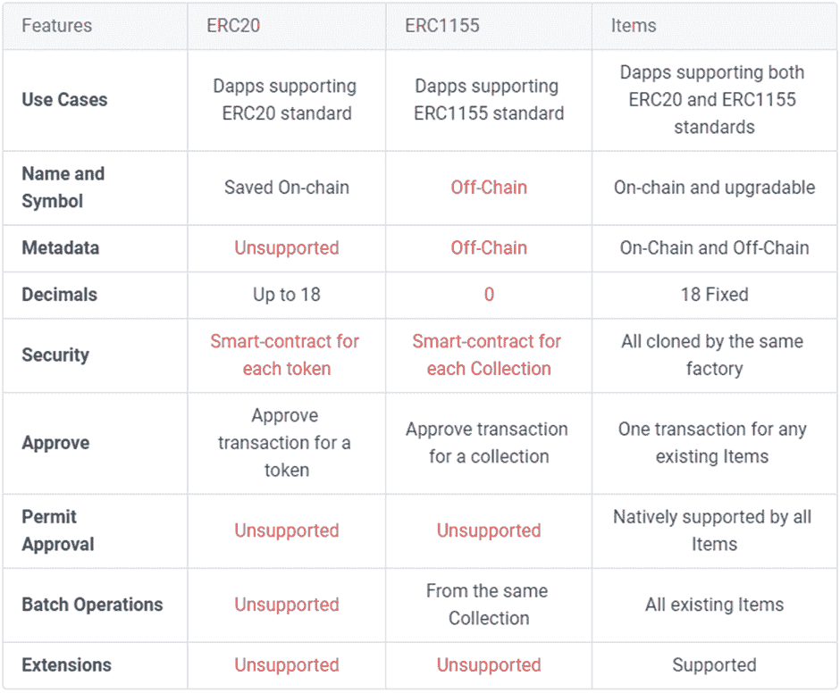
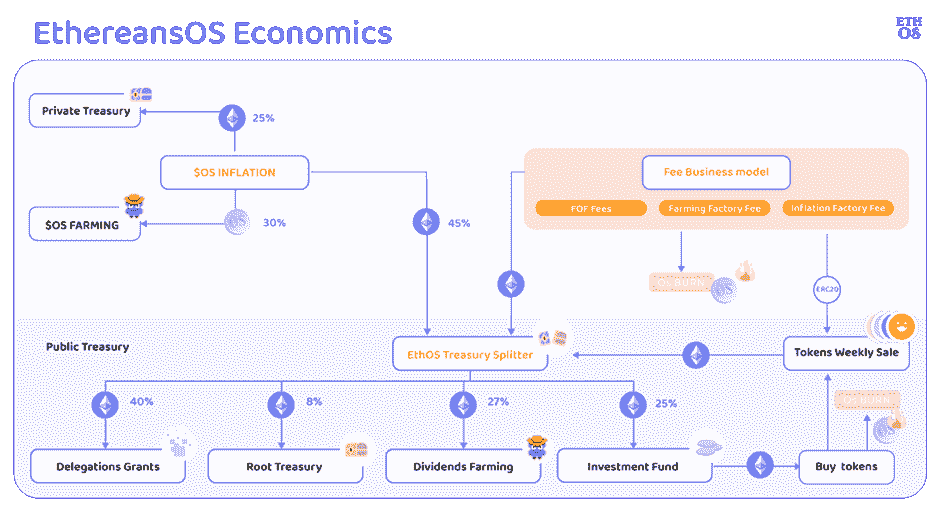

# 你可以走自己的路——项目标准和智能合同工厂的基本分析：以太网操作系统(OS)

> 原文：<https://medium.com/coinmonks/you-can-go-your-own-way-fundamental-analysis-on-the-items-standard-and-smart-contract-factories-13eb05d60f6c?source=collection_archive---------6----------------------->

这份基本面分析是 Crypto Consulting Institute 的付费时事通讯的一部分，提供市场洞察、可行的交易信号和基本面分析。更多信息请访问:【https://www.cryptoconsultinginstitute.com/newsletter 

# 选一张牌，任何一张。

在现代经济中，消费者已经习惯于接收成品。

假设你买了一台“新”电脑。我们可能足够精明，可以单独获得定制的部件，如主板、CPU、硬盘、RAM、闪存芯片等。但大多数消费者倾向于购买预组装的、随时可用的电脑。

然而，消费者并不购买钢铁、硅砂、玻璃、铁矿石、黄金、铝矾土和硅树脂等原材料来自行制造电脑部件。

普通消费者不了解将这些原材料转化为个人电脑功能组件背后的制造过程，这是可以理解的，因为制造的复杂性使其远不可及或不可扩展。

尽管如此，为定制生产选择预制部件对于实现期望的输出是合理的。一些定制版本有利于耐用性，而另一些则是为了高性能游戏，而另一些则优先考虑高质量的流媒体。在寻找工具来实现我们的目标之前，我们需要了解我们想要达到的目标。

分布式账本技术没有太大的不同。

我们可能会构想出一个奇妙的区块链项目，并规划出一条通往该项目的道路，但鉴于许多人无法编写代码，伟大的想法可能会因为无法访问这些资源而很快被扼杀。类似地，许多流氓开发者可以开发出一个产品，但是对于要开发什么却没有一点概念。

许多人无法从头开始建设。即使大多数人有能力，一些人可能缺乏熟练程度或对代码变得懒惰。这种方法对投资者有影响。在这种情况下，更有技巧和恶意的人可能会找到漏洞来利用合同，从而使整个项目处于危险之中。

该分析探索了加密货币、智能合约工厂和新令牌标准中的一个新生概念；项目。

可以肯定地说，这个概念几乎没有受到主流的关注。

为什么？

这非常复杂，市场还没有完全理解这个价值主张。

按照设计，通过简化过程来减少部署障碍的协议将大大减少开发人员的工作量。虽然这些障碍减少了，但想要发布产品的普通发烧友仍然会忽略其中的复杂性。即使我们得到了拼图的碎片，我们仍然需要把它们拼在一起。

此外，当我们购买计算机时，组件具有固定的功能。当出现升级时，我们通常不得不丢弃旧的部分来安装更新、更高效的组件。跟上最前沿的硬件并不是一项廉价的努力，而且会产生大量的浪费。

以太网的操作系统正致力于令牌标准的下一个发展。项目标准支持向后兼容。通过包装现有的 ERC20 和 ERC721 令牌，我们可以在这些项目上构建一个新的应用程序世界。

批量交易现在是可能的。ERC1155 合同将任意数量的 ERC20 和 ERC721 资产包装在一起，所有者管理项目集合的内容。在包装 ERC721 令牌(NFT)时，我们可以将这些 NFT 细分为 ERC20 令牌，以分配所有权份额，用户可以通过 Uniswap 交易这些部分或利用自托管的场。这些集合中内置了应用程序，如抵押指数、稳定币或 DAO 基金。

虽然这让我们难以理解，但毫无疑问，通过了解项目标准和智能合同工厂的颠覆性潜力，我们可以获得很多好处。

从一开始，这种分析的目标就不是提供一个投资论点，把你推向一个或另一个方向。价值来自于对 token 标准演变的理解，以及这些智能合同工厂将如何毫无疑问地在从传统经济范式中分散组织结构方面发挥破坏性作用。简而言之，我们已经确定了未实现用例的潜在未来趋势。

在本 FA 的范围内，不可能提供以太网生态系统中所有活动部分的详尽摘要。相反，我们将单独回顾最著名的令牌标准的功能，并讨论以太网如何将这些标准提升到下一个级别。随着我们的发展，我们将探索这项技术的含义。一旦硬币落下，很明显项目标准的用例只受我们想象力的限制。

# 以太网密钥摘要—TLDR；外卖食品

# ERC 之谜的碎片

以太坊请求评论(ERC)是一个首字母缩写词，你肯定在你的加密之旅中遇到过。

从最基本的意义上来说，这些 ERC 标准代表了分布式分类账(区块链)中存在的不变(不可更改)的价值单位。这些令牌标准有效地提供了一个模板来部署智能合同，将一组核心的强制和可选规则编程到数字资产中。

有许多不同的标准，但最常见和最常用的实现是 ERC-20 标准。在此标准之前，开发人员需要创建自定义实现标准来开发令牌。许多人将$ETH 误认为是 ERC-20，但事实并非如此，因为它是一种具有特定实现的自定义数字资产。

实际上，您可能遇到过“包装”令牌的概念，比如$ETH。您可能想知道为什么这是必要的，因为$ETH 在 ERC-20 标准之前就存在了，并且不能直接与使用 ERC-20 的 DApps 兼容。在它被“包装”成$WETH 之前，它不能与一些遵循 ERC-20 标准的智能合约(特别是 DApps)进行交互。包装过程使得像$BTC 这样的非本地资产可以在非本地的区块链上使用，并与以太坊生态系统中的 DApps 进行交互。

对于在区块链上发布令牌的开发人员来说，他们通常必须构建自定义智能合约，并构建一个可以利用非标准化令牌的 Dapp 智能合约。ERC 20 通过嵌入开发人员可以在其上构建的核心功能极大地简化了这个过程。

开发人员可以利用一个具有安全历史的模板，而不是从头开始编译每一行代码。在部署之前，开发人员可以定制令牌合同的一些规则，以安装一些新颖的功能，例如征税和令牌再分发。但是这种创新方法有其固有的局限性。

首先，ERC 20 是严格不可替代的。根据两种资产的市场价值，1 个 ERC-20 代币可以换成另一个 ERC-20 代币。它们与不可替代的标准不兼容。

其次，一旦部署，您就不能定制或编辑合同。一旦展开，就不可能将蛋黄放回蛋内。这样做的后果是，当在代码中发现一个严重的 bug 或错误时，通常需要“契约迁移”。这个术语让所有参与管理项目的人不寒而栗，因为这是一项费力不讨好的事业，在实施中充满了不可预见的困难。

第三个突出的问题是，当你发送一个 ERC-20 合同到一个智能合同，而不是设计来接收它们。交易会进行，资金可能会出现在智能合约中，但往往会永远无法访问或无法收回。许多人不愿意承认他们不小心将令牌发送到了最后一个复制到剪贴板的地址，而这个地址不同于预期的目的地址。

虽然 ERC-20 标准已被广泛采用，但它有些过时，因为上述问题在该标准中持续存在。这些限制产生了许多不同的 ERC 标准，但下一个最常见的标准是 ERC-721，俗称不可替换令牌(NFT)。

顾名思义，供应是不可调整的，并且具有不可替代的价值，本质上与 ERC-20 标准不相容。

在我们的分析中，我们一再指出，许多不了解加密的人倾向于过度简化和降低 NFTs 的价值主张。许多人仍然认为它只不过是可以被滑稽地复制和粘贴的数字艺术(TY 代表免费营销)。它目光短浅，没有看到 NFTs 所能提供的更大图景，即真实世界和数字资产的所有权和认证的不可改变的证据。

Cryptokitties 确实在 2017 年将 NFTs 标准推向了主流。但是现在，ERC-721 正被用于售票项目的实验。如果我们还记得的话，比特币著名地解决了双重支出问题。这些原则在有票 NFT 的开发中是显而易见的，在 NFT 中，同一张票不能作为复制品出售或被未经授权的地址使用。

此外，ERC-721 令牌认证真实世界资产的所有权。虽然房子看起来很相似并不罕见，但位置是独一无二的，代表房子所有权的 NFT 是*可区分的*。

与 NFT 相关联的基础资产的所有权需要人工监督，并且资产只能与专门设计来与之交互的智能合约进行交互。

直到金恩开发了 ERC-1155 标准。ERC-1155 可以创建可替代的(ERC-20)和不可替代的(ERC-721)资产。当我们深入这个兔子洞时，我们开始理解围绕元宇宙互操作性的声明。

我们为一个元宇宙购买了一个化身，插入完全不同元诗句。ERC-1155 支持批量处理事务和修改与资产相关的元数据。这种能力不能低估。当购买一项不可替代的资产时，无论是在数字世界还是现实世界，我们都需要该资产的一些历史记录，特别是以前所有者和过去交易的历史记录。

说到 metaverses，ERC-1155 的使用案例在批量交易中变得更加清晰，大大降低了费用，并且有一个钱包地址，可以提供 ERC-20 和 ERC-721 资产的可操作清单。你可以使用 NFT 头像来赚取分配给包含 NFT 的帐户的游戏内货币。鉴于 ERC-1155 合同记录了 NFT 的血统，它还允许您为您的 NFT 解锁升级和新功能，从而在元宇宙内实现更大的收入潜力。元数据对于促进非功能性测试的“升级”过程至关重要。

ERC-1155 合同有其局限性，元数据存储在链外，引起了对数据完整性的关注。

它们一旦被部署就不可修改，并且通常需要具有定制修改的克隆合同来满足特定应用，并且它们不向后兼容 ERC-20 标准 DApps。事实上，我们可能会遇到从所谓的 V1 合同升级到 V2 合同的协议。这些迁移活动对给定的项目具有很大的破坏性。

我们确实已经深入到了这个领域，但是为什么知道这些非常重要呢？

你可能在这些资产类别中有投资，理解我们的投资是必要的。虽然其中一些资产类型有明显的优势，但它们的能力也有局限性。现在我们转入以太网。

# 逻辑扩展——计算组织:链上聚合器、dfo 和项目标准

总的来说，今天存在的智能契约是静态对象。

它们是不可移动的，因为你不能轻易地将任何 ERC-20 或 ERC-721 令牌直接插入 Dapp。管理 Dapp 的契约专门与目标令牌标准一起工作。

Dao 契约通常独立于实现其功能的令牌契约。对于要与智能契约交互的 DAO 资产，令牌契约对于需要实现的预期用例必须是可行的。尽管如此，DApps 的智能合约通常是为了适应自定义标准而构建的，这增加了代码中出现错误或 bug 的可能性。

以太网的灵活合同生态系统完全建立在链上，ERC-1155 交织 ERC-20 和 ERC-721 资产，发挥彼此的能力。为了更好地了解情况，我们将介绍以太网生态系统中的每一款产品。

DFOHub 支持部署分散的灵活组织(DFO)。DFO 开始把投票规则构建成一个道的核心。不能修改管理 DAO 协定的规则。DFO 可以充当代理，支持修改和添加新的智能合同，作为核心的安全扩展。扩展智能合约通过以太网的智能合约工厂应用。

智能合同工厂并不新鲜，但拥有完全基于链构建的预制合同有几个优势。

首先，代码的安全关键方面不能被修改，从而对智能合约的完整性更有信心。

其次，预制智能合约的核心是不可修改的。有了 DFO，可以在不破坏核心契约完整性的情况下应用扩展。工厂可以生产所需的扩展。任何代码更改都需要经过 DAO 提议和批准流程。

实际上，当收到他们可以组装以满足其需求的预制部件时，没有必要从零开始构建，以这样一种方式降低复杂性，即使非编码人员也可以部署可靠的合同。

dfo 可以将产品进一步嵌入 Etherean 生态系统，如第一个完全分散的自动做市商(AMM)聚合器“契约”。许多人可能都熟悉 1inch，这是最广为人知的半链式 AMM 聚合器。当使用 1 英寸时，交易会进入流动性池，为您提供资产的最佳价格。使 1inch 成为“半链上聚合器”的是智能合约不能读取前端，这意味着它们不能与任何新的流动性池或农业合约对接。聚合器只能与硬编码到其路由器合同中的 AMM 进行交易。结果是，你无法访问链上的每一个流动性池。

Covenant aggregator 利用一个应用程序编程接口(API)来标准化 AMMs。任何钱包、自定义智能合约、DAO 或组织都可以直接从其国库投票进行互换。DAO 还可以利用 AMM 来部署多 AMM 农业合同、链上套利、流动性部署和一系列其他功能。

契约的另一个优势是进入 AMM 是不需要许可的。任何项目都可以部署智能合约的后端来生产用户可以投资的 DeFi 产品。尽管如此，通过集中式前端，该界面可以随时排除特定功能或完全删除它们，这使得收回存款成为普通用户的噩梦。

契约使 dfo 和 ITEM 能够托管本地流动性池和农场。

契约还可以实现财务例行程序。

项目标准将上述所有功能联系在一起，并为合同提供了灵活性。项目有三个高级功能:

该标准是可升级的。

这个标准是可互操作的。项目适用于使用任何 ERC 令牌标准的每个 Dapp。即使用 Uniswap 或 Opensea 中的项目

该标准是可编程的。“便携式分散应用”。

在更细的层面上，我们概述了项目的功能:

基于工厂:从现有模板部署合同，每个模板包含一个不能修改的核心。与试图克隆开源代码的开发人员相比，工厂合同中有一个标准化的安全级别和更少的出错机会。

扩展:可以将一组 ERC20、ERC721 或 ERC1155 包装到智能合约中，以制作一个项目。当一个令牌集合演变成一个项目时，它们采用项目契约中的功能，将它们绑定在一起。

可发现性:支持在链上轻松检索和存储元数据(从项目中提取的信息)。否则，所有这些数据都将存储在链外，或者由第三方外部 API(如 Coingecko 或 Coinmarketcap)提供。链上元数据存储库支持无缝集成到前端。因此，令牌徽标、供应、URL、名称和符号等信息是可用的，并且可以在链上访问，而不是从第三方 API 获取信息。

高级批处理操作:当开发人员需要批处理事务或契约作为操作的一部分时，他们通常只能批处理同一集合的令牌。ERC-1155 对 NFT 铸币特别有用。通过 ITEMS，您可以将来自不同集合或令牌标准的资产批处理在一起，智能合约的可互操作层实现了这一功能。

高级权限系统:启用 wallet 或智能合约来管理项目集合的特定权限。新的 DApps 建立在物品标准之上。

高级元数据实现:元数据可以在链上管理，创建一个分散的和抗审查的应用程序。

许可审批:使用外链消息而不是直接交易来签署审批合同。

ERC-20 代币陈旧过时，ERC-721 允许人们铸造数字艺术并进入元诗，但他们的能力是分散的。ERC-20 和 ERC-721 令牌之间没有互操作性。

如果物品拥有相关的 ERC 令牌，它们可以与任何 Dapp 或标准交互。它们是向前和向后兼容的，用于与过去、现在和未来的 DApps 进行交互。项目是包含流动资产集合的智能合同，ERC-1155 的标准是它们只能从同一集合中批量交易。他们无法在其他 ERC-1155 之间交互和切换资产。项目可以批量在一起以前不兼容的资产，如 ERC-20 和 ERC-721。可以将 ERC-721 转换成 ERC-20 资产，在 Uniswap 等分散式交易所(DEX)进行互换。ERC-721 被转让给任何拥有 51%或更多 ERC-20 代币的人，这些代币被创造来代表基础 NFT 的一部分。你甚至可以使用令牌化的 ERC-20 分数的 NFT 参与产量农业。

有了物品，你可以将你所有的 ERC 20 代币存入物品合约。您可以对合同进行编程，以进行一次性或例行的批量事务处理。因此，如果一件物品的含量达到预设水平，你可以批量出售你所有的 ERC 20。项目提供了一种全新的方式来管理链上的投资组合。

“DeFi、Governance 和 Collectible 世界通常被认为是独立的生态系统，因为区分它们的标准和协议不同。充当 ERC-20 和 ERC-1155 的项目是以太坊上最具互操作性的对象，并允许在基于这两种标准的协议上使用资产。事实上，通过结合两个主要标准，ERC-20 和 1155，项目可以在一个多学科的方式使用，融合了 DeFi 和 NFT 世界。这使得创建不仅仅与一个领域相关，而是同时与几个领域相关的项目和应用成为可能，创造了各种新的机会。”— Ale Toschi(联合创始人兼技术负责人)。

# $OS 令牌组学

$OS 是一个令牌，代表以太网旗下的整个产品生态系统。以前，$BUIDL 是 DFOHub 的本地令牌。从$ARTE 协议演变而来的物品。$UNIFI 以前是契约的治理标志。以太网提供代币交换，允许用户将这些停止使用的代币兑换成$OS。

以下词汇组学部分直接摘自[https://docs . ethos . wiki/ethereansos-docs/protocol-governance/OS-economics](https://docs.ethos.wiki/ethereansos-docs/protocol-governance/os-economics)

初期供应量:100 万。未来上限取决于 DAO 投票结果。

流通供应量:541，292

市值:655.5702 万美元

价格:12.08 美元

交易量:125，578 美元

通货膨胀率为每年初始供应量的 8% (80，000)。$OS 持有人可以通过治理投票将其调整到 0.5%到 15%之间。

*通货膨胀分布*

“通货膨胀事件每天都在发生，并且＄OS 分布如下:

30%的耕种奖励— $OS 持有者可以通过以太网 sOS 接口向 Uniswap v3 上的 OS-ETH 池提供流动性来耕种这$OS。

25%以$ETH 的价格出售给了 EthereansOS 私人金库——这是私人团队金库，致力于帮助团队研究和开发 EthereansOS 生态系统。

45%以$ETH 的价格出售给 ether aensos 公共债券——ETH 被发送到拆分器，拆分器每三个月在四个公共 ether aensos 债券之间重新分配它——由$OS 持有者管理——如下所示:

o 27%上缴红利农业国库

o 25%给投资经理资金部

o 授权拨款 40%给库务署

0 . 8%上缴国库。"

# 你把能在链上做任何事情的东西叫做什么？—讨论

简而言之——复杂。

以太人一点都不简单，虽然你的眼睛可能已经花了好几次试图理解上面的解释，但要知道这种复杂性会让那些自认为对区块链技术非常了解的人大吃一惊。当然，除了 Ale Toschi。

要回答一个挥之不去的问题，你可能会想:如果这个产品如此神奇，为什么它的市值只有 650 万美元？

首先，这仍然是一项进行中的工作。

这并不令人吃惊。该团队已经公开表示他们的重点是建设，他们对利用牛市流行语不感兴趣。

以太网生态系统的几个组成部分在过去三年中得到了发展，但仍有更多的工作要做。值得注意的是，直接在链上构建的前端用户界面的部署似乎正在进行中。这一发展反映了 DAOs 的总体状况，支撑它的分散化理念仍然需要一些检查和平衡，以实现完全分散化和完全自治。在未来的实现中，它们也不能避免不可预见的复杂性。

一名 ETHos 开发人员在 V1 令牌合同中发现了一个无法更改的关键缺陷。在恶意利用者(黑帽)意识到这个漏洞之前，dev 执行了一次 whitehat 黑客攻击，耗尽了流动性池以提供新的 V2 合约。投资者没有遭受损失。但这一事件表明需要进行持续的工作，一个没有投资者要求的封闭环境对项目的未来是理想的。虽然，在交换到新令牌的过程中，ETHos 能够炫耀他们的动态元数据功能和 NFT 渲染，将持有者导向将 V1 令牌交换到 V2 令牌的平台。

无论如何，不出所料，有很多高达企业层面的研究正在进行，以找出 Dao 如何取代或改善传统的商业模式。以太网操作系统的一个优点是，保护 DAO 完整性的策略是在链上投票和完全管理的。对于现有的 DAO，如果不迁移到新的 DAO 契约，控制其执行的规则就不容易更改。Ethereans 支持可定制的微服务框架，这是 Dao 与其国库和子 Dao 无缝链接的重要功能。无意中，通过设置微服务框架的参数，有可能通过 dex 执行国库资产的限价单。这些限价单功能在区块链很少见。

其次，对于普通用户来说，主题是复杂的。

当我们反思牛市周期中的市场活动时，我们在过去的 FAs 中注意到，对分布式账本技术的价值主张一无所知的新散户投资者会将他们的资金放在哪个社区喊得最响。柴犬和 Doge 确实符合要求。尽管最初没有效用，但它们吸引了大量新的流动性进入市场。

此外，价值主张可能与解决当今存在的现实问题无关。以$AGIX(奇点网)为例。他们正在区块链建造人工智能机器学习。该项目的幕后策划者 Ben Goertzel 博士是密码领域最受尊敬的人之一。然而，在我们拥有机器人来递送邮件和在杂货店工作之前，这个项目不会解决今天存在的直观问题，但可能会成为未来的关键基础设施。市场的需求必须与昨天需要解决的问题保持一致，因此，基本面往往落后于公允价值。同时，对于没有有意义的基础的项目来说，情况往往相反。

第三，几乎没有社区存在或营销来区分他们对类似技术的价值主张。这是不幸的，但如上所述——故意的。虽然智能契约工厂和令牌制造者肯定不是新的，并且现在已经存在，但是它们只能在区块链上部署静态对象，在许多情况下，这些对象不能被修改到预设参数之外。以太的物体是流动的，可移动的。它们可以快速适应任何 Dapp，可定制，并利用比一般工厂或令牌制造商所能提供的更令人印象深刻的功能。

试图找到一个简明的解释，用几句朗朗上口的妙语来概括以太，确实很棘手。当您浏览以太网的文档和媒体文章时，会发现有大量关于以太网的信息，但在其他地方并不多。它似乎也没有引起主流教育工作者/影响者的注意，否则他们会让研究团队仔细检查项目。

该团队希望部署一种安全的产品，能够抵御暴露风险的增加。如果他们要建立一个投资者基础，一旦出现漏洞，他们的辛勤工作就会被抹黑。许多不为人知的项目在寻求提高公众认知度之前，会花额外的时间来确保产品的完整性。

“我想，从外表上看，我们一定显得很疯狂。在牛市期间，以真实的愿景进行建设看起来是这样的。我们对以太坊的愿景不仅仅是一个制造庞氏骗局或快速赚钱的地方，而是一个具有真正目的和价值的所有未来应用的层面，这将由于 Web 3.0 的创新而重新设计无数行业。”Ale Toschi

尽管面临这些挑战，应用程序和使用案例的套件不能被夸大。项目合同本身打开了一个可能性的世界。您可以在区块链上首次批量处理资产并分配例程。我们都熟悉成本平均法。像 DCA 这样的经常性策略可以在项目合同中自动执行，或者将订单限制在预设的范围内。这是在区块链上进行交易时所缺乏的功能。

此外，这是一种新的避险手段，或者可以说是一种投资组合扼杀开关。只需按下按钮，所有持有的资产就会被变现为类似稳定债券的避险资产。

流动性池保存在一个分库内，以便与区块链的任何 Dapp 进行互动。这些功能使得投资 Dao 的建立比现有的 Dao 具有更大的通用性，现有的 Dao 通常是定制的或工厂部署的，只有有限的可能修改。要将 DAO 投资基金扩大到以太网所能提供的规模，需要数年的编码时间。出于这个原因，以及其他许多原因，许多现有的投资 Dao 在范围上是有限的。他们要么专门从事种子投资、投资组合管理，要么利用产生收益的工具。看来，一个“道”不可能使其职能多样化，与现有的投资、信托或对冲基金不相上下。

NFT 细分是密码领域中经常讨论的话题。有很多方法可以解决这个问题，但缺乏流动性是投资者面临的共同挑战。此外，ERC-20 馏分通常是 ERC-721 NFT 的独特代表。以太网的操作系统提供了一个平台来细分 ERC 20 和创造流动性。

去中心化是推动以太网操作系统发展的核心价值。权力下放意味着机会均等。即使我们缺乏为我们的目的部署契约的编码技能，我们也可以访问无数不同的工厂契约，并在其上构建扩展。

完全在链上构建和部署这项技术意味着，只要以太坊区块链存在，它就将继续存在并可访问。没有 DAO 的批准，不能进行更改。现有的 Dao 通常会进行离线调查以达成共识(不一致、合作等)。).虽然经常有防止操纵投票的措施，但实际执行情况令人怀疑。以太网生态系统的提案概述了需要更改的精确代码，通过内部检查和平衡进行操作，并且只有在获得批准后才能采取行动。

你可能会问自己的最后一个问题是，如果有这么多的标志强调现在可能不是建立$OS 头寸的正确时间，我们为什么要谈论它？

许多投资者表达了进入低市值仓位的愿望，这样他们就可以在股价上涨前进入。我们可以投资任何低市值股票，但如果没有表明新兴趋势的价值主张，它们就不太可能有所表现。众所周知，投资时没有确定性，只有可能性。

虽然$OS 的市值只有 650 万美元，但如果它流行起来，会有不可估量的上升空间。然而，只有 325 万美元将需要退出流动性，使新的投资处于 50%的未实现损失。

因此，投资$OS 是高风险的，任何资本分配都应反映风险状况。要获得令人瞠目结舌的回报，你不需要投入大量低上限的资金。如果您决定投资$OS，您将收到一个项目，这使您能够在 Opensea 和 Uniswap 上交易。

# 参考

“ERC 代币解释:它们是什么？”，【https://boxmining.com/erc-tokens/#ERC-223】T2

以太网文档库【https://docs.ethos.wiki/ethereansos-docs/ —

以太网登陆页面[—https://ethos.eth.link/](https://ethos.eth.link/)

以太网媒介[—https://medium.com/ethereansos](https://medium.com/ethereansos)

以太网令牌经济学[—https://docs . ethos . wiki/ethereansos-docs/protocol-governance/OS-economics](https://docs.ethos.wiki/ethereansos-docs/protocol-governance/os-economics)

Youtube，'*采访 ethereansOS 核心研究员 Ale Toschi — Ethereans 社区播客第 1 集'*，[https://www.youtube.com/watch?v=eYUvw0g02k0](https://www.youtube.com/watch?v=eYUvw0g02k0)

Youtube，'*ether eans OS—dfo hub(＄BUIDL)/con 契(＄UNIFI)/ITEMS(＄ARTE)*'，[https://www.youtube.com/watch?v=TbITi4znyeQ](https://www.youtube.com/watch?v=TbITi4znyeQ)

Youtube，*《联邦理工学院计算组织生态系统(又名 DFO)解释》，*[*https://www.youtube.com/watch?v=rWtcJHXUtaI*](https://www.youtube.com/watch?v=rWtcJHXUtaI)

*Youtube，' *ETHITEM 发布活动:“以太坊之上的东西”——https://www.youtube.com/watch? DFO 团队指导 01' '* v=IGHhs9qmHbY '*

> **加入 Coinmonks* [*电报频道*](https://t.me/coincodecap) *和* [*Youtube 频道*](https://www.youtube.com/c/coinmonks/videos) *了解加密交易和投资**

# *另外，阅读*

*   *[Bookmap 评论](https://coincodecap.com/bookmap-review-2021-best-trading-software) | [美国 5 大最佳加密交易所](https://coincodecap.com/crypto-exchange-usa)*
*   *最佳加密[硬件钱包](/coinmonks/hardware-wallets-dfa1211730c6) | [Bitbns 评论](/coinmonks/bitbns-review-38256a07e161)*
*   *[新加坡十大最佳加密交易所](https://coincodecap.com/crypto-exchange-in-singapore) | [收购 AXS](https://coincodecap.com/buy-axs-token)*
*   *[红狗赌场评论](https://coincodecap.com/red-dog-casino-review) | [Swyftx 评论](https://coincodecap.com/swyftx-review) | [CoinGate 评论](https://coincodecap.com/coingate-review)*
*   *[投资印度的最佳加密软件](https://coincodecap.com/best-crypto-to-invest-in-india-in-2021)|[WazirX P2P](https://coincodecap.com/wazirx-p2p)|[Hi Dollar Review](https://coincodecap.com/hi-dollar-review)*
*   *[加拿大最佳加密交易机器人](https://coincodecap.com/5-best-crypto-trading-bots-in-canada) | [库币评论](https://coincodecap.com/kucoin-review)*
*   *[火币的加密交易信号](https://coincodecap.com/huobi-crypto-trading-signals) | [HitBTC 审查](/coinmonks/hitbtc-review-c5143c5d53c2)*