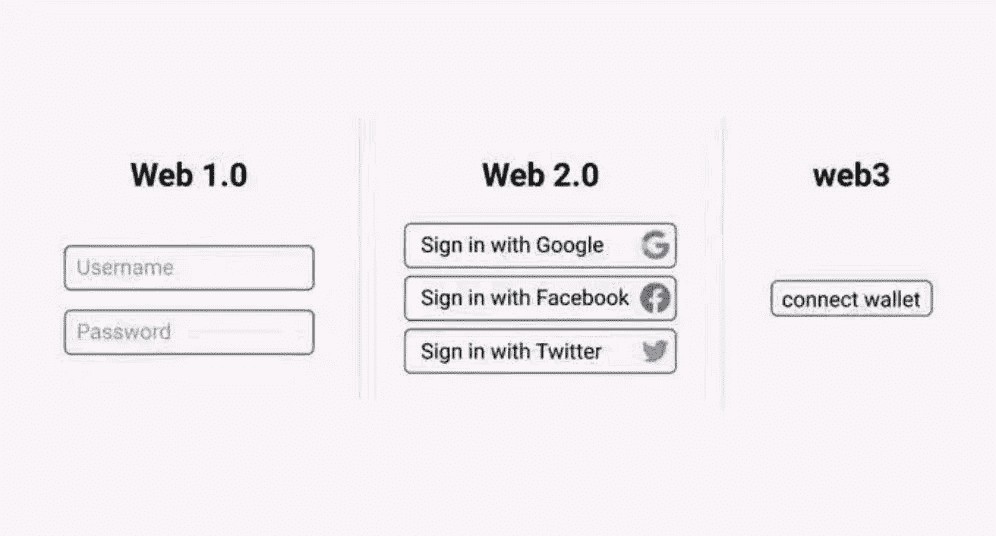

# 你不可能拥有“过去的样子”，并到达未来

> 原文：<https://medium.com/coinmonks/you-cant-have-the-way-it-was-and-arrive-in-the-future-8f801e377e52?source=collection_archive---------22----------------------->

[https://www.imdb.com/title/tt0088763/](https://www.imdb.com/title/tt0088763/)

# 数字化转型

我们已经理解了数据的价值和洞察力的重要性。但是对于任何转变来说，缺少的一个重要因素是实现。这需要额外的投资和获得高技能人才。大多数公司没有实施的耐心，或者，他们不是做大量的实验，而是进入招标和尽职调查的长期参与，只是为了深入投资，他们不愿意放弃糟糕的技术堆栈和不合适的解决方案。

或者更糟的是，如果他们看到竞争或挑战性的技术，他们会禁止公司使用。在一家全球科技巨头拥有部分股权的前雇主那里，在该科技巨头时任首席执行官的短暂访问后，最受欢迎的消费设备被禁止出现在公司补贴的设备中。因为它被视为具有竞争力。尽管它代表了这种新兴格式的大部分流量。如果一个公司只是决定忽略他们的竞争优势和新的创新技术，他们如何取胜？根据你所在的行业，你可能已经知道答案了。

 [## 数字化转型的基本要素

### 数字革命迫使每个组织重塑自我，或者至少重新思考如何去做…

hbr.org](https://hbr.org/2021/11/the-essential-components-of-digital-transformation) 

当实施区块链技术时，情况变得更糟。我们先假设，“**比特币修复这个**”并不总是对的。如果您需要的只是一个更好的数据库、共享状态或交换两个数字资产的方法，那么您可能可以跳过大部分开销。

然而，如果您的客户或业务需要更多的自动化，您希望减少对中介的信任，您希望参与全球生态系统，希望看到您的公司和客户受益于 24/7 服务，接近 100%的正常运行时间，并且您可以在没有漫长、繁琐的入职流程的情况下做到这一点，那么您应该强烈考虑分散的区块链技术。或者，就像孩子们说的，“T2”。

但你不会得到这个与企业区块链的私有版本。不管那些 68 页的幻灯片看起来有多光滑，上面有呼啸而过的火车、蓝色灯光和像飞行路线一样连接各大洲的线条。主要原因是什么？天赋。开发人员已经从后台晋升到前台。早就该这样了。

如果你是一个好奇的开发者，有着长远的职业规划，你希望看到一个更公平、更公正和不那么集中的互联网，那么你很有可能对区块链技术做过一些研究。你愿意 a)为一家传统的公司工作，构建你自己的与其他分散式应用程序(dapp)隔离的区块链，编写你自己的所有代码并继承技术债务，还是 b)从分散式技术的开源代码中受益，借用安全和高性能的元素，与其他 dapp 连接以增强功能，构建你需要的新元素，并从你的 GitHub 帐户上得到你的贡献的奖励？

> 如果说我看得更远，那是因为我站在巨人的肩膀上。”—艾萨克·牛顿爵士

*Blind Orion Searching for the Rising Sun* by [Nicolas Poussin](https://en.wikipedia.org/wiki/Nicolas_Poussin), 1658

优秀人才有选择权。在不确定的未来和已知的干扰困扰着你的行业的情况下，今天就好好赚钱吧——这是“**安全的选择**”。或者，投资于你自己，学习新的东西，仍然挣很多钱，并在新兴领域处于更好的领导地位——这是“**风险选项**”。对于那些早期接触网络技术、社交媒体、视频流、移动技术、云解决方案和游戏的人来说，他们可能会告诉你更多。毫不奇怪，我们再次看到人群开始动员起来。

这种转变是从封闭系统向开放系统的转变。放弃代码护城河。而是将标准、最佳实践、代码作为公共产品来订阅。世界上一些最大的技术公司代表了人们退休和投资组合的重要部分。但是你看不到他们的代码，当然更不会审计。你必须“相信”它是好的。当它行为不当时，几乎没有什么可求助的。这一切都将改变。

ngmi (not gonna make it) meme

# 瓦格米。但是，你呢？

在丛林中，事情并不像看上去的那样。web3 代表了一个更强大的数字未来。充满了它自己的语言，模因文化和已知的字符。去中心化的概念在比特币和以太坊社区反响最强烈。偶尔也会出现在其他区块链技术的语言中。尽管大多数人参与的“加密”发生在 Crypto.com FTX、比特币基地等中央交易所。从朋友那里获得链接，输入你的详细信息，证明是你，获得帐户访问权，连接到你的银行(或信用卡)，然后你就可以购买你的朋友上周在酒吧告诉你的疯狂硬币。

回到比特币和以太坊的世界，无论是闪电网络、CashApp、Strike 还是以太坊第二层(如 Arbitrum、Polygon、乐观、Starkware)，用户体验都较差，并有向集中化发展以提高速度和吞吐量的趋势。事实证明，大多数人并不像他们所说的那样喜欢去中心化。

没有比这更明显的例子了，当你移动到这个 web3 空间的闪亮的新边缘——NFTs 和 play-to-earn 游戏。看看这些艰难的经历:

 [## 我对 web3 的第一印象

### 尽管我认为自己是一名密码学家，但我并没有发现自己对“密码”特别感兴趣。我不认为我已经…

moxie.org](https://moxie.org/2022/01/07/web3-first-impressions.html)  [## “游戏赚钱”和狗屁工作

### 在《狗屁工作:一种理论》一书中，大卫·葛瑞博提出了劳动力经济中相当大的一部分本质上是…

paulbutler.org](https://paulbutler.org/2021/play-to-earn-and-bullshit-jobs/) 

透明度和问责制仍然是大多数人在 web3 领域的目标。不变性是一个好的监工。我们还有很长的路要走，解决为什么权力下放如此重要的难题也很重要。

虽然不完全致力于 web3 的长期发展也有赚钱的机会，但合法性会受到质疑。尽管淘金热从未减弱。我们在 2017-2018 年有 ico。现在我们有了 NFT。有些人会用钱来改变生活。但正如科比在他的同名剧集《UpOnly》中所说，

> “在这个周期中，60%靠改变生活赚钱的人将会血本无归”。

关于淘金热的话题——赛斯·戈丁:

> “匆忙可以帮助我们克服现状和对未知的恐惧。从长远来看，这也可能导致伤害我们的选择。”

 [## 关于淘金热

### 这不是“黄金”是“匆忙”改变了人们的行为方式。当被淘金热消费时，人们会制造…

seths.blog](https://seths.blog/2022/02/the-thing-about-a-gold-rush/) 

# 货币与技术

当试图理解一项新技术的语言时，混淆细微的细节是一个常见的错误。但是首先…

# 什么是加密货币？

[https://www . coin base . com/learn/crypto-basics/what-is-cryptocurrency](https://www.coinbase.com/learn/crypto-basics/what-is-cryptocurrency)

# 什么是区块链？

[https://www . coin base . com/learn/crypto-basics/什么是区块链](https://www.coinbase.com/learn/crypto-basics/what-is-a-blockchain)

因此，**加密货币≠区块链**。

了解这个简单的事实对于理解为什么每个人都很强大，但又互相依赖是至关重要的。加密货币需要区块链网络。区块链技术不需要加密货币，或者至少不需要自己的加密货币。但是经常可以从拥有一个中获益。

那么，你能用分散的区块链技术做什么呢？

# 什么是 DeFi？

[https://www.coinbase.com/learn/crypto-basics/what-is-defi](https://www.coinbase.com/learn/crypto-basics/what-is-defi)

这是更令人兴奋的竞技场。对于开发这项技术的人来说。对于寻求使用技术进行交易的人来说。对于不想与代理或中介打交道，但希望交换数字资产的人。对于那些无法进入银行的人来说。对于那些需要在全球贸易中转移资产或货币，又负担不起成本或时间延误的人。对于想要在周末或深夜访问其数字资产的人来说。对于数字原住民来说。

虽然 DeFi =去中心化金融，但它比那更大。这是一个应用程序的网络，它们非常简单地相互连接，就像“ **money legos** ”一样。DeFi 不是要取代你的银行。这不是在黑社会花钱的问题。它是关于拥有基于一套标准的可组合软件，以使强大的应用程序能够简单地部署给任何有互联网连接的人。碰巧的是，这个版本的互联网——web 3，在任何时候都有财务意识。它可以完全自动化地运营您的业务、向您的客户收费以及与您的供应商结算。

When you do this for the first time, you absolutely “get it”

我们只是触及了这项不断发展的技术的表面。而且有大量的信息可以启动你的学习之旅。

跳进来。这里欢迎你。每个人都是。来建设未来吧。