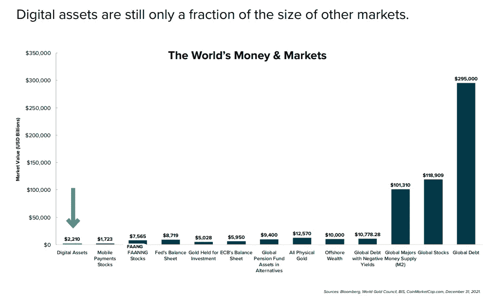
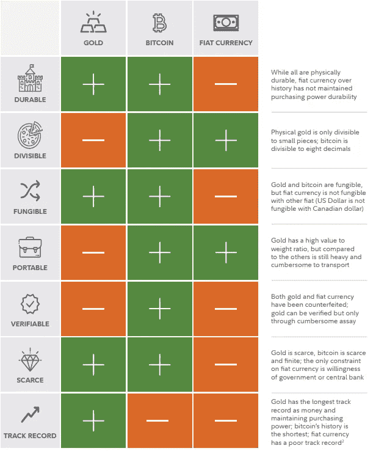
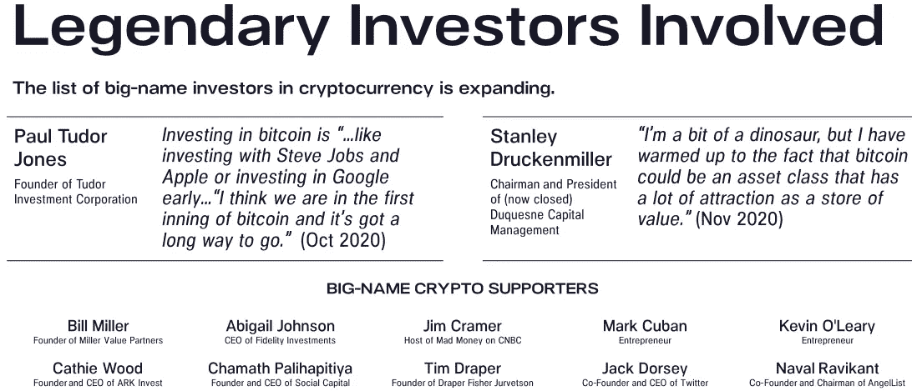
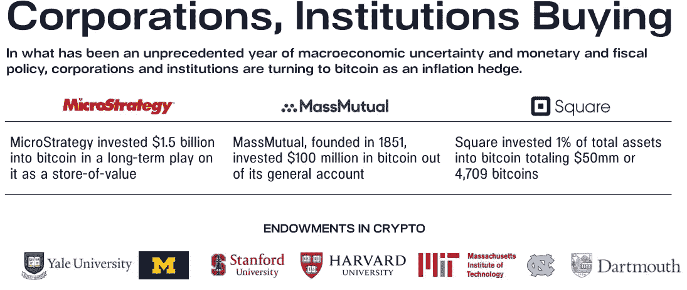
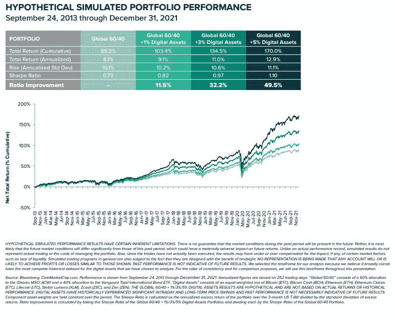
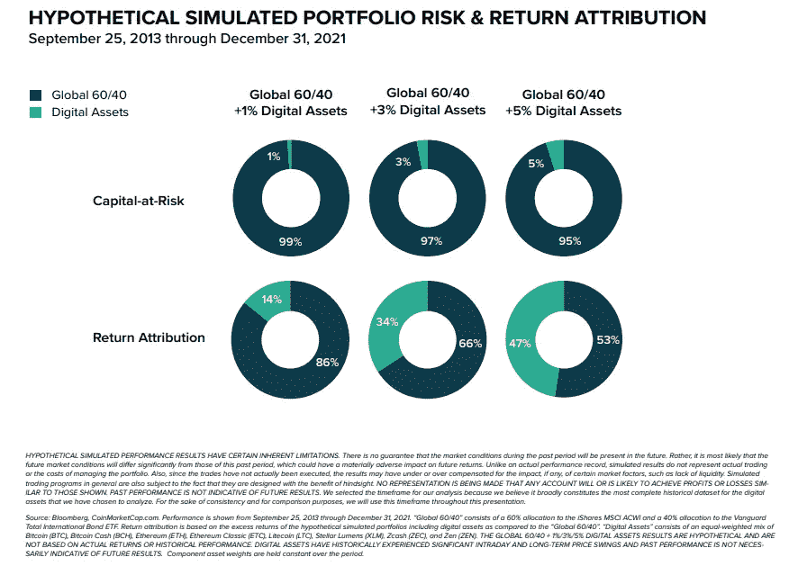
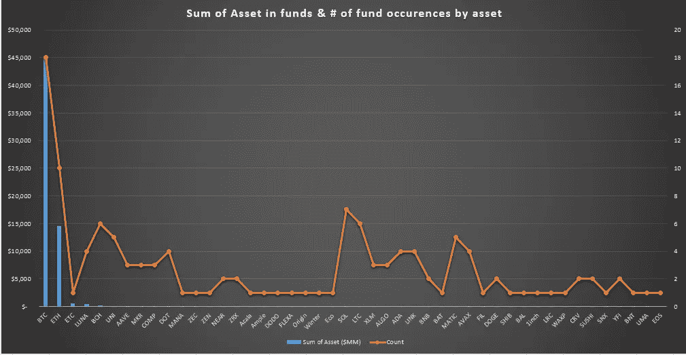
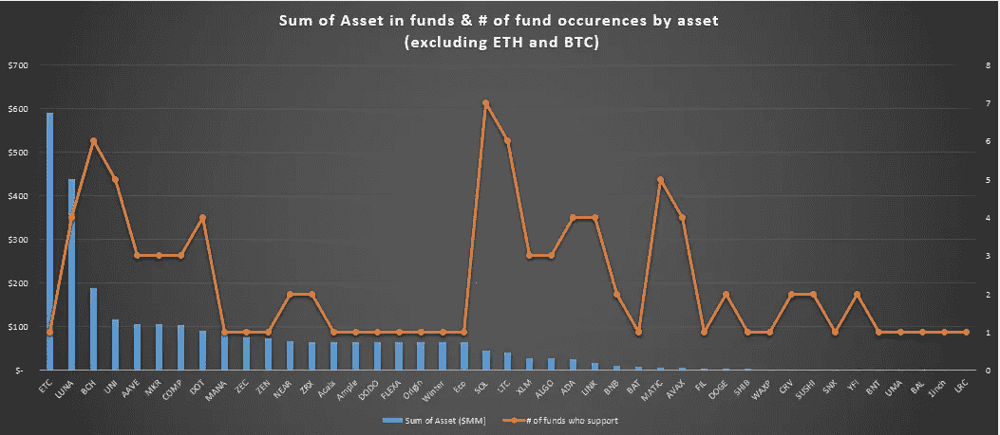
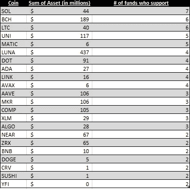

# 你错过了早期投资者的迅速成功。你现在做什么？

> 原文：<https://medium.com/coinmonks/you-missed-the-rapid-success-of-the-early-investors-what-do-you-do-now-dff6fa68f6bd?source=collection_archive---------13----------------------->

那么，你是否对加密市场感兴趣，但在投资方面遇到了困难？你有没有说服你的朋友或家人把股票作为他们投资组合的一部分的问题？我是你们中的一员。我对加密感兴趣已经很多年了(在 600 美元买入 BTC，然后看着它翻倍后恐惧地在 600 卖出)。然而，我没有朝着我的目标努力，而是一直在滚动 Twitter，购买 LTC (ughhh)，讨厌所有的 meme 币。2022 年，我的目标是通过投入更多的时间和金钱，并通过帮助他人加入这一旅程，成为社区中更好的一部分。

## 我们还早

我从播客、文章和帖子中收集到的共同线索是，我们仍然为时尚早。我不确定有多早，但根据棒球的类比，我的理解是从第一至第三局(9 局中的 9 局)。许多渴望收益的机构正在进入这个领域，人才正在离开其他行业进入加密行业，真实世界的用例继续增加，看不到尽头。在我看来，资产、支付、权利和游戏奖励的数字化种子正在被播种(由于 Covid 而加速)。鉴于我认为我们仍然为时尚早，再加上这可能会极大地改变商业和贸易方式的基本信念，这就是我想改变我的职业生涯并在该领域投入更多资金的原因。如果你不信任我，你会信任在这个领域下注的机构和人吗？在加密领域有职位的人是一些最优秀、最聪明的人，他们在自己的行业中已经连续十年取得胜利。此外，似乎很多技术人员正在从技术转向加密。

Grayscale January Investor Deck: [Link](https://grayscale.com/wp-content/uploads/2022/01/Grayscale_Investor_Deck_Jan22.pdf)

## 大公司和投资者正在进入这个领域

**苹果**——目前在看 crypto，蒂姆·库克拥有加密货币，“*拥有它作为多元化投资组合的一部分是合理的。***微软**——获得美国加密令牌创建服务专利，也推出了自己的区块链。收购 Activision，可能是为了进军元宇宙，并获取游戏控制权。 **Saudi Aramco** —对区块链公司进行了大量投资，业务运营严重依赖区块链技术。 **Alphabet(谷歌)**——刚刚宣布与比特币基地和 Bitpay 合作的加密卡。也公开宣布他们非常关注加密货币。**亚马逊** — AWS 大量参与区块链和加密货币工具和软件。

这只是前五名，但还有 Visa、万事达、高盛、PayPal、IBM、沃尔玛、英特尔、Square、SpaceX、脸书、Microstrategy、Robinhood、Twitter、摩根大通、富达、摩根士丹利、Block 和贝莱德，仅举几个其他参与该领域的公司为例。这份名单似乎是无穷无尽的，甚至不包括比特币基地，双子座，圆等许多加密公司。

所有这些公司都大相径庭，但它们都有一个共同点——对加密货币感兴趣，并理解这是未来。市值略低于 2 万亿美元，推动这一领域向前发展的投资者仍认为上涨空间巨大。除非我们看到公司放弃区块链并改变方向，否则我们显然还为时过早。

2022 年 1 月 31 日发表的这份来自富达的[报告](https://www.fidelitydigitalassets.com/articles/bitcoin-first?sf253214177=1)(下载 PDF)极其有趣。它简洁地总结了比特币的牛市案例，它被恰当地命名为*比特币第一*，并为 BTC 作为价值储存库、健全的货币、评估 BTC 与其他数字资产以及为什么它应该是传统配置者的切入点提供了理由。

[Link](https://www.fidelitydigitalassets.com/bin-public/060_www_fidelity_com/documents/FDAS/bitcoin-first.pdf)

所以，如果你不相信富达，你会相信看好这个行业的人或一些有信誉的机构(保险公司和捐赠基金)吗？

[Link](https://f.hubspotusercontent40.net/hubfs/4359599/Pantera%20Blockchain%20Fund%20Collateral/Pantera%20Blockchain%20Fund%20Presentation.pdf)

[Link](https://f.hubspotusercontent40.net/hubfs/4359599/Pantera%20Blockchain%20Fund%20Collateral/Pantera%20Blockchain%20Fund%20Presentation.pdf)

**国家**正在增加他们的资产负债表，并采用它作为法定货币。萨尔瓦多是第一个，但正如著名赛车手里基·鲍比所说，“如果你不是第一名，你就是最后一名”。如果他们的实验成功了，这些国家不会想被落下。他们会希望转换部分资产负债表，以保护自己免受通胀和美元波动的影响。将美元作为法定货币的萨尔瓦多，没有从我们的通货膨胀 QE/刺激中得到任何好处，相反，由于美元的通货膨胀，他们的资本受到了侵蚀。

如果不是那些国家想要保护自己免受美元通胀的影响，那么可能是那些生活在本国货币大幅通胀的地方的人们，比如阿根廷、土耳其或委内瑞拉。这里有一段引用自 fxempire 的话，它很好地抓住了这一点，“土耳其人每天进行一百万次加密交易，路透社[上个月报道](https://www.reuters.com/markets/us/exclusive-turkeys-cryptocurrency-trades-top-1-million-day-amid-lira-woes-2021-12-21/)。在阿根廷，甚至连总统都[称](https://www.youtube.com/watch?v=VBlKECPQ3Wo) crypto 为“某种程度上的硬通货”，具有“消除通货膨胀”的能力。“另一个例子是里约热内卢，他们最近分配了一些年度预算来持有比特币，以防未来通货膨胀。如果萨尔瓦多的实验成功，各国将被迫效仿，因为它们不想落在后面，而且越来越有可能的是，[插入高通胀国家]的公民将选择持有一种不会削弱其购买力的货币。

## 风险值得波动吗？

鉴于我上面的论文，以及其他拥有更多数据、知识和工具的人的赌注，crypto 或相关公司似乎应该在任何投资组合构建中得到考虑。特别是，我发现灰度公司 2022 年 1 月的投资者甲板中的这两张幻灯片很有趣，该幻灯片模拟了过去 8 年中给定 2-5%敞口的过去投资组合表现，以及随着一篮子更大的加密货币，[夏普比率](https://www.investopedia.com/articles/07/sharpe_ratio.asp)(该比率描述了你因持有更高风险资产而忍受的额外波动所获得的超额回报)如何提高。灰度模拟了 2-5%的曝光，然而，令我感兴趣的是，许多其他知名来源也呼应了类似的方法，如来自[耶鲁](https://www.investopedia.com/news/every-portfolio-should-have-6-bitcoin-yale-study/)、 [Cnbc](https://www.cnbc.com/2021/06/30/how-much-of-your-money-should-be-in-bitcoin-according-to-experts.html) 、[时间](https://time.com/nextadvisor/investing/cryptocurrency/how-much-your-portfolio-should-be-crypto/)和[吉普林](https://www.kiplinger.com/investing/602384/how-much-bitcoin-should-i-own-a-mathematical-answer)的那些。从长期来看，持有这种资产似乎是一项不错的投资。

Grayscale January Investor Deck: [Link](https://grayscale.com/wp-content/uploads/2022/01/Grayscale_Investor_Deck_Jan22.pdf)

Grayscale January Investor Deck: [Link](https://grayscale.com/wp-content/uploads/2022/01/Grayscale_Investor_Deck_Jan22.pdf)

## 创建新视图

因此，在 Twitter、消息渠道和其他视频平台上，有许多优秀的人值得关注，然而，我认为，遵循模仿当前加密信托和 ETF 的投资策略可能是最谨慎的。查看他们在哪里投资以及投资了多少(这是我以前没有见过的视图)将有助于我保留我的投资组合，同时将损失大量资本的风险降至最低。鉴于顺风——我认为从长远来看，这将是在这个市场取得成功的一个策略。因此，我查看了以下信托公司的持股情况，以了解投资方向:数字货币集团、潘迪拉、Bitwise、Galaxy、Osprey、Invictus、Coinshares、Skybridge、Ninepoint。并且，我看了以下基金:Purpose，Coinshares，ETC Group，3iQ，21 shares，VanEck，Evolve。

正如你在下面看到的，BTC 和瑞士联邦理工学院比这些基金篮子里的任何其他投资都要大。但是，我们应该记住，有些人可能通过风险资本参与其他项目。

在下图中，为了更好地观察尾部，我去掉了 BTC 和 ETH。我对此最大的收获是:灰度看涨等，迪诺加密硬币(LTC，BCH，XLM，阿达)仍然在许多投资组合中，但我认为最有趣的是看到 SOL，LUNA，DOT，LINK，MATIC，AVAX，UNI 被许多这些基金采用。这些硬币并不小，截至 2022 年 1 月 31 日，它们都在 coinmarketcap.com 排名前 25 位。随着更多的机构资金流向 BTC 和瑞士联邦理工学院，我预计这些资产将继续表现良好，但它们的波动性和风险会更小，回报率可能也会更低。因此，这提供了一个有趣的视角，让人们了解这些基金或它们的客户期望哪些硬币和项目表现良好。

对于另一个视图，这里有一个表，从上面的表中查看出现在**多个**基金中的硬币数据。

感谢您的阅读！这些都不是投资建议，投资风险自担。

**干杯，**

**转向加密**

以下是我在图表和分析中使用的资料来源。

*   [https://f . hubspotusercontent 40 . net/hub fs/4359599/潘迪拉% 20 区块链% 20 基金% 20 抵押品/潘迪拉% 20 区块链% 20 基金%20Presentation.pdf](https://f.hubspotusercontent40.net/hubfs/4359599/Pantera%20Blockchain%20Fund%20Collateral/Pantera%20Blockchain%20Fund%20Presentation.pdf)
*   [https://f . hubspotusercontent 40 . net/hub fs/4359599/Master % 20 presentations/潘迪拉% 20 比特币% 20 基金%20Presentation.pdf](https://f.hubspotusercontent40.net/hubfs/4359599/Master%20Presentations/Pantera%20Bitcoin%20Fund%20Presentation.pdf)
*   [https://invictuscapital.com/en/crypto10hedged](https://invictuscapital.com/en/crypto10hedged)
*   [https://www . galaxyfundmanagement . com/funds/crypto-index-fund](https://www.galaxyfundmanagement.com/funds/crypto-index-fund)
*   [https://ospreyfunds.io/products/oalg/](https://ospreyfunds.io/products/oalg/)
*   [https://ospreyfunds.io/products/obtc/](https://ospreyfunds.io/products/obtc/)
*   [https://ospreyfunds.io/products/odot/](https://ospreyfunds.io/products/odot/)
*   [https://ospreyfunds.io/products/opol/](https://ospreyfunds.io/products/opol/)
*   [https://www.buybitcoinworldwide.com/treasuries/#etfs](https://www.buybitcoinworldwide.com/treasuries/#etfs)
*   [https://www.skybridgeeth.com/](https://www.skybridgeeth.com/)
*   https://www.skybridgebitcoin.com/
*   [https://gray . com/WP-content/uploads/2022/01/gray _ Investor _ Deck _ Jan 22 . pdf](https://grayscale.com/wp-content/uploads/2022/01/Grayscale_Investor_Deck_Jan22.pdf)

> 加入 Coinmonks [电报频道](https://t.me/coincodecap)和 [Youtube 频道](https://www.youtube.com/c/coinmonks/videos)了解加密交易和投资

# 另外，阅读

*   [币安收费](/coinmonks/binance-fees-8588ec17965) | [僵尸加密审查](/coinmonks/botcrypto-review-2021-build-your-own-trading-bot-coincodecap-6b8332d736c7) | [热点审查](/coinmonks/hotbit-review-cd5bec41dafb)
*   [my constant Review](https://coincodecap.com/myconstant-review)|[8 款最佳摇摆交易机器人](https://coincodecap.com/best-swing-trading-bots)
*   [我的加密副本交易经历](/coinmonks/my-experience-with-crypto-copy-trading-d6feb2ce3ac5) | [AAX 交易所评论](/coinmonks/aax-exchange-review-2021-67c5ea09330c)
*   [Bybit 融资融券交易](/coinmonks/bybit-margin-trading-e5071676244e) | [币安融资融券交易](/coinmonks/binance-margin-trading-c9eb5e9d2116) | [Overbit 审核](/coinmonks/overbit-review-9446ed4f2188)
*   [有哪些交易信号？](https://coincodecap.com/trading-signal) | [比特斯坦普 vs 比特币基地](https://coincodecap.com/bitstamp-coinbase)