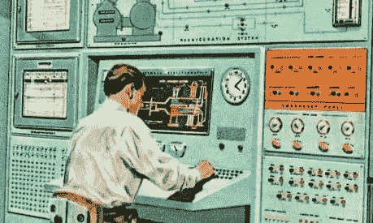
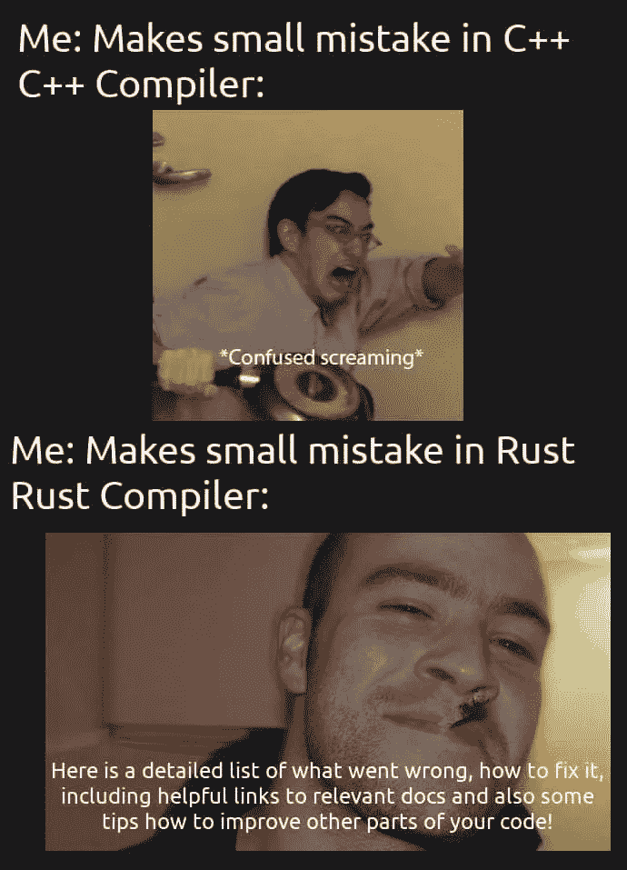

# 你必须知道 DeFi 技术，用你的剑而不是别人的剑。

> 原文：<https://medium.com/coinmonks/you-must-know-the-defi-technology-fall-on-your-sword-and-not-anothers-sword-6f3c404f19e7?source=collection_archive---------28----------------------->

~dwulf

**用户和工程师之间的平衡**

在区块链时代，我们的货币系统是交织在一起的，重要的是要记住，现在用户比以往任何时候都更需要用技术思维来处理金融问题。

在未来的日子里，工程师和软件开发人员将比律师和政治家拥有明显的优势。这里不需要软技能，你必须知道尽可能多的你能够理解的代码，对于你不能理解的，你必须寻求专家的建议，并仔细检查这些建议。

**我会倒在自己的剑下，而不是被另一把剑刺穿**

我决定非常清楚我所支持的区块链的细节。首先是工程师，其次是经济学家，最后是投资者。

了解支持我参与的区块链和协议的 github 级代码的细节对我来说很重要。

这意味着将 Rust 作为一种语言来学习，将 Substrate 作为一个生态系统来学习，并掌握我的流利程度。这绝不是一项简单的任务，因为即使有大量的资源、URL 和教程，也不足以完全理解该协议。

首先，这是一个不断发展和变化的代码库系统。波尔卡多特的一些系统要么已经失宠(比如渔民功能)，要么当时还不完整(比如 XCM/XCMP)。因此，它使学习的基础成为一个移动的目标，很难学习不保持不变的东西。

为此，对于 Rust，我依赖于遵循核心语言的首要原则和最佳实践。

当然，我有一些 JavaScript 和 Python 的经验，但当我第一次开始使用 JavaScript 时，我没有遵循 ECMA 标准，这使我变得懒惰，当内存泄漏和其他错误困扰我时，我的世界变得复杂。因此我会倒在我的剑下。

如果不理解指针和内存分配的“谁、什么和为什么”, Rust 虽然很难，但它迫使开发人员关注它们，从而迫使他们认识到代码的细节。

一个更好的计划，更多的工作和预先考虑，在编译过程中获得更好的回报。

**当你知道这个概念的时候，欺骗的空间很小**

简而言之，这种详细的理解水平，特别是 Rust 和第一原理的知识，以及基底框架及其实施的知识和应用，将保护自己免受行业中常见的欺诈和诈骗。因为人们会简单地知道并能够对该行业的营销前景保持警惕。

但是，了解技术细节并不是防范骗局和欺诈的唯一方法。还需要对最佳实践和策略有详细的了解。

**月神没有达到月亮的高度**

案例和要点，卢娜/UST 一对。许多聪明的技术人员和亿万富翁被骗了。如果我之前没有把我所有的加密资产从卢娜和 UST 转移并交换到 Atom / Osmosis 和 Acala Polkadot，我就会成为他们中的一员。我的逻辑是，因为我一直在开发这些协议，所以我对它们了解最多。虽然我知道卢娜和 UST，但我没有直接研究过他们的代码库。因此，我匹配了 Acala 的稳定硬币持有量 aUSD，由实际抵押品支持，而不是由算法支持。六个月之后，卢娜/UST 崩溃发生了。

我很幸运，但没有那么幸运，因为我在 Acala 上过度杠杆化了澳元，用 DOT 做抵押，下跌如此之快，在我能够卖掉它之前，我的抵押资本的 2/3 被清算了。留给我 1/3 的资本来弥补我的损失。

**达沃斯和 IMF CBDCs，还有 Crypto Stress**

卢娜/UST 崩溃的压力也没有逃过国际货币基金组织和其他财政部长的愤怒。财政部长们现在将考虑推出 CBD，并尽可能快地加快这一进程。

这给加密带来了压力，造成了波动性，推低了价格，这是一个疯狂的主题，对蜘蛛来说是正常的，对苍蝇来说是混乱的。精明的投资者(蜘蛛)，正在购买低成本的加密，主要是 BTC，但也有实用加密，点，ACA，原子，以及一些稳定的硬币 aUSD 的良好措施。当苍蝇处于绝对的恐慌中，卖掉他们的资产，把他们的法定现金塞在床垫里，以应对通货膨胀的严峻命运，而他们的钱变得一文不值。

这就是 CBDCs 和随之而来的所有限制，将是没有铸币者的唯一选择。

> 加入 Coinmonks [电报集团](https://t.me/joinchat/Trz8jaxd6xEsBI4p)，了解加密交易和投资

**新的金属神**

这就是为什么你必须了解技术，或者至少对计算机科学 101 有一个基本的了解。选择退出的唯一方法是在自己的 metal cloud 上运行自己的节点和验证器。

Avado 是一个很好的单元，允许这样做，是的，你可以在任何金属云上从头开始构建它，但这是迄今为止运行你自己的节点和验证器最简单的方法。

以太坊，雪崩，波尔卡多 XCM，宇宙 IBC 和其他人正在建立这样做，但它需要用户了解金属神很好。这说起来容易做起来难，但是不要搞错，如果你想成为一个能够充分利用新的加密经济的用户，这是必须要做的。

**结论**

裂缝、铁锈、Golang 和基底。甚至收集了一点宇宙代码库。拉出 github，并在您的机器或云实例上运行。了解机器的核心和灵魂，以及其内部运作的机制。

这并不容易，即使知道内情的人也不了解全部情况，但有一些方法可以缓冲消化第 0 层、第 1 层和第 2 层操作所需的大量数据的最初冲击。

最重要的是不断学习和提问。

你喜欢我的区块链奇迹故事吗？