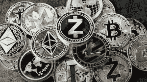
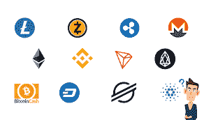
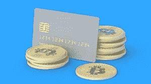
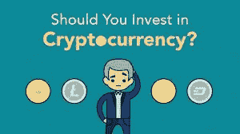
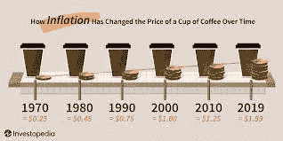

# 你应该投资加密！原因如下！

> 原文：<https://medium.com/coinmonks/you-should-be-investing-in-crypto-heres-why-11bf4fc11da9?source=collection_archive---------24----------------------->

首先，我不是财务顾问，请确保你对这些类型的投资做了自己的研究。然而，如果你看到了这篇文章，我相信你是三种不同类型的人之一。第一类人可能会读到这篇文章，他们不知道什么是加密，但希望了解更多关于这个主题的知识。第二种类型的人对加密有很好的了解，并且希望听到其他投资加密的人的意见。第三种人知道加密的潜力，但也想获得一些话题，解释为什么加密是一项伟大的投资。

你也可能像我一样，是这三种人的结合。如果你以某种方式适合这些领域中的一个，继续阅读，希望你能得到更多的信息供你个人使用。

**什么是密码？** 你们大多数人可能听说过“加密”这个术语，但仍有许多人并不真正完全了解什么是加密。加密货币是一种数字硬币。在最简单的形式中，可以把加密想象成一种数字货币，人们可以在彼此之间传递，而不需要像在银行或其他机构中那样需要第三方。

大多数时候，当一个人买东西时，他们要么用现金，要么用另一种支付方式，无论是银行卡还是支票。然而，你实际上可以拥有自己的密码，并支付它的人对人，而不是有另一方参与。现在你对什么是加密有了一个概念，让我们看看它是如何使用的。

**密码是用来做什么的？**

因此，当人们考虑加密时，大多数人分为两类。第一种是那些不知道密码将如何使用或它的用途的人。第二组是那些对如何使用它以及我们将来会用它做什么有好主意的人。没有第三方参与的数字支付方式的想法确实吸引了其他人。以及拥有分散的、不受第三方或特定人群“控制”的东西的能力。

**为什么要投资**

嗯，说你“应该投资”是不正确的措辞。大多数时候，第一次尝试进入密码的人认为他们会在一夜之间上涨 50%,或者他们会毫不费力地获得疯狂的利润。这是不正确的！大多数时候，当有人投资 crypto 时，会有上涨和下跌。只有几天，你会看到你的投资有 10%的增长，而其他的几天你会下降 25%。因此，如果你愿意冒这个险，那么 crypto 可能适合你。

然而，我要说一件事，那就是如果你需要你投资的钱，那么我会说，把钱放到一个比加密风险更低的地方可能会更好！

**你为什么应该投资—第二部分**

如果你已经读到这一部分，并且觉得你想投资一些密码，我希望你考虑一下。加密是一种数字货币，你可以用它购买物品。从长远来看，你持有的密码的价值**应该会上升。这意味着如果你最终在 2018 年 12 月购买比特币，你可能会以每枚 3000 英镑左右的价格买入。因此，我们可以取任何数量，并将其分解为每枚硬币 3000 美元。如果你坚持下去，你最终将能够以至少 3 万英镑的价格出售这些硬币，这将是你投资的 10 倍增长。让我们进一步说，你坚持到 65，000，但它下降到 54，000，你卖了。这几乎是 18 倍的增长。**

**现在这些动作“正常”吗？不完全是。这些都是极端的例子，我不希望人们认为这些事情是一夜之间发生的。但它们确实发生了，你可以从这些运动中获利。这将引导我进入下一个部分，即权力下放！**

****

****放权！****

**很多时候，当发生经济灾难，人们在金钱上遭受损失或停止花钱时，一个中央单位会“做些事情”来解决这种情况。例如，在 2020 年，当世界上 95%的人处于封锁状态，不能去商店消费，或去商店工作拿薪水时，许多政府创造了刺激法案，或“疫情”支票。这些是什么，本质上是人们“不需要工作”的免费资金。我是在说这样做是错误的吗？不，但我是说，当你开始向经济中注入大量资金，即“人们没有为之工作”的资金时，你就会出现通货膨胀。现在可能只是一点点，也可能很多，目前美国刚刚从 41 年高点 8.5%回落。这意味着美元贬值，除此之外，其他所有东西的价格都在上涨。**

**这就是加密发挥作用的地方。没有人能告诉比特币它能做什么，不能做什么。只是人民的力量。不是一个政府，不是一个人，不是除了人民力量之外的任何人。这就是为什么我认为现在投资加密技术是明智的长期投资。**

****如何投资****

**在考虑如何投资的时候，你首先要做的是做一个预算，弄清楚你能投资什么，不能投资什么。事实是，明天所有的密码都可能消失。你记得#露娜吗？是啊，走了。无数其他人离开了市场，只是为了成为回忆。然而，如果你做了预算，你有 10 美元，100 美元，或 1000 美元，你可以把密码，然后我相信这是正确的时间开始你的财务自由之路！我已经包括了一些链接，你可以使用，以便今天就开始！**

**YouTube 上的 grid bot Guru:[点击这里！](https://www.youtube.com/c/gridbotguru)**

**美国公民的 pionex:[点击这里！](https://pionex.us/en-US/sign/ref/RnIZeirs)**

**全球公民 pionex:[点击这里！](https://www.pionex.com/en-US/sign/ref/zVt0KmHU)**

**报名参加比特币基地:[点击这里！](https://www.coinbase.com/join/wyatt_h)**

> **加入 Coinmonks [电报频道](https://t.me/coincodecap)和 [Youtube 频道](https://www.youtube.com/c/coinmonks/videos)了解加密交易和投资**

# **另外，阅读**

*   **[3 商业评论](/coinmonks/3commas-review-an-excellent-crypto-trading-bot-2020-1313a58bec92) | [Pionex 评论](https://coincodecap.com/pionex-review-exchange-with-crypto-trading-bot) | [Coinrule 评论](/coinmonks/coinrule-review-2021-a-beginner-friendly-crypto-trading-bot-daf0504848ba)**
*   **[莱杰 vs Ngrave](/coinmonks/ledger-vs-ngrave-zero-7e40f0c1d694) | [莱杰 nano s vs x](/coinmonks/ledger-nano-s-vs-x-battery-hardware-price-storage-59a6663fe3b0) | [币安评论](/coinmonks/binance-review-ee10d3bf3b6e)**
*   **[Bybit Exchange 审查](/coinmonks/bybit-exchange-review-dbd570019b71) | [Bityard 审查](https://coincodecap.com/bityard-reivew) | [Jet-Bot 审查](https://coincodecap.com/jet-bot-review)**
*   **[3 commas vs crypto hopper](/coinmonks/3commas-vs-pionex-vs-cryptohopper-best-crypto-bot-6a98d2baa203)|[赚取加密利息](/coinmonks/earn-crypto-interest-b10b810fdda3)**
*   **最好的比特币[硬件钱包](/coinmonks/hardware-wallets-dfa1211730c6) | [BitBox02 回顾](/coinmonks/bitbox02-review-your-swiss-bitcoin-hardware-wallet-c36c88fff29)**
*   **[BlockFi vs 摄氏](/coinmonks/blockfi-vs-celsius-vs-hodlnaut-8a1cc8c26630) | [Hodlnaut 点评](/coinmonks/hodlnaut-review-best-way-to-hodl-is-to-earn-interest-on-your-bitcoin-6658a8c19edf) | [KuCoin 点评](https://coincodecap.com/kucoin-review)**
*   **[Bitsgap 审查](/coinmonks/bitsgap-review-a-crypto-trading-bot-that-makes-easy-money-a5d88a336df2) | [Quadency 审查](/coinmonks/quadency-review-a-crypto-trading-automation-platform-3068eaa374e1) | [Bitbns 审查](/coinmonks/bitbns-review-38256a07e161)**