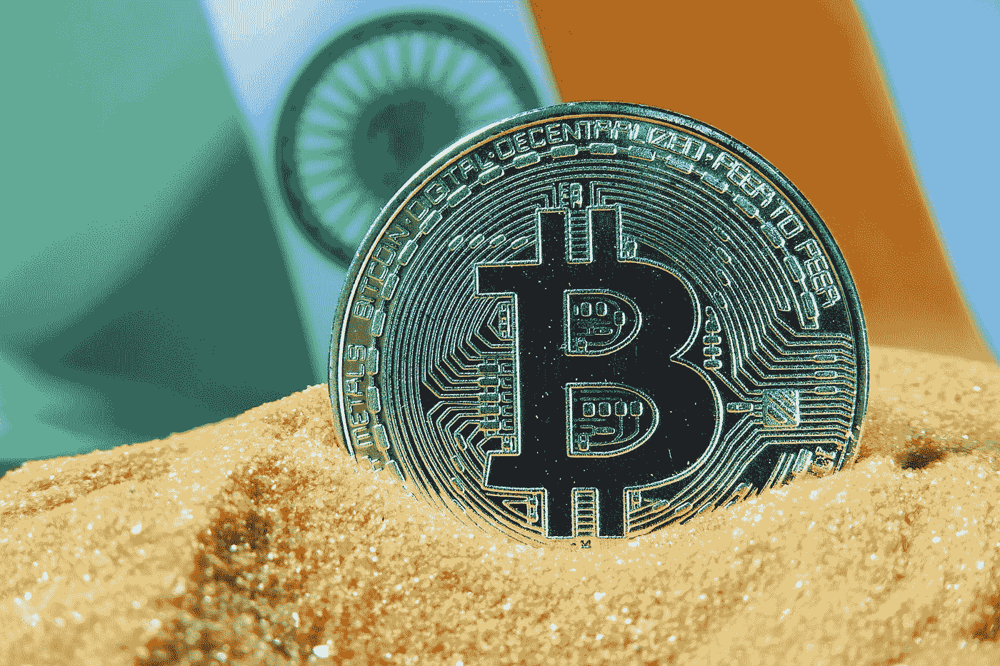

# 比起黄金和股票，印度的年轻投资者更喜欢加密技术

> 原文：<https://medium.com/coinmonks/young-investors-in-india-prefer-crypto-over-gold-and-stocks-ce54c55e9eee?source=collection_archive---------34----------------------->

Photo by [Ewan Kennedy](https://unsplash.com/@ewankennedy?utm_source=medium&utm_medium=referral) on [Unsplash](https://unsplash.com?utm_source=medium&utm_medium=referral)

印度的加密货币市场正出现巨大增长，特别是自疫情开始以来，尽管亚洲第三大经济体的参与者已经表达了对数字货币的担忧，印度政府甚至提出了禁止数字货币的可能性。

CNN Business 在印度商人中进行的一项调查表明，鉴于印度是 T2 世界主要网络强国之一，拥有 7.5 亿用户，并有可能增加数百万新用户，这个亚洲国家甚至有可能成为加密货币超级大国。

**根据数据公司 Chainalysis 的数据，在过去一年里，印度在加密货币采用速度最快的国家中排名第二，仅次于越南。**

尽管印度政府没有拥有加密货币的投资者数量的数据，但专家估计，该国有超过 2000 万人使用加密货币进行交易。

**读来也:** [**印度据传将非法采矿者和商人**](https://bitnewsbot.com/india-to-reportedly-outlaw-crypto-miners-and-traders/)

当然，这种推动是由年轻投资者推动的，他们大多不到 35 岁，其中许多人来自较小的城市，甚至建立了两个印度领先的加密货币买卖应用。

根据 **CoinDCX** 的首席执行官兼联合创始人 Sumit Gupta 的说法，许多 20 多岁的印度年轻人已经开始了他们进入加密货币投资世界的旅程。

Sumit Gupta 说，虽然 20 年前他的父母选择投资黄金，但今天许多年轻人对比特币更感兴趣。

购买黄金是一种投资，也是一种源自印度人民文化的习惯，印度现在是、将来也仍然是这种贵金属最重要的市场之一。

然而，总部位于孟买的 CoinDCX 去年成为印度第一家加密货币独角兽——第一家价值超过 10 亿美元的公司。

> 加入 coin monks[Telegram group](https://t.me/joinchat/Trz8jaxd6xEsBI4p)学习加密交易和投资

**阅读也:** [**印度政府准备禁止加密货币——再来一次**](https://bitnewsbot.com/indias-government-prepares-to-ban-cryptocurrencies-again/)

相应地， **WazirX 已经拥有超过 1000 万用户**，其管理层将 2021 年描述为印度加密货币交易的“非凡”一年。

该公司超过 65%的用户年龄在 35 岁以下，根据公司的官方声明，来自小城镇和乡村的新用户增加了 700%以上。

回想一下，去年 11 月，比特币的交易价格创下 68990 美元的历史新高，但自那以来已经损失了很大一部分价值，截至撰写本文时，比特币的交易价格为 3 万美元。

*原载于 2022 年 6 月 9 日*[*【https://bitnewsbot.com】*](https://bitnewsbot.com/young-investors-in-india-prefer-crypto-over-gold-and-stocks/)*。*