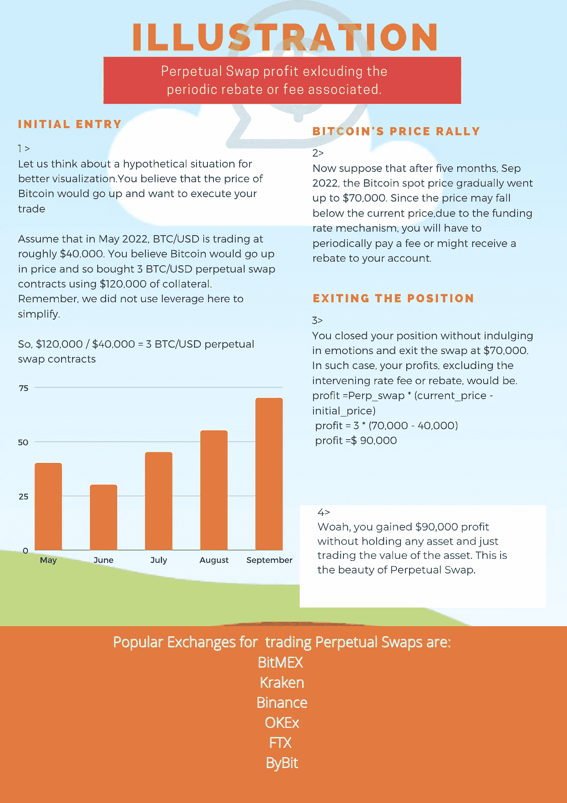

# 你的永久互换 101 指南

> 原文：<https://medium.com/coinmonks/your-101-guide-to-perpetual-swaps-96e649e551c?source=collection_archive---------39----------------------->

## 如果你一直在努力理解永久合同，那么这就是你想要的

Image by Author

> 这是对永久互换的一个非常简单的介绍。我故意把它写得很短，这样读者可以在旅途中享受阅读的乐趣。

投资 1 美元能等同于投资 100 美元吗？永久掉期(Perps)最近成为加密衍生品交易商的热门选择。Crypto 的高波动性吸引交易者对资产价格进行投机，因此在市场上观察到了巨大的杠杆作用。

Perps 是通过去除现货和衍生品市场的不良特征而精心设计的。与现货不同，在 Perp 中，你不持有标的资产。 **Perp 类似于期货或期权合约，但没有到期日**。你想保持你的位置多久都可以。此外，期货价格可以偏离基础现货价格，但交易者的价格应该与基础资产紧密挂钩。

Perp 由全球加密交易所**bit MEX**首先发明并推出，是一种基于基础资产价值进行交易的衍生产品。*高流动性、廉价的杠杆和固定的债券价格*是其采用的驱动力。“**融资利率机制**”(FRM)通过激励交易员在投机的另一方持有头寸来维持联系汇率。

FRM 的基础是根据正或负的融资利率激励交易者。**融资利率**是资产的 perp 价格和指数价格之间的差额。指数价格是该资产在所有主要现货交易所的加权平均价格。

当交易价格高于指数价格时，融资利率为正，当交易价格低于指数价格时，融资利率为负。当融资利率为正时，该机制通过要求多头交易者根据计算支付费用来激励空头交易者。这个过程抑制了购买，刺激了出售，降低了罪犯的价格，使其与指数价格一致。类似地，当融资利率为负时，空头交易者向多头交易者付款，从而抑制卖出，刺激买入，抬高交易者的价格，使其与指数价格一致。

这种费率作为费用或回扣收取，通常每 8 小时支付一次；但是，在某些交易所，该时间表可能会有所不同。Perp 的实施因交易所而异。

让我们用下图来想象一下。

Image by Author

永久性掉期交易一直主导着主要交易所的交易量，2022 年 5 月 8 日的日交易量为 4755.3 亿美元。然而，带杠杆的衍生品是高风险投资，容易被清算。对交易者来说，了解风险敞口是至关重要的。

*免责声明:此处阐述的部分或全部内容都不是任何财务建议。这篇文章是关于个人投资哲学和在金融旅程中产生意识的媒介。在做出任何财务决定之前，请咨询您的财务顾问。*

**为上述免责声明道歉！**

*我希望你喜欢这些内容，并且值得你花时间。不开心！请让我知道。但是，如果你喜欢这个内容，* ***你知道该怎么做*** *。更多文章和更新，可以点击“* ***关注*** *”关注我，或者订阅我的简讯。*

> *加入 Coinmonks* [*电报频道*](https://t.me/coincodecap) *和* [*Youtube 频道*](https://www.youtube.com/c/coinmonks/videos) *了解加密交易和投资*

# 另外，阅读

*   [3 commas Review](/coinmonks/3commas-review-an-excellent-crypto-trading-bot-2020-1313a58bec92)|[Pionex Review](https://coincodecap.com/pionex-review-exchange-with-crypto-trading-bot)|[coin rule Review](/coinmonks/coinrule-review-2021-a-beginner-friendly-crypto-trading-bot-daf0504848ba)
*   [莱杰 vs n rave](/coinmonks/ledger-vs-ngrave-zero-7e40f0c1d694)|[莱杰 nano s vs x](/coinmonks/ledger-nano-s-vs-x-battery-hardware-price-storage-59a6663fe3b0) | [币安评论](/coinmonks/binance-review-ee10d3bf3b6e)
*   [Bybit Exchange 审查](/coinmonks/bybit-exchange-review-dbd570019b71) | [Bityard 审查](https://coincodecap.com/bityard-reivew) | [Jet-Bot 审查](https://coincodecap.com/jet-bot-review)
*   [3 commas vs crypto hopper](/coinmonks/3commas-vs-pionex-vs-cryptohopper-best-crypto-bot-6a98d2baa203)|[赚取加密利息](/coinmonks/earn-crypto-interest-b10b810fdda3)
*   最好的比特币[硬件钱包](/coinmonks/hardware-wallets-dfa1211730c6) | [BitBox02 回顾](/coinmonks/bitbox02-review-your-swiss-bitcoin-hardware-wallet-c36c88fff29)
*   [BlockFi vs Celsius](/coinmonks/blockfi-vs-celsius-vs-hodlnaut-8a1cc8c26630)|[Hodlnaut 点评](/coinmonks/hodlnaut-review-best-way-to-hodl-is-to-earn-interest-on-your-bitcoin-6658a8c19edf) | [KuCoin 点评](https://coincodecap.com/kucoin-review)