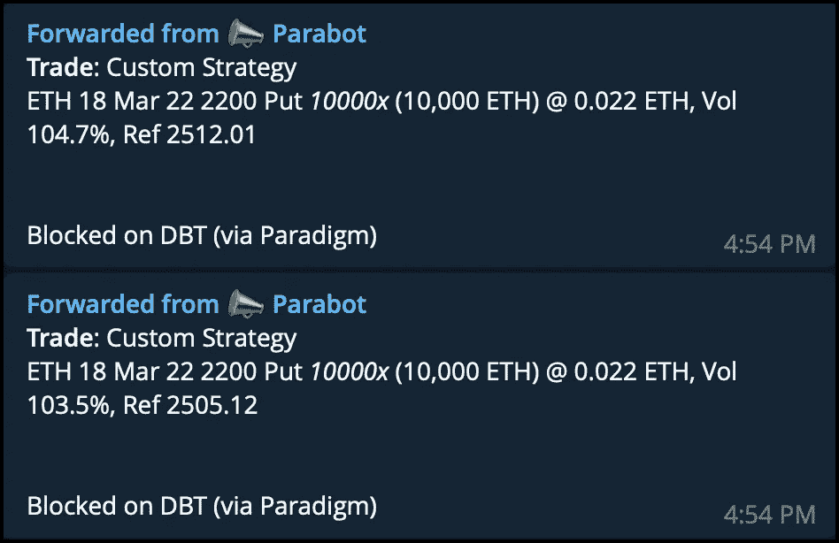

# 你的关系网很重要

> 原文：<https://medium.com/coinmonks/your-network-matters-64f44f096da4?source=collection_archive---------71----------------------->

你的关系网很重要。

以下是今天通过[范式](https://www.paradigm.co/company)场外流动性网络进行的两笔交易。你觉得在公开市场上订购 10，000 个 ETH 期权怎么样？不是一次，而是两次？这会产生什么样的市场影响？

当你有一个由 700 多名机构交易员组成的网络，将流动性聚集到一个平台上时，这很有帮助。

[#加密衍生品](https://www.linkedin.com/feed/hashtag/?keywords=cryptoderivatives&highlightedUpdateUrns=urn%3Ali%3Aactivity%3A6906783865306800128)[#加密货币](https://www.linkedin.com/feed/hashtag/?keywords=cryptocurrencies&highlightedUpdateUrns=urn%3Ali%3Aactivity%3A6906783865306800128)[#贸易范式](https://www.linkedin.com/feed/hashtag/?keywords=tradeparadigm&highlightedUpdateUrns=urn%3Ali%3Aactivity%3A6906783865306800128)