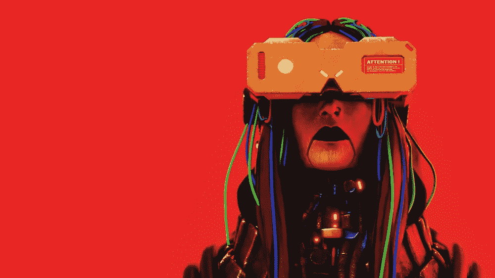

# 你那套扎染盔甲

> 原文：<https://medium.com/coinmonks/your-psychedelic-suit-of-tie-dyed-armor-f6eeeb6988f3?source=collection_archive---------16----------------------->

*往返于 Web 2.0 世界的 Web3 装备*

我们已经让自己陷入了困境。这些天我们彼此不太信任。

我们一直都知道有些人是我们不能信任的，但是由于这种不信任已经上升到了制度层面，我们把对制度的恐惧带入了 Web3。事实上，我们进入 Web3 是为了摆脱恐惧本身。以及引起恐惧的机构。

沿着这条路，当我们想回到 Web 2.0 去做生意或工作或买东西或其他什么的时候，我们将从空间站 Web3 重新进入那个氛围。为了重返大气层而不被烧毁，我们需要保护。防火保护。

然后，当我们离开 Web 2.0 回到 Web3 的家时，我们希望我们所有的东西都跟随着我们。一捆。安全可靠，只有我们或我们授权的人才能看到。

如果我们决定留下一些东西，那么这些东西就与一个智能合约相关联，这个智能合约能够自我毁灭，或者更好的是，在查看时会产生成本和收入，所有这些都与父智能合约相关联。然后自毁按钮被按下。通过智能合同。

这是我们想要的，也是正在发生的。

我们将允许我们的方式回到 Web 2.0，并且只允许在 Web 2.0 中工作所需的最少的数据元素，并且只在某些条款和条件下。这一许可流程确保了对各方的保护，包括 Web 2.0 系统和运营商的利益。

这两个世界的外观和行为非常不同。

许多人可能会理解，这就像是在 Discord 和 LinkedIn 之间来回切换。彩色回到黑白；对于你们这些年龄足够大的人来说，知道这意味着什么。只是给你们这些婴儿潮一代在文学之旅中找到的一点小奖励。

我知道这对很多人来说很难理解。刚才，我也同样困惑。我只知道我有一堆问题没有答案。

就像，为什么我们每次被雇佣都要填写同样的文件？

举个例子。

所以，快进到明天，我们将看到 Web 2.0 冒险者进入 Web3-land 的朝圣之旅。也许这是我的嬉皮士教养，但我实际上开始明白，这真的是一场运动，可能会挠到至少自 60 年代以来从未消失的痒处。

艺术的迷幻和美丽。需要超越的思想转变。自由的色彩和想象。志同道合的人一起分享他们的网络 3 梦想。一起。

我认为社区是这个问题的核心。对社区的需求。

在一个社区因为这样或那样的原因受到攻击的时代，Web3 开始看起来像一个避风港，至少探索这种社区可能会是什么样子。

有点像公社。

和平结束。