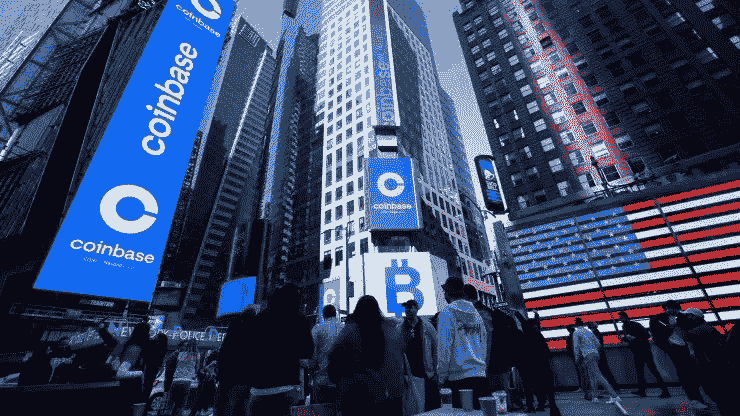

# 你的每周新闻聚合器#1

> 原文：<https://medium.com/coinmonks/your-weekly-news-aggregator-1-89a2ede35f9a?source=collection_archive---------44----------------------->

如今，聚光灯下的许多聚合器也可能会顺应这一趋势。

让我们从离家近的地方开始。

## 索拉纳 NFT 市场魔术伊甸园(ME)筹资 1.3 亿美元，计划进行多连锁店扩张。

Leading NFT marketplace on Solana.

神奇伊甸园(Magic Eden)的估值已经达到 16 亿美元，正计划扩张到新的连锁店，大概是以太坊和 NEAR。

*首席执行官陆兆禧(Jack Lu)表示，“ME 不想受到资源限制”，并强调 ME 希望*“为未来 5 到 10 年做准备”。**

*为了庆祝，他们今天晚些时候将在纽约举办一场仅限受邀者参加的游艇派对，分发给拥有领先的索拉纳·NFT 系列的人。*

## ***Uniswap 正在收购 Genie***

**

*最受欢迎的基于 ETH 的 DEX 的所有者 Uniswap Labs 正在购买 NFT 聚合平台 Genie。这相当于 Raydium 获得了 CoralCube(对于我的 Solana 本地人)。*

*为了庆祝，Uniswap 实验室计划向 Genie 的早期支持者空投数量不详的稳定币 USDC。任何在 4 月 15 日之前使用过该平台至少一次或拥有 Genie Genesis NFT 的人都将获得 USDC。既然各机构都在庆祝，这里有一个给我们的*‘打倒坏蛋’。**

## ***隐鲸努力清算摄氏温度***

**

*Alexander Machinsky CEO of Celsius.*

*比特币打喷嚏，altcoins 就得肺结核。因此，让我的读者(和他们的袋子)感到欣慰的是，Celsius 不仅因持有 ETH 控股公司而面临清算风险，还因持有 BTC 控股公司而面临清算风险。Celsius 在一个保险库里保存了大约 17，900 个 wBTC。*

*如果比特币的价格低于特定金额(可以在这里看到[https://oasis.app/25977#Overview](https://oasis.app/25977#Overview))，那么他们就会在追加保证金通知中被清算。*

*这将给市场带来毁灭性的打击，给鲸鱼们的空头一点钱，并给它们随后的低价积累打个折扣。*

*哦，令人欣慰的是这还没有发生！*

## ***SBF 救助布洛克菲&航海家数码***

**

*Sam Bankman-Fried Father of FTX & Alameda Research.*

*如果你没有注意到，流动性危机正在蔓延。亿万富翁山姆·班克曼·弗里德在卖水。*

*BlockFI 获得 2.5 亿美元，以“*凭借优势地位*驾驭市场”。*

*通过 Alameda (SBF 的巨型量子基金)向加密经纪公司 Voyager Digital 融资 5 亿美元。*

***快速旁白-** 我在伦敦的一家黑客公司与一位对冲基金经理交谈，他告诉我 3AC 离清算还有*分钟，他的基金和 Alemeda 一听到风声就积极做空市场。事实证明，我们的两只基金都借给了 3AC 相当多的钱，并且幸运地躲过了 3AC 的违约…上帝啊。**

## *币安将免除在美国马厩里买卖 BTC 的费用。比特币基地股票被打了。*

**

*币安首席执行官杰克·马勒斯(Jack Mallers)在下文中解释了这一举措:“这是一场向底部的竞赛，”马勒斯表示，他预计竞争对手未来将收取越来越低的费用。*“你在股市上看到了这一点。现在，进行股票交易是自由的。这叫做罗宾汉。”**

*希望这并不意味着交易所寻求罗宾汉身上看到的其他收入来源。例如，将零售订单流出售给加密对冲基金，该基金通过高频交易算法预先运行净流以产生收入……哦，等等，这已经发生了。*

## *法尔雷尔·威廉姆斯(？？？？)很乐意与涂鸦一起工作。*

*事实上，他非常高兴，接受了很多钱……我指的是涂鸦的首席品牌官的职位，一个 NFT 收藏的蓝筹股。*

**

*An example of a Doodles NFT.*

*放心，他的兴奋是无止境的。*

*他甚至以预先录制的脚本信息的强大形式出现在纽约 NFT。如果你问我，道国库的资金花得好吗？*

*尽管抛开所有讽刺不谈，这可能对杜德尔有利，因为他们从他身上榨取了更多的参与/支持。*

*这些都是我写的，伙计们，下周见。我会保持这一个每周一次的基础上，并释放一些喃喃自语的一面。*

> *加入 Coinmonks [电报频道](https://t.me/coincodecap)和 [Youtube 频道](https://www.youtube.com/c/coinmonks/videos)了解密码交易和投资*

# *此外，请阅读*

*   *[如何匿名购买比特币](https://coincodecap.com/buy-bitcoin-anonymously) | [比特币现金钱包](https://coincodecap.com/bitcoin-cash-wallets)*
*   *[币安 vs FTX](https://coincodecap.com/binance-vs-ftx)|[Best(SOL)Solana 钱包](https://coincodecap.com/solana-wallets)*
*   *[Binomo Review](https://coincodecap.com/binomo-review)|[Stoic vs 3 commas vs trade Anta](https://coincodecap.com/stoic-vs-3commas-vs-tradesanta)*
*   *[Capital.com 评论](https://coincodecap.com/capital-com-review) | [香港密码借贷平台](https://coincodecap.com/crypto-lending-hong-kong)*
*   *[如何在 Uniswap 上交换密码？](https://coincodecap.com/swap-crypto-on-uniswap) | [A-Ads 综述](https://coincodecap.com/a-ads-review)*