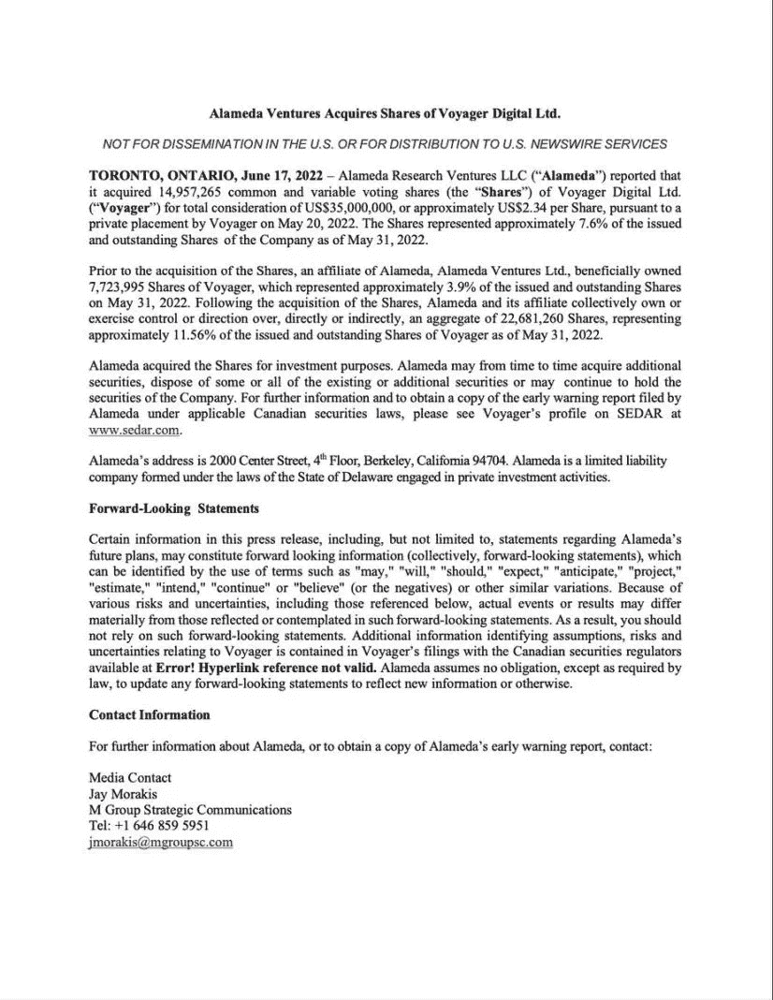
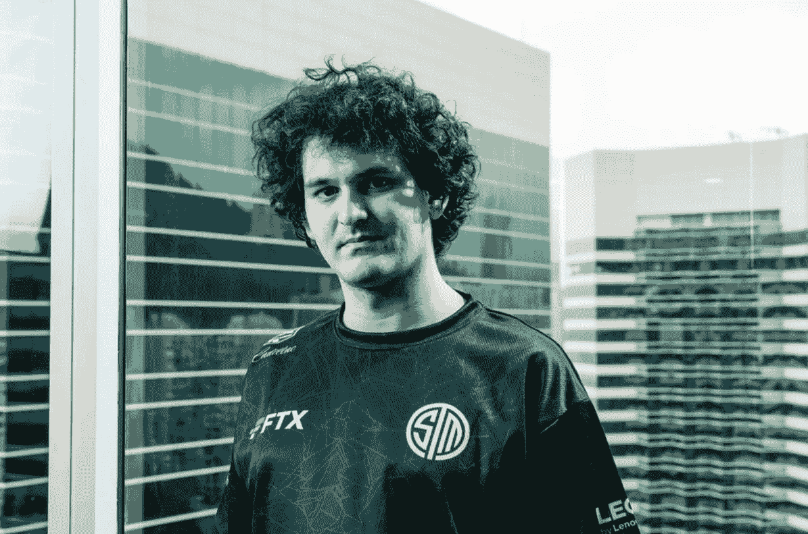
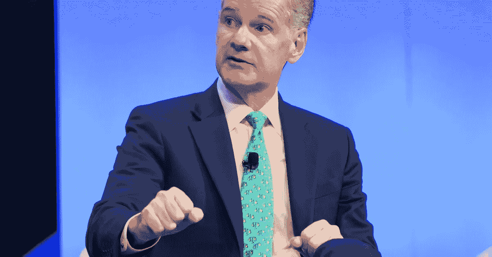
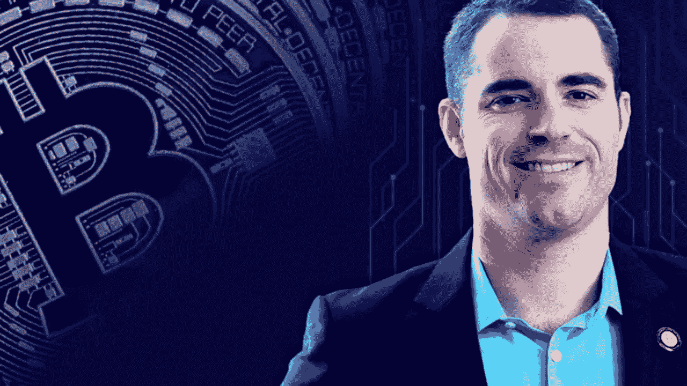
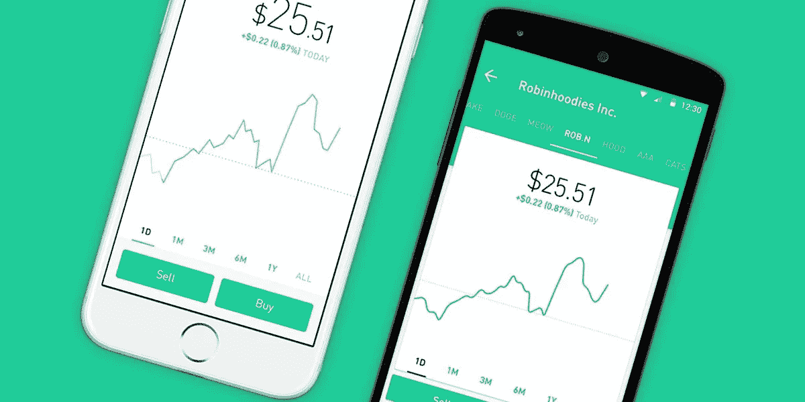

# 你的每周新闻聚合器#2

> 原文：<https://medium.com/coinmonks/your-weekly-news-aggregator-2-7f7324d02214?source=collection_archive---------40----------------------->

让我们本周就切入正题。

这个很有趣。很有意思。

## **SBF 是慈善家吗？**

— — — — — — — —
SBF 给航海家号提供了 5 亿美元的信用额度，这笔钱已经用完了。以下是尚未涉及的内容:

*SBF 通过 Alameda Ventures 在宣布之前购买了 1490 万股 Voyager 股票。*

Tut tut.

Oh 和 [Voyager 发布违约通知](https://www.coindesk.com/business/2022/06/27/voyager-digital-issues-default-notice-to-3ac-draws-down-75m-of-alameda-revolver/)要求收回借给三箭资本的钱(6.7 亿美元)。

也许结果是，三箭资本被英属维尔京群岛的法院命令清算他们的资产并履行债务。

急切地想知道航海家号带走了多少钱。
— — — — — — — —

## **block fi…陷入债务陷阱外交？**

I want that T-shirt.

BlockFi 的一个贷款人透露，SBF 的 2 . 5 亿美元信用额度附带了**尼龙线****。
——————
实质上:FTX 对 BlockFi 的贷款是 ***从属于客户存款*** 。**

**这意味着 BlockFi 必须在支付给自己的客户(当前的零售用户&借钱给他们的公司)之前支付给 FTX。现在，如果 BlockFi 不能解决这笔贷款，那么 FTX 有权以几乎为零的价格收购 BlockFi 几乎所有的股权。**

**BlockFi 目前的股东和用户完全被骗了，FTX 以极低的价格获得了所有的基础设施、整个贷款网络和剩余的资产。
— — — — — — — —**

## **为什么会有公司接受这一点？**

**我认为这里可能会发生两件事。**

1.  **BlockFi 是一家在过去两年的牛市中亏损 285，000，000 美元的公司，现在已经破产。由于没有治愈的空间，他们需要救助。如果是这样，FTX 会知道的。整个交易实质上是打折收购。**
2.  **BlockFi 只是资不抵债(招待我)，有流动性问题。那么这只是一个他们不能忽视的低劣报价，但不是收购。**
3.  **FTX 提出了一个低报价，以吓唬 BlockFi 的当前贷款人/股东抛出一个可行的还价。有证据表明这可能是谜题的一部分。**

> **交易新手？试试[加密交易机器人](/coinmonks/crypto-trading-bot-c2ffce8acb2a)或者[复制交易](/coinmonks/top-10-crypto-copy-trading-platforms-for-beginners-d0c37c7d698c)**

**— — — — — — — — **根据 Coindesk:****

***“mor gan Creek Digital 正试图为 BlockFi 制定一个替代救援计划”***

***为什么？***

***“FTX 2.5 亿美元的信用额度将会消灭 BlockFi 的股东，包括 Morgan Creek。”***

****

**[https://www.coindesk.com/business/2022/06/25/morgan-creek-is-trying-to-counter-ftxs-blockfi-bailout-leaked-call-shows/](https://www.coindesk.com/business/2022/06/25/morgan-creek-is-trying-to-counter-ftxs-blockfi-bailout-leaked-call-shows/)**

**不管怎样，有一件事是肯定的。SBF，通过 FTX，通过 Alemeda Research，是量子基金中的一只秃鹫。**

**— — — — — — — — — — — — — — — — — — — — — — — — — — — — — — —**

## ****令人捧腹的是,“匿名者”已经盯上了跆拳道！****

**他完了。**

**义务警员来了，决心让他承担责任。

“*我们是军团…期待我们”***

****

**[https://www.youtube.com/watch?v=RB4rK9eB2oE&t=146s](https://www.youtube.com/watch?v=RB4rK9eB2oE&t=146s)**

**— — — — — — — — — — — — — — — — — — — — — — — — — — — — — — —**

## **BTC 基金的资金外流达到历史最高水平。**

**….仅在上周就有 4.53 亿美元。**

**根据 Coinshares 的报告，这抹去了过去 6 个月获得的所有累计流入。此外，ProShares 做空比特币策略 ETF 有 1530 万美元资金流入。呀。**

**— — — — — — — — — — — — — — — — — — — — — — — — — — — — — — —**

## ****罗杰·维夫 vs 考因福莱****

****

**Roger Ver in the flesh.**

**鲸战的前奏，这是我在这些更新之外的下一篇文章，所以我会尽量简短。BTC·威尔正在和一家(可能破产的)加密交易所打一场法律战。**

**我把钱押在鲸鱼身上，他所要做的就是把它拉出来！**

**(更详细的总结即将发布)。**

**— — — — — — — — — — — — — — — — — — — — — — — — — — — — — — —**

## **FTX 有意收购零售股票交易平台 Robinhood。**

****

**现在还没有结论。**

**班克曼-弗里德在一份声明中告诉 Decrypt，虽然他和 FTX“对罗宾汉的商业前景和我们可能与他们合作的潜在方式感到兴奋”，但“目前没有关于罗宾汉的积极并购对话”**

**然而，他在一个月前获得了该公司 7.6%的股份。行动胜于言语。**

**有一点是肯定的，币安和 FTX 是这个干渴的市场中流动性最强的玩家。**

**很明显他们饿得要命。**

**— — — — — — — — — — — — — — — — — — — — — — — — — — — — — — —**

> **加入 Coinmonks [电报频道](https://t.me/coincodecap)和 [Youtube 频道](https://www.youtube.com/c/coinmonks/videos)了解加密交易和投资**

# **另外，阅读**

*   **[OKEx vs KuCoin](https://coincodecap.com/okex-kucoin) | [摄氏替代品](https://coincodecap.com/celsius-alternatives) | [如何购买 VeChain](https://coincodecap.com/buy-vechain)**
*   **[ProfitFarmers 回顾](https://coincodecap.com/profitfarmers-review) | [如何使用 Cornix 交易机器人](https://coincodecap.com/cornix-trading-bot)**
*   **[如何匿名购买比特币](https://coincodecap.com/buy-bitcoin-anonymously) | [比特币现金钱包](https://coincodecap.com/bitcoin-cash-wallets)**
*   **[瓦济克斯 NFT 评论](https://coincodecap.com/wazirx-nft-review)|[Bitsgap vs Pionex](https://coincodecap.com/bitsgap-vs-pionex)|[Tangem 评论](https://coincodecap.com/tangem-wallet-review)**
*   **[如何使用 Solidity 在以太坊上创建 DApp？](https://coincodecap.com/create-a-dapp-on-ethereum-using-solidity)**