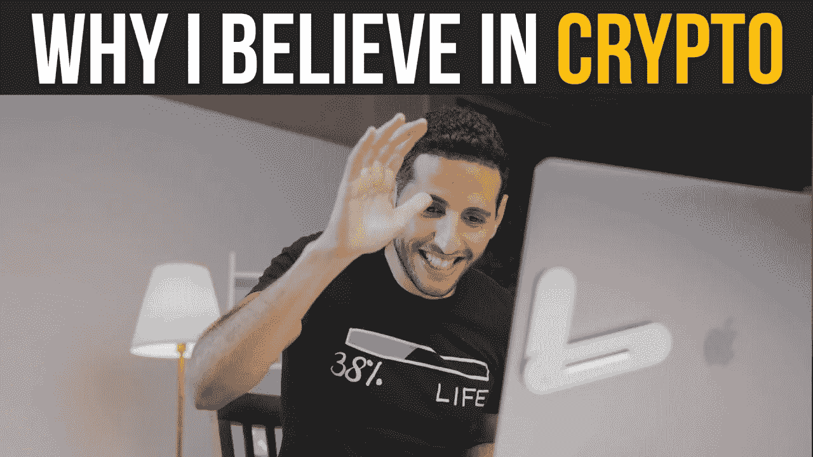

# Youtuber NasDaily 的比特币在水下少了 20 万美元

> 原文：<https://medium.com/coinmonks/youtuber-nasdailys-bitcoin-by-200k-underwater-e5342e130f7d?source=collection_archive---------45----------------------->

Youtuber NasDaily 经历了一场比特币(BTC)的火的洗礼。这位拥有超过 5000 万粉丝的企业家和有影响力的人在比特币上投资了 50 万美元——就在熊市开始之前。

在瑞士达沃斯举行的世界经济论坛(WEF)期间，Cointelegraph 采访了 NasDaily(他的真名是 Nuseir Yassin)。亚辛告诉 Cointelegraph，他在比特币中节省的 50 万美元现在价值 30 万美元，并笑着补充说“这是对信念的巨大考验。”

尽管纸面上的损失，他比以往任何时候都更加确信加密是未来:

“即使下降到零，我想我确实相信需要一种在互联网上获取价值的方法。我敢打赌，比特币是一代人才有一次的事情。”

Yassin smashes 在 3 月底购买了 10 多辆 BTC(50 万美元)，当时价格在 4 万美元左右。亚辛被“世界上正在发生的革命”所吸引，在购买比特币的同时，他在 Youtube 上的内容也受到了加密的关注。

事实上，亚辛告诉 Cointelegraph，虽然他的动机是与观众分享重要的故事，“我们必须谈论它(加密)。”

“Crypto 让我开始思考今天存在的问题，以及我们明天如何共同解决这些问题。这就是我感到兴奋的原因，因此我也应该努力教育我的观众。”

亚辛开玩笑说，数字货币革命如此重要，以至于他不得不“强迫任何关注 NasDaily 的人接受加密”，因为他用每日视频教育他的观众。

亚辛的比特币投资账面亏损 20 万美元，但他还在买进更多，在 WEF 之前的日子里，他的筹码又增加了 3 BTC。在下面的推文中，雅辛在 WEF 步行街的欧洲酒店前收到了一顶硬币电报帽。

亚辛是“奥马哈圣人”的粉丝，也就是掌管伯克希尔·哈撒韦公司的亿万富翁商业巨头沃伦·巴菲特。1986 年，巴菲特写了一封投资者信，创造了一个流行的投资者陈词滥调。

巴菲特认为，投资者应该“在别人贪婪的时候恐惧，在别人恐惧的时候贪婪。”流行的投资策略已经被秘密世界劫持和迷化了。这个短语大致翻译为“购买蘸酱”。

至于亚辛，他开玩笑说，在价格低于 3 万美元时，他在自己的库存中添加了 3 BTC，他“现在对比特币很好”。与此同时，他很高兴能建立一个加密社区，无疑将带领他的观众踏上比特币兔子洞的旅程。

> 加入 Coinmonks [电报频道](https://t.me/coincodecap)和 [Youtube 频道](https://www.youtube.com/c/coinmonks/videos)了解加密交易和投资

# 另外，阅读

*   [Bookmap 点评](https://coincodecap.com/bookmap-review-2021-best-trading-software) | [美国 5 大最佳加密交易所](https://coincodecap.com/crypto-exchange-usa)
*   最佳加密[硬件钱包](/coinmonks/hardware-wallets-dfa1211730c6) | [Bitbns 评论](/coinmonks/bitbns-review-38256a07e161)
*   [新加坡十大最佳加密交易所](https://coincodecap.com/crypto-exchange-in-singapore) | [购买 AXS](https://coincodecap.com/buy-axs-token)
*   [红狗赌场评论](https://coincodecap.com/red-dog-casino-review) | [Swyftx 评论](https://coincodecap.com/swyftx-review) | [CoinGate 评论](https://coincodecap.com/coingate-review)
*   [投资印度的最佳密码](https://coincodecap.com/best-crypto-to-invest-in-india-in-2021)|[WazirX P2P](https://coincodecap.com/wazirx-p2p)|[Hi Dollar Review](https://coincodecap.com/hi-dollar-review)