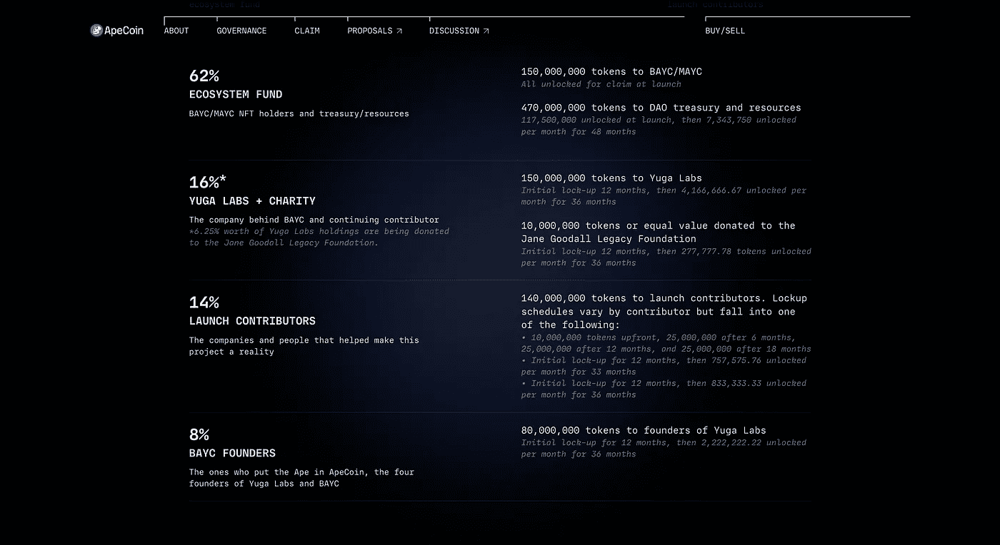
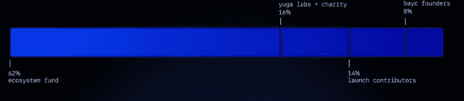
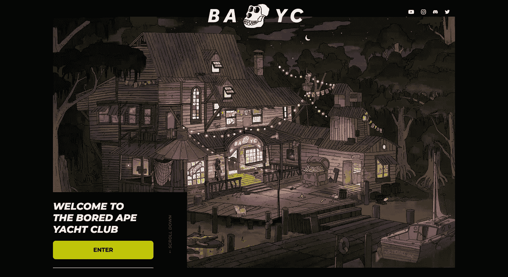

# 宇迦实验室、ApeCoin 和分裂的 NFT 的未来

> 原文：<https://medium.com/coinmonks/yuga-labs-apecoin-and-the-future-of-web-3-0-corporate-structure-b65cc1462fb3?source=collection_archive---------13----------------------->

## **名人涌入无聊猿游艇俱乐部**

流行音乐女王麦当娜通过 Moonpay 以 56.4 万美元的价格收购了一艘编号为 4988 的无聊猿 NFT，成为无聊猿游艇俱乐部(BAYC)的最新成员。据报道，[的 moonpay](https://cryptopotato.com/madonna-enters-metaverse-with-a-new-bored-ape-nft-bought-for-560k/)在 NFT 被转移到麦当娜的个人钱包前十天已经为 NFT 支付了 180 ETH。

花费数十万美元收购 BYAC NFTs 的名人名单包括贾斯汀比伯、阿姆、帕丽斯·希尔顿，而且名单越来越长…

随着名人涌入这个知名品牌，并将他们的社交媒体个人资料照片变成他们购买的无聊猿类，人们开始不仅想知道 BAYC 本质上是什么，而且想知道他们如何才能成为这个时尚和潜在有利可图的 NFT 项目的一部分。

BYAC 是一种现象——然而——排除了一些人可能会发现这种炒作是为名人和有影响力的人保留的疏远和富人的游戏。帕丽斯·希尔顿和吉米·法伦随意聊起他们对计算机生成的人类漫画猴子图像的奢侈所有权，这无疑引起了公众的不安——如果不是强烈抗议的话——这种不安和荒谬的奇怪现象植根于 NFTs 的狂热中。

许多人认为这种文化现象只不过是荒谬的表现，他们的问题可能是:我为什么需要关心这些。jpeg 推测？

## 空投

3 月 14 日，BAYC 向其 NFT 持有者空投了 15%的原生令牌 APE coin(APE coin ),宇迦实验室也在这次历史性的空投中获得了相同的金额。APE 是一种 ERC-20 令牌，目前正在币安、比特币基地和 FTX 等主要加密货币交易所交易。ApeCoin [一度成为以太坊鲸鱼中交易量最大的代币，账户数量超过 36500 个](https://cryptopotato.com/apecoin-becomes-the-most-traded-token-among-ethereum-whales/)

ApeCoin 的创建使 NFT 景观成为一个完全不同的游乐场，具有一定程度的包容性。根据 ApeCoin 的网站，ApeCoin“将作为社区主导的倡议的分散协议层，推动文化进入元宇宙。”换句话说，该令牌被标记为各种即将到来的元宇宙和 Web 3.0 项目的社区/游戏内令牌。

ApeCoin 标志着一种新的企业结构模式，如果有一天 NFT 被证明不仅仅是数字历史时间线上的一点时尚，这种模式很可能仍然有效。

## 艺术？社交令牌？

收藏艺术品，无论是数字的还是实物的，从来都不仅仅是关于产品本身。其价值的无形性根植于它的社会和文化含义，这在很大程度上是由网络效应体现和促进的。

Raoul Paul，the crypto bull & Real Vision 的首席执行官，[在他最新的 substack 简讯中写道](https://raoulpal.substack.com/p/the-monkey-network?utm_source=twitter&s=r)他刚刚花了大约 40 万美元买了一只无聊的猿。他承认，一开始他认为这种会员形式只不过是一个名人代言的项目，但后来他改变了看法，因为他充分意识到了来自 BAYC 的知识产权的力量——这是一个跨越音乐、出版、时尚等领域的快速爆发的文化帝国——最终巩固了他的投资论点。

尽管列出了由于“这是 15，000(约)NFT 的基础上建立的，但对于网络效应来说，这太精英化了”而导致的传播方面的缺点，劳尔还是加倍看好这个项目，因为他注意到宇迦实验室最近收购了 Meebits 和 CryptoPunks IP，以及发行了 ape coin——这两者都是该公司转变为元宇宙主导公司的标志。与他将**的社会标志**视为未来的观点一致，Raoul 也将品牌效应视为 BAYC 相对于其他 NFT 项目的突出优势。

“宇迦正从头开始打造一个 Web 3 媒体、时尚和艺术品牌，并且迈出了大胆的一步。这是 Web 3 还没有看到的。”拉乌尔写道，“毕竟，BTC 只是一个具有独特属性的社会标志，所有这些都是数字主权国家的各种模式，我认为这是我们的发展方向。”

拉乌尔将 ApeCoin 视为一种社会象征，允许普通人参与 BYAC 领导的 NFT 项目的资本密集型投机活动，这些项目对普通人乔和萨姆来说过于昂贵。事实上，这被用来作为一个营销角度，以促进 ApeCoin 作为金融民主化的扩展工具。

3 月 22 日，BAYC 的母公司宇迦实验室透露，该公司已经从风险投资公司和区块链主要游戏工作室筹集了 4.5 亿美元——著名的风险投资公司 Andreessen Horowitz 领导了新一轮的融资。**尽管宇迦实验室坚称 ApeCoin 独立于实验室存在，但两者之间的联系几乎不可能被视为是分离的。**

支持宇迦实验室的 Animoca Brand、FTX 和 Reddits 的主要利益相关方被授予 ApeCoin DAO 的“[初始董事会成员](https://cryptopotato.com/what-is-ape-coin/)。从为激励 APE 的预期增长和采用而设计的令牌组学来看，人们可以决定 DAO 是一个分散化的中心，还是仅仅是一个大型 VC 资金的隐藏发电站。

## 硬币记号组学

APE 的总供应量固定在 10 亿代币，不会因为焚烧代币而减少，也不会因为发行代币而增加。

总供应量的 62%——约 6 . 2 亿代币——预留给 BYAC 持有者和 DAO 国库。前者获得 1.5 亿代币，而后者获得 4.7 亿代币。

Source: ApeCoin’s Official Website

ApeCoin 的其余 38%将用于“初始捐助者”和简·古道尔遗产基金会，该基金会支持现实生活中丛林灵长类动物的保护工作。

在这 38%中，宇迦实验室和基金会分别分发了 1.5 亿和 1000 万只猿，占总供应量的 16%。对于剩余的代币，14%给发起贡献者，8%给 BAYC 创始人。

所有分配给初始捐款的代币都有从 12 个月开始的锁定期，因此主要利益相关者不能立即兑现。

APE Token Distribution. Source: Source: ApeCoin’s Official Website

尽管不考虑持有 15%猿令牌的无聊猿和变异猿 NFT 持有者，宇迦实验室及其支持者仍然持有大约 23%的储备。鉴于投票权与一个人拥有的令牌数成正比，因此有人质疑这种令牌组学规定的 DAO 实际上有多分散。

## 令牌发放——非功能性令牌的补充细分

ApeCoin 首先被设计为 ApeCoin DAO 的治理和公用事业令牌，Ape coin DAO 是一个社区控制的组织，由其成员监督，成员可以对治理提案进行投票，并决定由宇迦实验室投资者组成的母公司 Ape 基金会如何运营。如上文所述的令牌组学所示，还创建了代表"一体行动"执行决策的基金会。

“由于 ApeCoin 表面上只是来自 ApeCoin DAO，而不是来自宇迦实验室，”威尔·戈特斯根[为 *Coindesk 写道*](https://www.coindesk.com/layer2/2022/03/18/what-is-apecoin-and-who-is-behind-it/)，“这里有一个*貌似可信的否认——一个独立实体向一家公司及其创始人分配代币，而不是该公司及其创始人自己投资。”*

*因此，人们担心的是，像 APE 这样的加密货币是否会像证券一样受到监管——就像上市公司发行的股票一样，以筹集资金，并可能由所有者注入自己的股票。如果宇迦实验室足够分散，正如 Gottsegen 指出的那样，根据 SEC 对数字令牌的指导意见，它可能能够合法地发行令牌，而无需将其注册为证券:[Hinman 令牌标准](https://blockchainassoc.medium.com/understanding-the-secs-guidance-on-digital-tokens-the-hinman-token-standard-dd51c6105e2a)。*

*基于宇迦实验室对 BYAC 和 Ape 基金会的直接参与，它利用 DAO 这种看似分散的所有权结构来促进资本化的成员资格，如 NFTs 的形式。**“不可替代”应该是指独特性、稀有性和所有权记录，但是，在宇迦实验室发行 ApeCoin 以支持其未来项目并奖励其作为 BYAC 成员的股东的情况下，NFT 因此可以通过细分的令牌化进行货币分割。***

*细分化本身为被排除在特权俱乐部之外的大多数人参与 BYAC 的成功提供了一个入口。每个代币持有者就像一家上市公司的散户股东，他/她将通过持有 APE 获得项目敞口，尽管代币本身与昂贵的 NFTs 没有直接关联，但其对宇迦实验室领导的各种项目的预期效用支持其当前价值。*

*宇迦实验室——这个品牌本身——以及 BYAC 知识产权的货币价值受到其在众多领域的全面应用的支撑，这是投资 ApeCoin 的主要动机。的。JPEGs 不是目的，而是实现利用文化身份的手段。**无聊的猿类既是一种审美，也是一种金钱地位——一个大众渴望成为其中一员的专属俱乐部。***

**

*Source: BAYC Website*

*宇迦实验室计划将 APE 定位为其无所不包的 web 3.0 生态系统的货币，这一雄心表明，NFT 超越了证明所有权的技术媒介，而是通过所有权细分筹集资本和加速数字资产流动性的手段。*

*虽然宇迦实验室可能不会直接控制 ApeCoin，这归因于分配给散户投资者的细分资本的比例，但这种令牌的推出可能会将 BAYC 定位为更广泛的区块链游戏和媒体世界的中心。一种新的公司结构形式与 DAOs 的主要特征相结合，创造了一种与 NFTs 资本化相关的新的治理模式。*

## ***可替代还是不可替代？***

*宇迦实验室将其元宇宙帝国扩展到游戏、时尚、当代艺术和其他领域的雄心勃勃的故事，随着新安装的治理机制:去中心化自治组织(DAO)的出现，变得尤为引人注目。*

*这种混合治理结构——将道推行的自下而上的投票制度与公司式的自上而下的制度结合起来——只不过是将一家私有公司转变为一家上市公司。本地代币的发行可以简单地理解为首次公开募股(IPO)的过程，散户投资者可以参与公司充满希望的未来。*

*事实上，主要的创新是细分主要来自 NFT 的企业价值——据说是不可见的，是世界上找不到另一个这样的象征。从某种意义上来说，购买一枚硬币就是赌每一只无聊的猿 NFT 的价格在未来会上涨。*

*福利之友(FWB)在所有新兴的 Dao 中取得了显著的成功，它要求任何想加入该俱乐部的人至少持有 75 个 FWB，这是当地的象征，目前每个相当于 63 美元左右。门槛相对较高，但与加入 BYAC 的资格相比并不算高。*

*一只无聊的猿 NFT 现在值多少钱？*

*无聊猿#4740 NFT，作为一只悲伤猴子的. jpeg，于 2022 年 3 月 28 日 02:09:35AM+UTC 在 open sea[以 200 ETH](https://opensea.io/assets/0xbc4ca0eda7647a8ab7c2061c2e118a18a936f13d/4740?ref=0x079f2dA348Fc863FDc1A2B995B4796b8fAA25e48)出售[，折合 661490.00 美元。](https://etherscan.io/tx/0x4a62ac21eb1e4ce77a206c7cab4a950a72ec1fbb3feff0e3874053bf8fce1653)*

*可替代或不可替代的代币在某种程度上是可以互换的，因为它是一种会员形式。在未来，如果宇迦实验室开始发展自己的区块链网络，并将其 NFT 产品货币化，这些产品以其国内区块链的本地令牌(ApeCoin)计价，那么无聊的猿 NFT 将不再与 ETH 挂钩，而是与 X 数量的 ApeCoin 挂钩。*

> *加入 Coinmonks [电报频道](https://t.me/coincodecap)和 [Youtube 频道](https://www.youtube.com/c/coinmonks/videos)了解加密交易和投资*

# *另外，阅读*

*   *[加拿大最佳加密交易机器人](https://coincodecap.com/5-best-crypto-trading-bots-in-canada) | [库币评论](https://coincodecap.com/kucoin-review)*
*   *[火币加密交易信号](https://coincodecap.com/huobi-crypto-trading-signals) | [HitBTC 审核](/coinmonks/hitbtc-review-c5143c5d53c2)*
*   *[如何在 FTX 交易所交易期货](https://coincodecap.com/ftx-futures-trading) | [OKEx vs 币安](https://coincodecap.com/okex-vs-binance)*
*   *[OKEx vs KuCoin](https://coincodecap.com/okex-kucoin) | [摄氏替代品](https://coincodecap.com/celsius-alternatives) | [如何购买 VeChain](https://coincodecap.com/buy-vechain)*
*   *[ProfitFarmers 回顾](https://coincodecap.com/profitfarmers-review) | [如何使用 Cornix Trading Bot](https://coincodecap.com/cornix-trading-bot)*