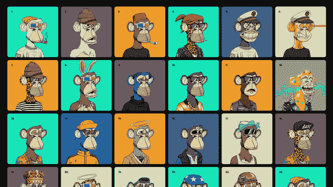

# 宇迦实验室以 100 万美元收购 MetaDads🦍

> 原文：<https://medium.com/coinmonks/yuga-labs-bayc-purchases-metadads-for-1m-79e6dd6c36d9?source=collection_archive---------40----------------------->

昨天下午晚些时候，著名的“宇迦实验室”，Bored Ape Yacht Club (BAYC) NFT 系列的创造者，Crypto Punk 和 Meebit 系列的现所有者，刚刚以 100 万美元的价格收购了这个名为“MetaDads”的小系列。

乍一看，MetaDad 系列看起来并不怎么样，甚至是 CryptoDads NFT 系列的衍生产品，但一旦你深入了解路线图、效用和未来计划，就开始明白为什么 YL 会收购这个小项目了。

MetaDads 的目标是开办他们自己的*啤酒厂*，在那里 NFT 持有者可以终身免费获得啤酒，为 NFT 赌上潜力，并永远从啤酒厂利润中分红。

MetaDads 的创造者 Ty，又名 The Dudes Crypto，在去年成为 Crypto 和 NFT 的全职员工之前，曾是一名多年的专业啤酒酿造商，现在他正带着自己对创造啤酒的热情，将其与不断发展的 Web3 世界融合在一起

关于这次 NFT 系列的收购，泰说“这真是难以置信…它改变了我的生活，而且我的宝宝即将出生，我对我的家庭的未来充满信心。我们现在可以把美国的精酿啤酒带到西班牙的贝尼多姆，为沿途的所有参与者带来丰厚的利润。”

MetaDads 也开始了他们自己的非盈利性的支持爸爸和准爸爸。泰说“我就是那个没钱付下个月房租的爸爸…我不想让其他爸爸或准爸爸为此担心…”通过这次慈善回馈，我们将确保爸爸们(和家庭)能够支付得起房租。

在 WL 因不和而关闭之前的几天里，所有的 BAYC 持有者都可以在白名单中获得优先权…

**这是什么意思？？** 这意味着宇迦实验室正在疯狂收购，买断 NFT 所有的顶级项目，从而似乎垄断了 NFT 池。当然，如果你和宇迦实验室有关系的话！！！

________________________________________________________________

**如何参与:**

# 白名单点(2 Matic ea)-https://opensea . io/assets/Matic/0x a 59 fdf 7 fa 6962d 15 e 634 f 70 ee 11517384 b 593755/1

***推特***-[https://www.twitter.com/metadadsxyz](https://www.twitter.com/metadadsxyz)
***抖音***-[https://www.tiktok.com/@thedudescrypto](https://www.tiktok.com/@thedudescrypto)
***中****-*[https://medium.com/@thedudescrypto](/@thedudescrypto)
***Spotify***-[si=4AIfAfsNS5O9tfxi9ifhmw](https://open.spotify.com/episode/2rD6VGHW7fsb0qfXFCoCzx?si=4AIfAfsNS5O9tfxi9ifhmw)

在推特上转发 500 次将获得 WL 奖。
发送给我们一个好的多边形钱包地址(METAMASK)来发送一个 WL NFT 的太💫_______________________________________________________________

**时刻小心！！！**

*这一点我怎么强调都不为过！保持高度警惕，注意你点击的每一个链接，你做的每一笔交易，以及你接触的每一个人，因为骗子在这个空间里比比皆是，最好看的项目都被取消了。*

*在点击所有链接之前，要再三检查，确保它们是你要找的官方链接。在把任何有价值的东西寄给别人之前，也要仔细检查所有的钱包地址。*

**跟随我们的加密/NFT/区块链/元宇宙之旅**

[*推特*](https://www.twitter.com/metadadsxyz)[*不和*](https://discord.gg/Cv8v2Ert8m)[*YouTube*](https://www.youtube.com/channel/UC7pbtSBs9nRJHK6coMhCR8g)[*抖音*](https://www.tiktok.com/@thedudescrypto)[*insta gram*](https://www.instagram.com/thedudescrypto/)[*Spotify 播客*](https://open.spotify.com/episode/5U8vXE9HDAsGbSbebw9p62?si=2rZIigw-Tw2pCxjxmkbYzQ)

*请支持我发送 Polygon Matic 到这个 Eth 地址，或 Eth 令牌:
0x b 53b 3978333 e 11 c 382 ab 619 f 02 f 469 A8 c 70750 af*

**愚人节！！！！这完全是一个玩笑，宇迦实验室并没有购买 MD NFT 项目…还没有；如果冒犯了你们中的任何人，我很抱歉，我只是希望在这个愚人节发布一些有趣的消息🤡**

一如既往地保持安全和警惕

干杯，
哥们儿

> 加入 Coinmonks [电报频道](https://t.me/coincodecap)和 [Youtube 频道](https://www.youtube.com/c/coinmonks/videos)了解加密交易和投资

# 另外，阅读

*   [OKEx vs KuCoin](https://coincodecap.com/okex-kucoin) | [摄氏替代品](https://coincodecap.com/celsius-alternatives) | [如何购买 VeChain](https://coincodecap.com/buy-vechain)
*   [ProfitFarmers 回顾](https://coincodecap.com/profitfarmers-review) | [如何使用 Cornix 交易机器人](https://coincodecap.com/cornix-trading-bot)
*   [如何匿名购买比特币](https://coincodecap.com/buy-bitcoin-anonymously) | [比特币现金钱包](https://coincodecap.com/bitcoin-cash-wallets)
*   [瓦济克斯 NFT 评论](https://coincodecap.com/wazirx-nft-review)|[Bitsgap vs Pionex](https://coincodecap.com/bitsgap-vs-pionex)|[Tangem 评论](https://coincodecap.com/tangem-wallet-review)
*   [如何使用 Solidity 在以太坊上创建 DApp？](https://coincodecap.com/create-a-dapp-on-ethereum-using-solidity)