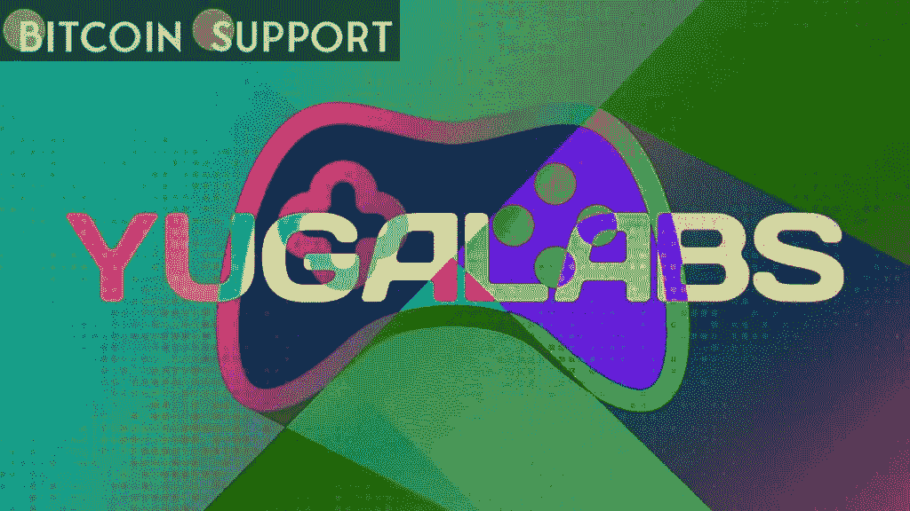

# NFT 的发明者宇迦实验室已经筹集了 4.5 亿美元，使公司估值达到 40 亿美元

> 原文：<https://medium.com/coinmonks/yuga-labs-the-inventor-of-nft-has-raised-450-million-valuing-the-company-at-4-billion-40724543c13b?source=collection_archive---------62----------------------->

**Visit our website:-** [**https://bitcoinsupports.com/**](https://bitcoinsupports.com/)

种子轮是由安德森·霍洛维茨(Andreessen Horowitz)领导的不可兑现代币市场上最大的融资协议之一。

无聊猿游艇俱乐部(BAYC)的发明者、CryptoPunks 和 Meebits 品牌的新所有者宇迦实验室表示，其最近的 4.5 亿美元种子投资轮已将其估值提高至 40 亿美元。该公司的第一笔机构投资由风险投资公司 Andreessen Horowitz(简称 a16z)牵头，这是迄今为止最大的不可伪造代币(NFT)集合种子投资之一。其他投资者包括 Animoca Brands、FTX 和 MoonPay，以及 LionTree、Sound Ventures 和 Thrive Capital。这笔钱将用于增加公司的人员，招募更多的创意，工程和运营人才，并为未来的合资企业和合作提供资金。安德森·霍洛维茨律师事务所的普通合伙人克里斯·莱昂斯将这只无聊的猿送给了 a16z，a16z 用它作为公司新的 Twitter 个人资料照片来纪念这一时刻。莱昂斯在推特上宣布，他将加入宇迦实验室的董事会，帮助“塑造文化和创新的未来”宇迦实验室的首席执行官妮可·穆尼斯也表示，鉴于猿、朋克和密比特知识产权(IP)的“新经济”，这“大有可为”宇迦实验室刚刚从幼虫实验室购买了密码朋克和 Meebits 知识产权，并打算授予 NFT 持有者完全的商业权利。据《金融时报》报道，正如之前报道的那样，宇迦实验室上个月正在为该公司数百万美元的股份寻求融资。3 月 18 日，宇迦实验室宣布了一个名为 Otherside 的新元宇宙项目，而该公司可能在周二证实了其种子轮融资。

[https://twitter.com/yugalabs/status/1505014986556551172](https://twitter.com/yugalabs/status/1505014986556551172)

随着他们未来市场的新加密货币代币 ApeCoin 的首次交易，另一边元宇宙宣布成立。ApeCoin 分散自治组织(DAO)生产并推出了这款资产，它在上市的头几个小时里出现了巨大的波动，影响了 BAYC、突变猿游艇俱乐部和无聊猿养狗俱乐部系列的平均价格。

**访问我们的网站:-【https://bitcoinsupports.com/】**

****免责声明:以上为作者观点，不应视为投资建议。读者应该自己做研究。****

> **加入 Coinmonks [电报频道](https://t.me/coincodecap)和 [Youtube 频道](https://www.youtube.com/c/coinmonks/videos)了解加密交易和投资**

# **另外，阅读**

*   **[SmithBot 评论](https://coincodecap.com/smithbot-review) | [4 款最佳免费开源交易机器人](https://coincodecap.com/free-open-source-trading-bots)**
*   **[杠杆令牌](/coinmonks/leveraged-token-3f5257808b22) | [最佳密码交易所](/coinmonks/crypto-exchange-dd2f9d6f3769) | [Paxful 点评](/coinmonks/paxful-review-4daf2354ab70)**
*   **[加密套利](/coinmonks/crypto-arbitrage-guide-how-to-make-money-as-a-beginner-62bfe5c868f6)指南| [如何做空比特币](/coinmonks/how-to-short-bitcoin-568a2d0b4ae5)**
*   **[币安期货交易](https://coincodecap.com/binance-futures-trading)|[3 comas vs Mudrex vs eToro](https://coincodecap.com/mudrex-3commas-etoro)**
*   **[如何购买 Monero](https://coincodecap.com/buy-monero) | [IDEX 评论](https://coincodecap.com/idex-review) | [BitKan 交易机器人](https://coincodecap.com/bitkan-trading-bot)**