# 美味赌注教程:合同

> 原文：<https://medium.com/coinmonks/yummy-staking-tutorial-contracts-3bd02719efb8?source=collection_archive---------10----------------------->

通过使用所谓的“智能合同”, DeFi 上的标桩平台成为可能。“智能合同基本上是两个人之间以计算机代码形式达成的协议。它们在区块链上运行，因此存储在公共数据库中，不能更改。一旦创建者编写并部署了智能合约，就不能再更改其功能。

智能合约中发生的交易由区块链处理，这意味着它们可以在没有第三方的情况下自动发送。

在本教程中，我们将经历一个从部署到结束的生命周期。我们还将解释一些可以使用的最重要的功能。

*   入门指南
*   寻找赌注合同
*   检查部署
*   检查所有权
*   检查奖励分配
*   读取合同信息
*   使用契约函数。
*   紧急撤离
*   到期日期已到

**🔸入门指南🔸**

你可以点击这个[链接](http://staking.yummy-crypto.com/)直接进入我们的赌注平台。

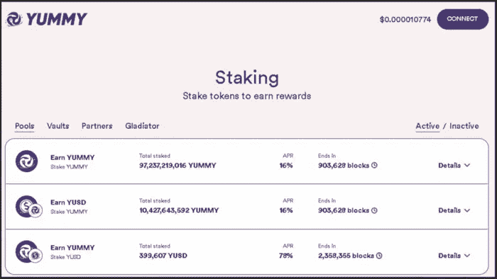

**🔸寻找赌注合同🔸**

许多跑马圈地平台不为用户提供查看跑马圈地合同的直接可能性。要找到未链接到定标平台的定标合同，您需要使用[bscscan.com](http://bscscan.com/)并手动找到定标合同。

为了用户友好，Yummy 直接在平台上添加了所有的跑马圈地合同链接。要查看合同，只需打开您想要探索的游泳池。对于本教程，我们将采取一个不活跃的 YD-YUMMY 赌注合同。

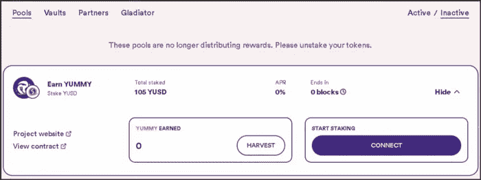

扩展池后，您将看到一个指向标桩合同的直接链接。

注意:如果一个平台不提供一个直接链接到赌注合同去 bscscan.com，并找到一个与合同互动的 TX。例如“存款”TX。

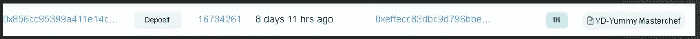

与之交互的契约是标桩契约。

**🔸检查部署🔸**

通过点击“查看合同”，您将直接进入合同的[bscscan.com](http://bscscan.com/)页面。

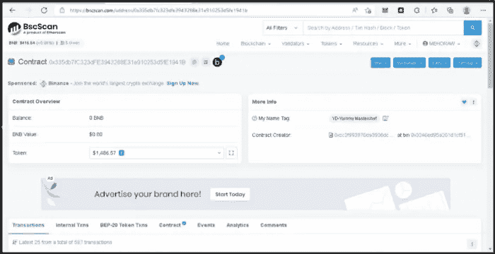

从这个页面你基本上可以使用合同中的大部分功能。要查看何时或由何人创建了定标合同，请转到“内部事务”选项卡。

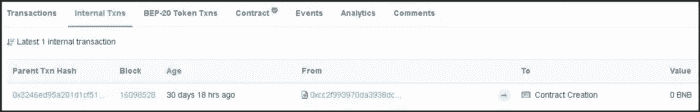

在这个例子中，YD-YUMMY 合同是在 29 天前创建的。要查看此合同部署的详细信息，请单击“”父事务哈希。''

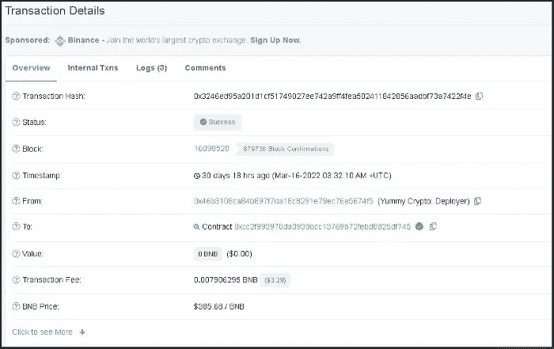

正如你在上面看到的，合同是由“Yummy Crypto: Deployer”创建的。''

**🔸检查所有权🔸**

部署后，合同的所有权必须转移。这可以在“”日志中看到。“但这也可以在赌注合同”交易中看到。''

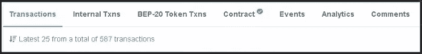

从这里转到交易的最后一页。第一个交易是“所有权转移”TX。

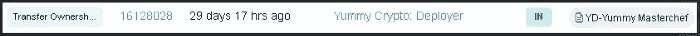

**🔸检查奖励分配🔸**

要查看所有者设置每块奖励的 TX，请在“交易”选项卡中搜索显示“设置每块奖励”的 TX。''

打开发送详细信息后，单击“日志”选项卡。

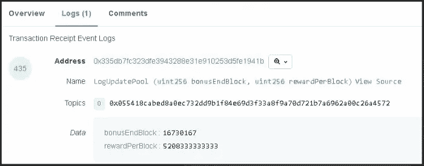

在这里你可以找到每块的奖励。如本例所示，它被设置为 520833333333。Yummy 的编码中有 9 位小数，使得奖励的实际数量为 5283333333 YUMMY/块。

**🔸读取合同信息🔸**

您可以使用 bscscan.com 的[直接与智能合约交互并使用其功能。要查看合同，请转到“合同”选项卡。](http://bscscan.com/)

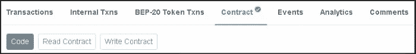

在这个页面上，您可以查看完整的代码，阅读合同，并编写合同功能。

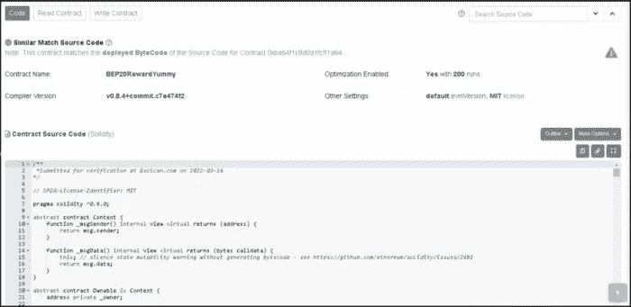

在本教程中，我们不会深入研究代码，但让我们来看看一些合同信息。单击“阅读合同”按钮继续。

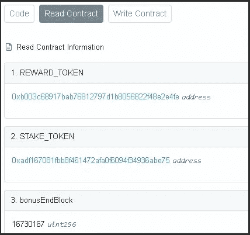

在这里你可以看到“奖励令牌”，在这种情况下美味。YUSD 的“STAKE_TOKEN”。“bonusEndBlock”将显示合同的结束块。要查看这是什么时候，只需复制并粘贴到[bscscan.com](http://bscscan.com/)的搜索栏中。

您还可以看到合同所有人，在本例中，他们是 Yummy V2 合同和所有其他打桩合同的所有人。这个钱包的钥匙由 Yummy 的 CEO 保管。

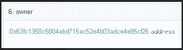

这里也可以看到回报。如果所有者使用“设置每块奖励”功能，它们将得到更新。

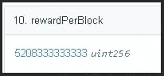

请记住，该值再次包括 9 位小数，因此在这种情况下，528.33333333 美味/块。

开始块也可以在这里找到，再次简单地复制并粘贴到[bscscan.com](http://bscscan.com/)搜索栏接收准确的时间。

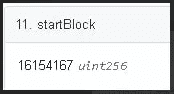

**🔸使用合同功能🔸**

如前所述，您可以通过[bscscan.com](http://bscscan.com/)直接与智能合约互动。要使用合同的功能，请转到“编写合同”选项卡。点击“连接到 Web3”将您的 DeFi 钱包连接到[bscscan.com](http://bscscan.com/)。

当您单击“连接到 Web3”时，您需要在 DeFi wallet 中批准该操作。

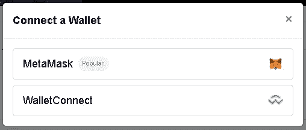

成功连接后，红点将变为绿色。现在，您可以编写智能合约函数。

**🔸紧急撤离🔸**

我们不会详细讨论所有功能，但让我们来看看一个非常重要的功能，叫做“紧急撤回”。''

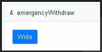

此功能旨在从赌注池、金库或场提取全部赌注金额。在黑客攻击、利用或简单的来自开发人员的诈骗企图的情况下，用户可以使用该功能来提取他的本金，即使赌注网站离线。如前所述连接 DeFi 钱包，并在此功能中点击“写入”。需要在 DeFi 钱包中获得批准，但如果成功，所有下注金额将被撤回到用户的钱包中。

在 Yummy，我们总是建议在你开始使用赌注合同时测试紧急撤回。这种方法几乎可以在所有平台上使用。

请记住，不是每个桩合同都有这个功能。没有紧急撤回的桩合同被广泛认为是不安全的，应该避免使用。

**🔸已达到退出日期🔸**

当赌注平台到达终点时，它会停止奖励代币。在大多数平台上，池移动到“非活动/已完成/已结束”选项卡。在这一点上，用户唯一能做的就是提取他的本金并(自动)获得奖励。

“锁定合同”教程到此结束。所描述的所有方法基本上都适用于所有标桩合同。我们建议每一个使用 staking 平台的用户在存款前做好自己的研究，并仔细查看合同。

我们的赌注合同非常接近 ApeSwap 的合同。ApeSwap 因拥有 BSC 中最安全的赌注平台之一而闻名。

如果您在使用我们的赌注平台时遇到任何问题，请随时在官方[电报](https://t.me/yummyfinance)聊天中联系我们。我们 Yummy 的宗旨是教育和安全。如果您对与 Yummy 无关的其他合同有任何问题，您也可以联系我们，我们将乐意以任何可能的方式提供帮助👍

敬请关注更多教程！

最好的，

美味团队！

> *加入 Coinmonks* [*电报频道*](https://t.me/coincodecap) *和* [*Youtube 频道*](https://www.youtube.com/c/coinmonks/videos) *了解加密交易和投资*

# 另外，阅读

*   [3 商业评论](/coinmonks/3commas-review-an-excellent-crypto-trading-bot-2020-1313a58bec92) | [Pionex 评论](https://coincodecap.com/pionex-review-exchange-with-crypto-trading-bot) | [Coinrule 评论](/coinmonks/coinrule-review-2021-a-beginner-friendly-crypto-trading-bot-daf0504848ba)
*   [莱杰 vs Ngrave](/coinmonks/ledger-vs-ngrave-zero-7e40f0c1d694) | [莱杰 nano s vs x](/coinmonks/ledger-nano-s-vs-x-battery-hardware-price-storage-59a6663fe3b0) | [币安评论](/coinmonks/binance-review-ee10d3bf3b6e)
*   [Bybit Exchange 评论](/coinmonks/bybit-exchange-review-dbd570019b71) | [Bityard 评论](https://coincodecap.com/bityard-reivew) | [Jet-Bot 评论](https://coincodecap.com/jet-bot-review)
*   [3 commas vs crypto hopper](/coinmonks/3commas-vs-pionex-vs-cryptohopper-best-crypto-bot-6a98d2baa203)|[赚取加密利息](/coinmonks/earn-crypto-interest-b10b810fdda3)
*   最好的比特币[硬件钱包](/coinmonks/hardware-wallets-dfa1211730c6) | [BitBox02 回顾](/coinmonks/bitbox02-review-your-swiss-bitcoin-hardware-wallet-c36c88fff29)