# Yummy 教程:购买 Yummy/YUSD/NFT

> 原文：<https://medium.com/coinmonks/yummy-tutorials-buying-yummy-yusd-nfts-5f58b402e50a?source=collection_archive---------25----------------------->

亲爱的美味社区:

这是我们的荣幸带给你这个教程。我们将详细介绍如何购买 Yummy、YUSD 和 YummyDog NFTs。快乐阅读！

*   创建钱包
*   获得 BEP20 代币
*   买好吃的
*   购买 YUSD
*   购买 NFT

**🔸创建钱包🔸**

要开始使用 Yummy，首先你需要设置一个支持 BNB 链的钱包。

设置钱包时，请仔细遵循指南，并安全备份您的恢复(种子)短语。确保你在纸上写下你的种子短语，不要用手机拍截图！同样，在任何情况下，你都不应该给别人你的私人密钥或恢复短语。没有人会问你要短语，即使是钱包支持。

我们推荐以下钱包，便于安装和使用:

[meta mask](https://metamask.io/download/)→[Guide](https://academy.binance.com/en/articles/connecting-metamask-to-binance-smart-chain)
[trust wallet](https://trustwallet.com/)→[Guide](https://www.binance.com/en/blog/ecosystem/how-to-set-up-and-use-trust-wallet-for-binance-smart-chain-421499824684901157)

**🔸获得 BEP20 代币🔸**

BNB 锁链的原生令牌在 **BEP20** 上。

对于 BNB 链上的大多数行动，你将需要支付天然气，其形式为 BEP20 BNB。

你还需要 BEP20 版本的任何你想在 BNB 链上交易、下注等的代币。

要获得 BEP20 代币，我们推荐以下方式:

[**Binance.com**](https://www.binance.com)—您可以通过您的币安账户(如果您有)以 BEP20 的形式提取代币。请记住，您需要一个帐户才能这样做。

这是他们为帮助你而制作的快速指南。

您也可以从大多数其他集中交易所提取 BEP20 代币。

**🔸买好吃的🔸**

要购买美味的代币，你首先需要在 BEP20 网络上发送 BNB 到你的 DeFi 钱包。

让我们先通过单击“导入令牌”(元掩码)或“添加令牌”(信任钱包)，将 Yummy 令牌添加到钱包中。粘贴合同地址时，令牌符号(YUMMY)和小数(9)会自动填充。

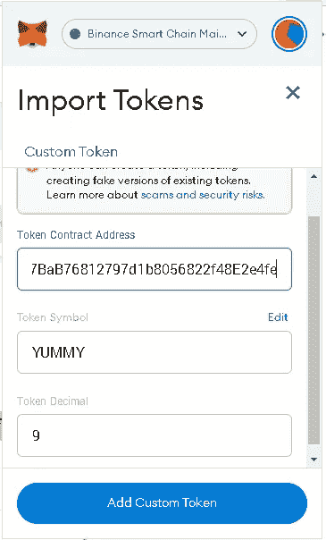

Yummy 令牌合约是 0xb 003 c 68917 Bab 76812797 D1 b 8056822 f 48 e 2e 4 Fe

在 DeFi 上购买 Yummy 的几种选择:

[PancakeSwap](https://pancakeswap.finance/swap#/swap?outputCurrency=0xB003C68917BaB76812797d1b8056822f48E2e4fe)
SokuSwapT5[安吉科](https://anjiswap.com/bsc?inputToken=0xbb4CdB9CBd36B01bD1cBaEBF2De08d9173bc095c&outputToken=0xb003c68917bab76812797d1b8056822f48e2e4fe)

方法总是相同的:

**1。连接钱包**

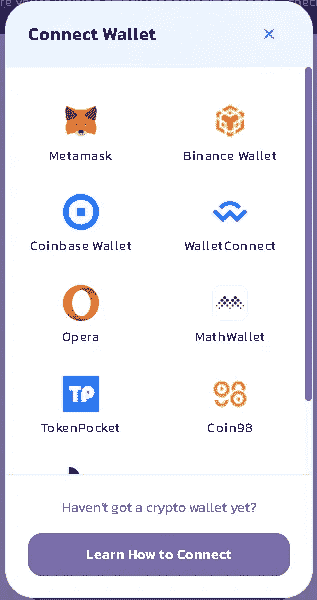

选择您正在使用的钱包，对于 TrustWallet，大多数情况下按“”WalletConnect。''

**2。选择令牌**

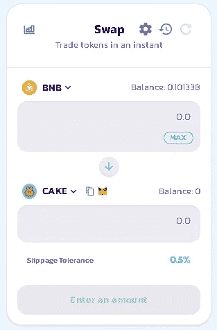

最常见的互换是 BNB 或 BUSD 美味。选择顶部的 BNB 和底部的美味。

在 [PancakeSwap](https://pancakeswap.finance/swap#/swap?outputCurrency=0xB003C68917BaB76812797d1b8056822f48E2e4fe) 上需要手动添加 Yummy 合同:0xb 003 c 68917 Bab 76812797 D1 b 8056822 f 48 e 2e 4 Fe 找到后选择。

请记住，在 [SokuSwap](https://app.sokuswap.finance/bsc/#/swap) 和[anjico](https://anjiswap.com/bsc?inputToken=0xbb4CdB9CBd36B01bD1cBaEBF2De08d9173bc095c&outputToken=0xb003c68917bab76812797d1b8056822f48e2e4fe)上，您可以选择上面列出的美味。

**3。设定滑动量**

当你选择了输入和输出令牌，你需要设置滑动。为此，请按 swap 上的设置按钮。

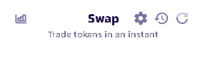

The gear wheel is the settings button

您可以在滑动部分设置滑动。

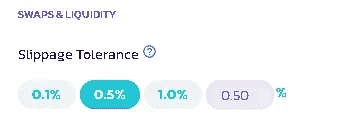

Yummy 的滑点为 11-12%，这意味着 9%的象征性税收和约 2-3%的价格波动容限。这在特定的时刻和情绪下会有所不同。

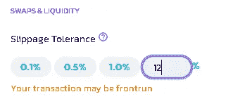

出现“您的交易可能是提前完成的”的文本，但这是正常的，您可以继续进行。

**4。输入金额**

设置滑动量后，您可以输入所需的量。

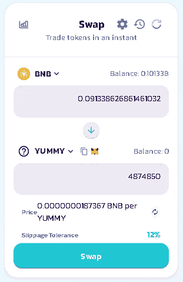

完成后，按“交换”。''这将弹出一个新窗口。

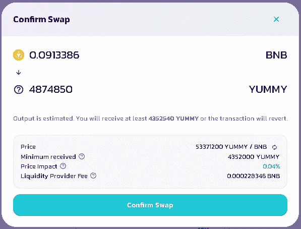

当您按下“确认交换”时，您的 DeFi wallet 将需要获得批准。要继续，请按“”确认。''

当你这样做了，交换成功了，你就会看到你钱包里的美味。

**🔸购买 YUSD🔸**

目前有 2 种方式购买 YUSD。一种是通过与 BUSD 在 [PancakeSwap](https://pancakeswap.finance/swap#/swap?outputCurrency=0xB003C68917BaB76812797d1b8056822f48E2e4fe) 上的常规互换，另一种方式是直接从我们的赌注平台上的合约中购买。

这里的区别在于，当你在 PancakeSwap 上买入时，你基本上是在掉期的流动性池中交易。这意味着如果 YUSD 没有完全固定在 1 美元，你可能会多付或少付每 YUSD。尤其是在 YUSD 生命周期的早期，流动性有点低，因此较大的买入/卖出会产生较高的价格影响，这可能会带来不便。但这也是双向的，所以如果你想购买少量的 YUSD，那么 PancakeSwap 实际上可能会比从合约中购买更有优势。

要购买美味的代币，你首先需要在 BEP20 网络上发送 BNB 到你的 DeFi 钱包。

首先通过单击“导入令牌”(元掩码)或“添加令牌”(信任钱包)，将 YUSD 添加到 wallet 中。粘贴合同地址时，令牌符号(YUSD)和小数(18)会自动填充。

YUSD 合同是 0x ADF 167081 fbb 8 f 461472 AFA 0 f 6094 f 34936 Abe 75

我们将首先讨论 [PancakeSwap](https://pancakeswap.finance/swap#/swap?outputCurrency=0xB003C68917BaB76812797d1b8056822f48E2e4fe) 的购买方法。

**1。连接钱包**

选择您正在使用的钱包，对于 TrustWallet，大多数情况下按“”WalletConnect。''

**2。选择代币**

购买 YUSD 所需的互换是 BUSD → YUSD。在顶部选择 BUSD，在底部选择 YUSD。

在 PancakeSwap 上你需要手动添加 YUSD 契约:0x ADF 167081 fbb 8 f 461472 AFA 0 f 6094 f 34936 Abe 75 找到后选中它。

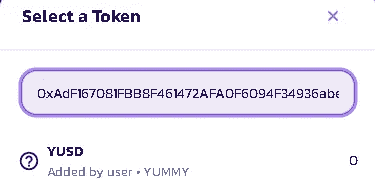

**3。输入金额**

设置滑动量后，您可以输入所需的量。

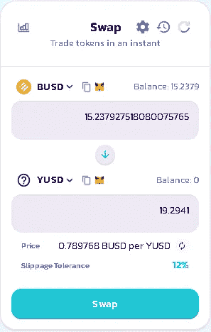

完成后，按“交换”。''这将弹出一个新窗口。

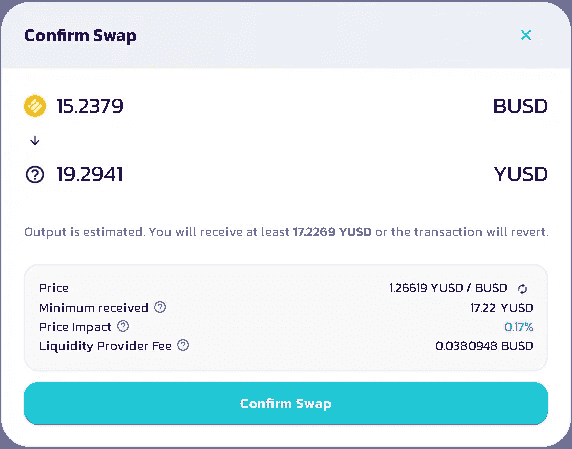

当您按下“确认交换”时，您的 DeFi wallet 将需要获得批准。要继续，请按“”确认。''

当你这样做了，交换是成功的，你会看到你的钱包里的 YUSD。

要直接从合同中购买 YUSD，请访问我们的[赌注平台](https://www.staking.yummy-crypto.com/)。

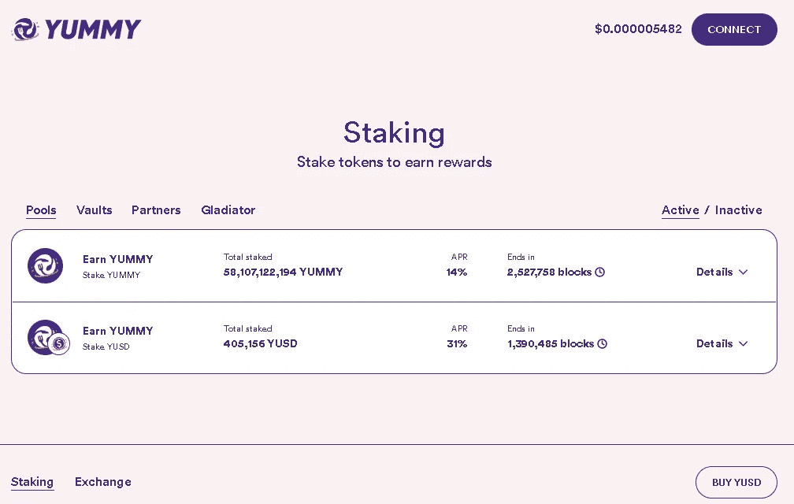

**1。连接钱包**

要开始下注，请先使用页面右上角的“连接”按钮连接您的 BSC DeFi wallet。

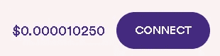

按下后，会弹出一个窗口，提供连接 MetaMask 或 WalletConnect 的选项。

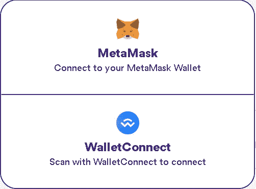

点击首选连接方式后，您需要在钱包(MetaMask/TrustWallet)中批准该操作。当您成功连接到网站时，您的钱包将显示在屏幕顶部。

**2。去交易所**

在页面的右下角，你可以看到一个“购买 YUSD”按钮。

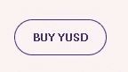

点击这个按钮，它将引导您到我们自己的交换。在这里，你可以随时以 1 美元的价格将 BUSD 换成 YUSD，而不会对价格产生任何影响！

您需要先按下“批准”按钮，并在您的 DeFi 钱包中进行确认。这将授权平台访问您的 BUSD 以进行交换。

**3。输入金额**

成功批准后，您可以将任何给定金额兑换成 YUSD。

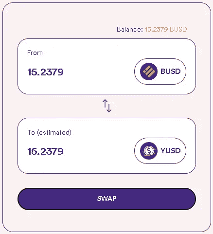

如您所见，比率为 1:1，现在可以使用“交换”按钮。当您按“交换”时，您的 DeFi 钱包内将需要一个批准。要继续，请按“确认”。

当你这样做了，交换是成功的，你会看到你的钱包里的 YUSD。

**🔸购买 NFT🔸**

要购买 YummyDog NFTs，在我们的 staking 平台上为用户提供额外的 APR 提升，请访问我们在 [Lootex](https://lootex.io/stores/yummy-dog-nft) 上的商店。

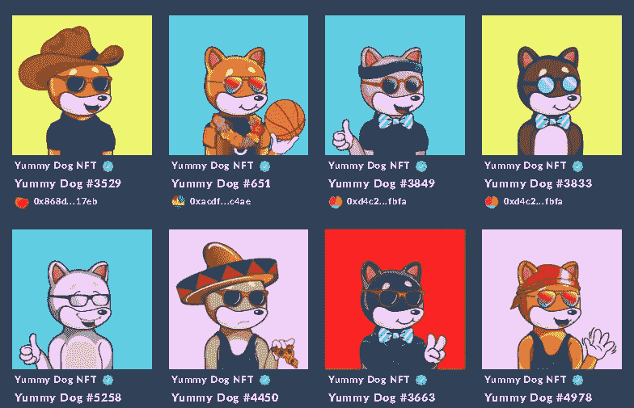

在这里，你可以找到由所有者和/或 Yummy 团队列出来出售的各种 NFT。截至 2022 年 5 月，直接从 Yummy 团队购买时，每 NFT 的价格为 0.6 BNB。总共铸造了 10，000 枚 NFT，不能铸造额外的 NFT。

首先通过单击“导入令牌”(元掩码)或“添加令牌”(信任钱包)，将 YummyDog NFT 添加到您的钱包中。粘贴合同地址时，令牌符号(YUMMYDOG)会自动填充，您需要手动填充小数(0)。

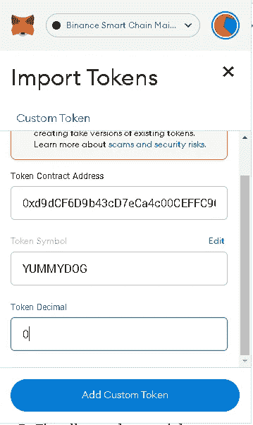

YummyDog NFT 合同是 0x d 9 DCF 6d 9 b 43 CD 7 ECA 4c 00 cef fc 965 fcd 4405 c 787

**1。连接钱包**

若要购买 NFT，请前往我们的[商店](https://lootex.io/stores/yummy-dog-nft)并在右上方连接您的 DeFi 钱包。

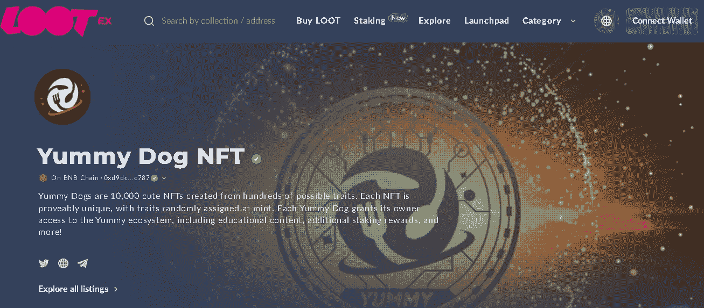

选择您正在使用的钱包，然后单击“完成”。''

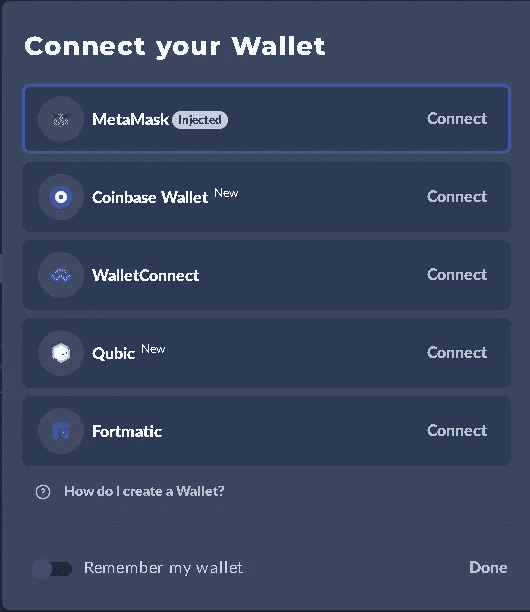

**2。选择一个 NFT**

找到一个您想出价购买的 NFT，然后选择它。

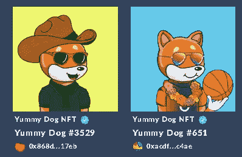

**3。下单报价**

点击页面上的“出价”按钮。

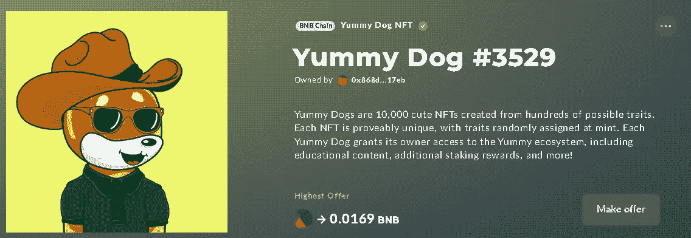

将弹出一个新窗口，其中有一个“批准并签名”选项。''

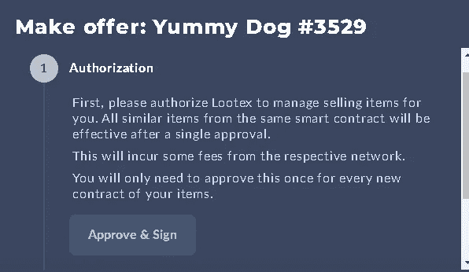

在此之后，您的 DeFi 钱包将需要批准。当你这样做了，你就可以为 NFT 报价了。

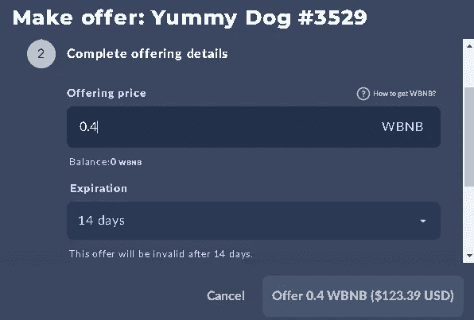

您可以在 WBNB 中下单，并选择 1-90 天的“到期日”。当您选择好价格和有效期后，点击“优惠”按钮发送。在此(签名)之后，需要 DeFi 钱包中的另一个批准。如果成功，您将收到通知，告知要约已发送。

如果卖家接受你的出价，WBNB 会从你的钱包中扣除，NFT 会寄给你。

**4。直接购买(无报价)**

也有直接以挂牌价购买的可能。若要显示所有刊登价格和购买选项，请按「浏览所有刊登物品」按钮。

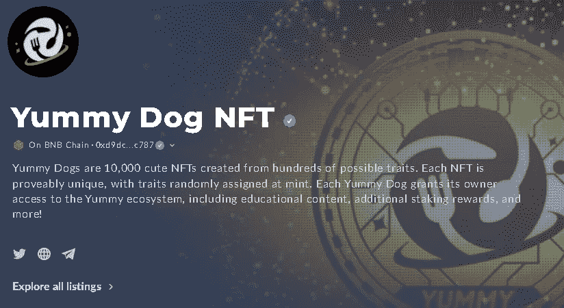

在这里你可以看到完整的列表价格，有一个“购买”按钮可以直接购买。

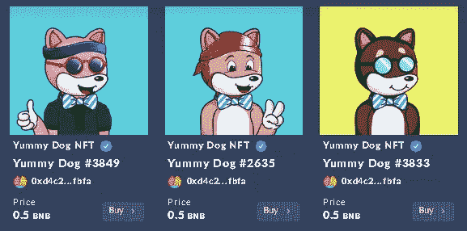

点击“购买”后，会弹出一个新窗口。

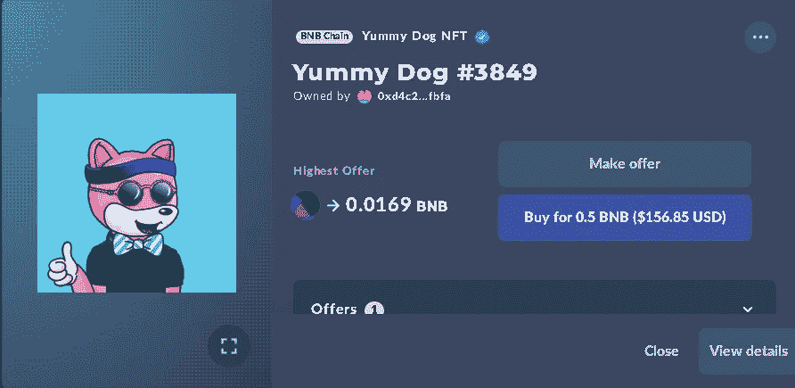

在这里，你可以再次出价或直接购买，在这种情况下为 0.5 BNB。如果您想购买，请点击“为 xxx BNB 购买”并再次在您的 Defi 钱包中批准交易。如果成功，NFT 将直接发送到你的钱包。

注意:直接购买需要 BNB，下单需要 WBNB。

Yummy/YUSD/NFT 购买教程到此结束。

如果您在使用所述交换或购买时遇到任何问题，请随时在官方[电报](https://t.me/yummyfinance)聊天中联系我们。我们 Yummy 的宗旨是教育和安全。如果您有与购买 Yummy/YUSD/NFT 无关的其他问题，您也可以联系我们，我们将乐意以任何可能的方式提供帮助👍

敬请关注更多教程！

最好的，

美味团队！

> 加入 Coinmonks [电报频道](https://t.me/coincodecap)和 [Youtube 频道](https://www.youtube.com/c/coinmonks/videos)了解加密交易和投资

# 另外，阅读

*   [最佳加密交易信号电报](/coinmonks/best-crypto-signals-telegram-5785cdbc4b2b) | [MoonXBT 评论](/coinmonks/moonxbt-review-6e4ab26d037)
*   [如何在 Bitbns 上购买柴犬(SHIB)币？](https://coincodecap.com/buy-shiba-bitbns) | [购买弗洛基](https://coincodecap.com/buy-floki-inu-token)
*   [CoinFLEX 评论](https://coincodecap.com/coinflex-review) | [AEX 交易所评论](https://coincodecap.com/aex-exchange-review) | [UPbit 评论](https://coincodecap.com/upbit-review)
*   [十大最佳加密货币博客](https://coincodecap.com/best-cryptocurrency-blogs) | [YouHodler 评论](https://coincodecap.com/youhodler-review)
*   [AscendEx 保证金交易](https://coincodecap.com/ascendex-margin-trading) | [Bitfinex 赌注](https://coincodecap.com/bitfinex-staking)
*   [最好的卡达诺钱包](https://coincodecap.com/best-cardano-wallets) | [冰棒副本交易](https://coincodecap.com/bingbon-copy-trading)
*   [印度最佳 P2P 加密交易所](https://coincodecap.com/p2p-crypto-exchanges-in-india) | [柴犬钱包](https://coincodecap.com/baby-shiba-inu-wallets)