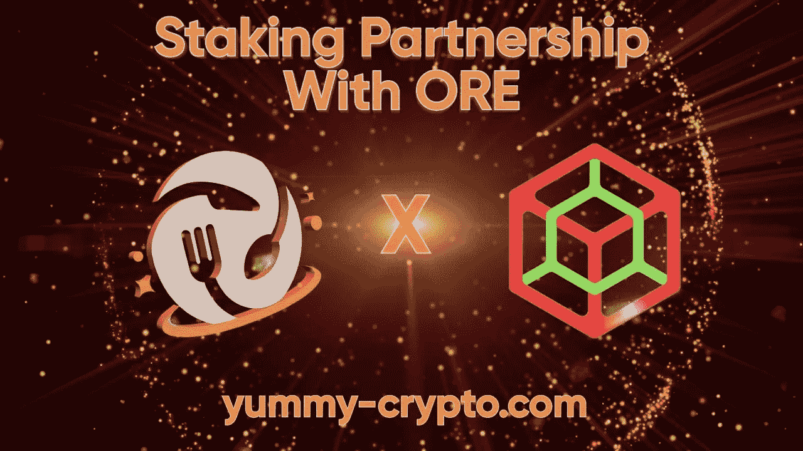
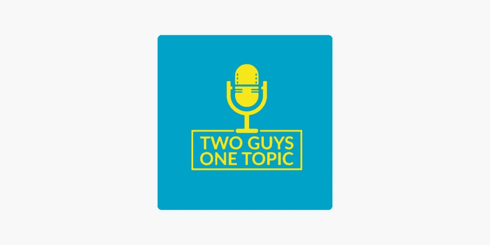
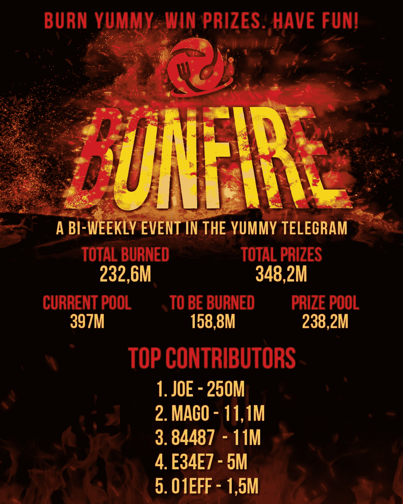

# 美味更新— 02

> 原文：<https://medium.com/coinmonks/yummy-update-02-6e10ca96dedd?source=collection_archive---------17----------------------->

亲爱的社区:

我们很高兴再次在这里见到你！让我们带给你最新最棒的美味。

此版本:

*   新闻更新
*   YUSD 公告
*   与 ORE 建立合作伙伴关系
*   播客公告
*   美味赌注教程
*   煤渣优先信息
*   美味的统计
*   YUSD 统计
*   打桩平台统计
*   增长基金统计
*   第三届篝火活动结果
*   第 26 周烧伤
*   第 27 周烧伤

🔸新闻更新🔸

我们希望每个参加庆祝的人都有一个愉快的复活节假期！

自从上次更新以来，我们已经开始了新的赌注合作伙伴关系，并确保了下一个。

首席执行官乔·富特(Joe Foot)出现在一家风投公司，谈到了“煤渣项目”。''

引入了一个临时的 Yummy 到 YUSD 的交换选项。不久前录制的乔·富特的播客终于上传了。

还举行了另一个篝火活动和 2 次每周燃烧🔥

加密市场总体上已经出现了一些重大的下跌和熊市信号。在社交平台上，提到另一个加密冬天更为常见。久而久之通过我们的成长基金获得了巨大的收益，它在后台工作，给了我们现在最有价值的东西，那就是时间！

Yummy 团队不害怕熊市信号，与此同时，我们将继续努力实现接下来的所有重大举措👍🏼👍🏼

🔸YUSD 公告🔸

在非常有限的时间内，最高限额为 150，000 美元，我们将提供 YUSD 到 Yummy 的转换(收取 9%的费用)，这意味着您可以用 Yummy 购买 YUSD，而无需 BUSD 或 BNB。

这是一个非常有限的时间或直到达到 150，000 美元。

详情 DM @MehoRaw。

🔸与 ORE 建立合作伙伴关系🔸

我们非常荣幸地宣布我们的第一个合作伙伴！🤝🏼🤝🏼

矿石系统！

请看一下[官方公告的文章](/@YummyCrypto/staking-partner-announcement-ore-system-afd1138961e2)。

🔸播客公告🔸

我们的首席执行官乔·富特出现在“两个人一个话题”播客上。讨论的主题是 NFT 的，一般加密和乔的背景。

点击[上的链接](https://podcasts.apple.com/us/podcast/topic-expert-interview-nfts-ceo-of-yummy-crypto-joe-foot/id1562353750?i=1000558333532)获取播客。

🔸美味赌注教程🔸

我们已经出版了另一个赌注教程，叫做“赌注合同”。“本教程深入探讨了打桩合同的生命周期和功能。这篇文章得到了非常积极的回应，并吸引了媒体上的[同人](https://medium.com/coinmonks)。我们现在被允许在他们的页面上发布👍🏼👍🏼

这里是赌注教程[文章](/coinmonks/yummy-staking-tutorial-contracts-3bd02719efb8)的直接链接。

🔸煤渣优先信息🔸

4 月 27-22 日，乔·富特在美味 TG 房间举行了一次电话会议，分享了关于煤渣的第一手信息。他透露了 Cinder 如何涉及其他项目的排水/恢复/迁移。这个想法是用他们的 LP 基金来增加我们的增长基金。

煤渣的阶段是:

1)余烬
2)点火
3)火焰
4)地狱

余烬涉及其他项目 LP 的流失。那些项目不是死了就是被放弃了。另一个项目如何合并到 Cinder 中也有几个阶段，例如在 Cinder Token 下完全吸收或所谓的“软合并”，这意味着与 Cinder 建立某种形式的合作关系，但该项目仍然有自己的路线图和商业模式。

总体想法是大规模增加增长基金。

完整的 VC 录制好了，可以在我们 TG 的房间里重新听，请查看！

一篇煤渣专用文章也在计划中，敬请期待！

🔸美味的统计🔸

价格:0.000008003 美元

总供应量:4.059 亿

流通供应量:364725754612

市值:291.89 万美元

燃烧总量:594，098，090，230

🔸YUSD 统计🔸

价格:1 美元

总供应量:75 万

流通供应量:419662

市值:75 万美元

🔸打桩平台统计🔸

**赌注:**
美味-美味总赌注:66133302765 美味

Yummy-YUSD 总赌注:9，009，671，756 Yummy

YUSD-Yummy 总赌注:404，341 YUSD

**金库:**
好吃好吃 90 天总赌注:92，082，657，207 好吃

**合作伙伴:** Yummy-矿石总赌注:32,832,611,227 Yummy

**总赌注:**
200058242955 Yummy

404，341 美元

TVL:200.5407 万美元

🔸增长基金统计🔸

净资产:1257443.57 美元

回购总额:**【407，986.98 美元**

**🔸第三届篝火活动结果🔸**

**第三届篝火晚会于 2022 年 4 月 29 日举行，结果如下:**

****

**这一轮的获胜者是:
0 xe3d 84469 aee 59d 28 e 7 fc 4b 9 c 261731 bb 16039 c 31**

**谁将获得 238，200，000 个美味的代币作为奖励！**

**祝贺获胜者🤝🤝**

**🔸第 26 周烧伤🔸**

**🔥我们的每周燃烧现在完成了！**

**1，405，042，664 Yummy 现在已经一去不复返了(目前价格约为 15，000 美元)🔥🔥**

**资金来源是灭霸一如既往地踢屁股👍🏼**

**这是我们第 26 次每周燃烧👍🏼**

**灭霸和 V2 在短短的 200 天内就烧掉了 100.5 万美元，相当于每天 931 亿或 4.65 亿代币！**

**本周 TX 燃:
https://bscscan . com/TX/0 xef 02 f 0143 DC 80 c 0d 0 de 5021077991456 b 842 a 2d 189131311 C1 e67 f 6797317111**

**🔸第 27 周烧伤🔸**

**🔥我们的每周燃烧现在完成了！**

**955，523，282 Yummy 现在已经一去不复返了(目前的价格大约是 9，000 美元)🔥🔥**

**资金来源是灭霸一如既往地踢屁股**

**这是我们第 27 次每周燃烧👍**

**灭霸和 V2 在短短的 207 天内就烧掉了 93.5 万美元，相当于每天 941 亿或 4.54 亿代币！**

**TX 本周燃:
[https://bscscan . com/TX/0x 14639 e 14 D8 e 96465202341 c8 CDA 910475249 f 44 be 4094 f 36 fcd fc C1 b 8 FB 058d 78](https://bscscan.com/tx/0x14639e14d8e96465202341c8cda910475249f44be4094f36fcdfc1b8fb058d78)**

**我们的更新到此结束。我们祝大家周末愉快，请继续关注更多内容👍🏼👍🏼**

**最好的，**

**美味团队**

> **加入 Coinmonks [电报频道](https://t.me/coincodecap)和 [Youtube 频道](https://www.youtube.com/c/coinmonks/videos)了解加密交易和投资**

# **另外，阅读**

*   **[5 款最佳加密交易终端](https://coincodecap.com/crypto-trading-terminals) | [最佳 DeFi 应用](https://coincodecap.com/best-defi-apps)**
*   **[比特币基地 vs 瓦济克斯](https://coincodecap.com/coinbase-vs-wazirx) | [比特鲁点评](https://coincodecap.com/bitrue-review) | [波洛涅克斯 vs 比特鲁](https://coincodecap.com/poloniex-vs-bittrex)**
*   **[德国最佳加密交易所](https://coincodecap.com/crypto-exchanges-in-germany) | [Arbitrum:第二层解决方案](https://coincodecap.com/arbitrum)**
*   **[币安交易机器人](/coinmonks/binance-trading-bots-d0d57bb62c4c) | [OKEx 评论](/coinmonks/okex-review-6b369304110f) | [阿塔尼评论](https://coincodecap.com/atani-review)**
*   **[最佳加密交易信号电报](/coinmonks/best-crypto-signals-telegram-5785cdbc4b2b) | [MoonXBT 评论](/coinmonks/moonxbt-review-6e4ab26d037)**
*   **[如何在 Bitbns 上购买柴犬(SHIB)币？](https://coincodecap.com/buy-shiba-bitbns) | [买弗洛基](https://coincodecap.com/buy-floki-inu-token)**