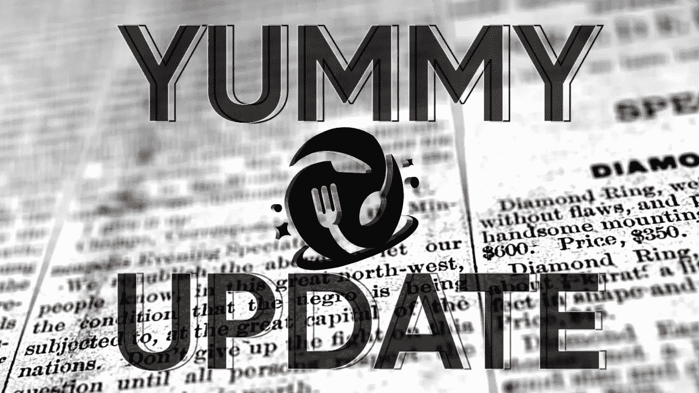
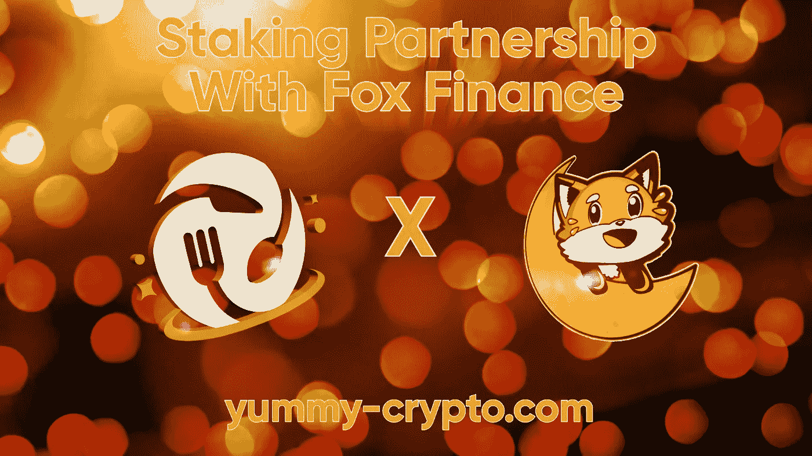
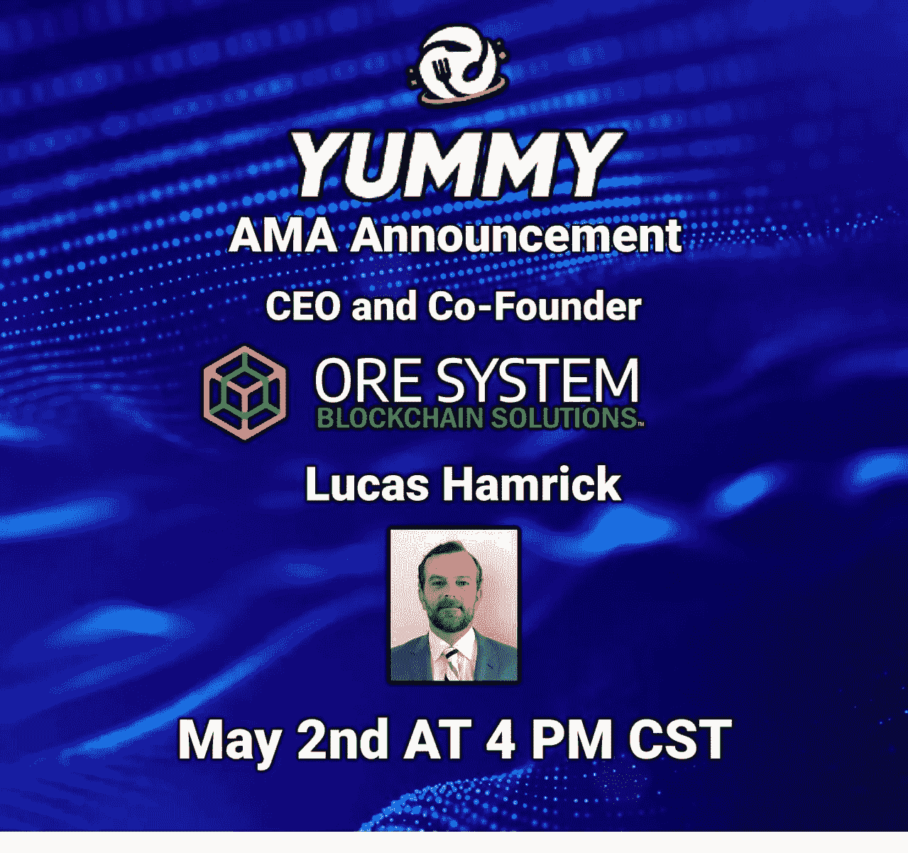
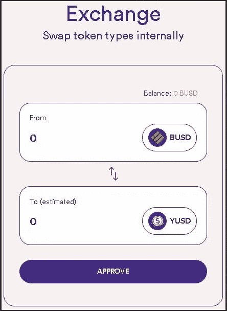
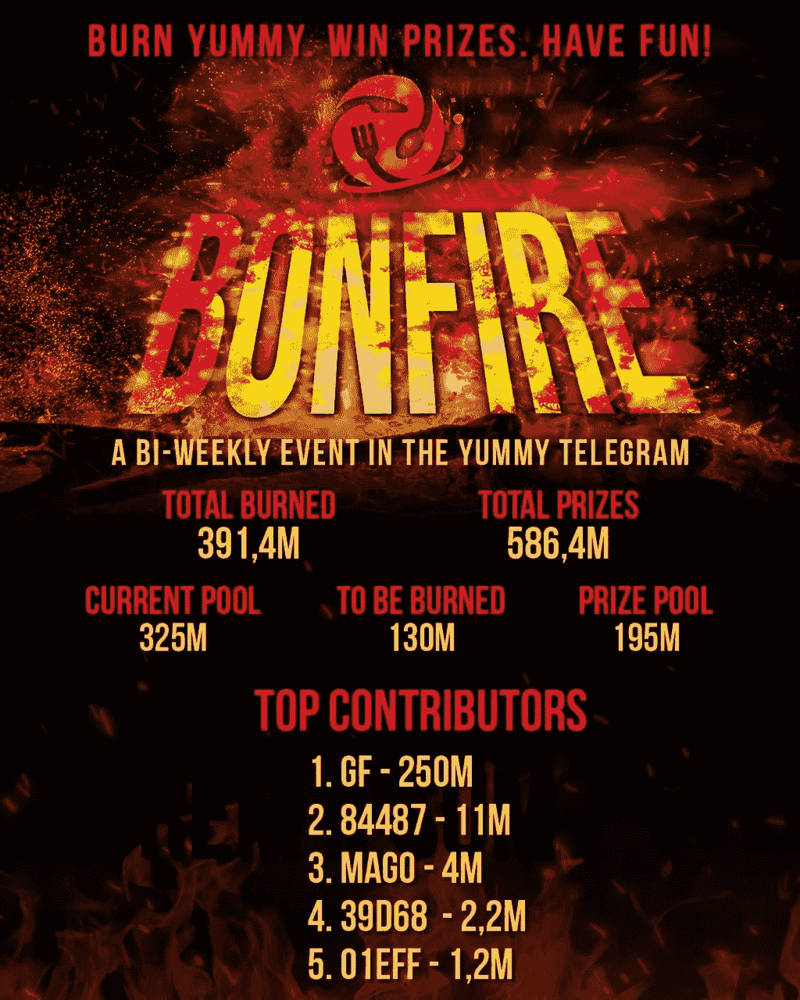

# 美味更新— 03

> 原文：<https://medium.com/coinmonks/yummy-update-03-185f7b70da6?source=collection_archive---------8----------------------->

亲爱的社区:

我们很高兴再次见到大家！距离上次更新又过去了 2 周，是时候更新了！

此版本:

*   新闻更新
*   与 EverRise 建立合作伙伴关系
*   与福克斯金融公司建立合作伙伴关系
*   NFT 公告
*   矿石 AMA 公告
*   YUSD 公告
*   美味的统计
*   YUSD 统计
*   打桩平台统计
*   增长基金统计
*   第四届篝火活动结果
*   第 28 周烧伤

🔸**新闻更新**🔸

首先，像往常一样，我们希望每个人都很好，身体健康。自上次更新以来，加密市场已经成为一个绝对的屠杀。关于$露娜和$UST 的新闻是亮点，事实是一个稳定的硬币设法暴跌如此之深(

Bloody market or not, Team Yummy is always working to keep delivering and building the project. What have we achieved recently?

First of all a staking partnership with no other than EverRise has been signed and started! Also another staking partner has been added, Fox Finance! More about this below.

The very first NFT bonus airdrop has been successfully sent to the users of the ORE partner pool.

Joe Foot once more appeared on an AMA with ORE and we announced a new swap function for YUSD on the staking platform.

Another successful Bonfire event has been held as well.

As always we will go through all of these topics, have a good time reading! 👍🏼

🔸**与 EverRise** 建立伙伴关系)🔸

我们非常荣幸地宣布我们的下一个赌注合作伙伴！🤝🏼🤝🏼

EverRise！

在 staking.yummy-crypto.com
的
[赌上您的美味和/或今天的崛起，然后前往“合作伙伴”选项卡👍🏼](https://www.staking.yummy-crypto.com/)

如果你需要帮助使用我们的赌注平台，来我们的电报
[https://t.me/yummyfinance](https://t.me/yummyfinance)
和管理员会帮你排序👍🏼

请看一下[官方公告的文章](/coinmonks/staking-partner-announcement-everrise-32e6150e8ef4)。

**🔸与福克斯金融公司建立合作伙伴关系🔸**

我们还有另一个赌注伙伴要宣布！🤝🏼🤝🏼

有请福克斯财经！

今天就在
[staking.yummy-crypto.com](https://www.staking.yummy-crypto.com/)
下注 Yummy 和/或 FOXV2，然后前往“合作伙伴”选项卡👍🏼

如果你需要帮助使用我们的赌注平台，来我们的电报
【https://t.me/yummyfinance】T21
和管理员会帮你排序👍🏼

请看一下[官方公告的文章](/coinmonks/staking-partner-announcement-fox-finance-f611f84fefc3)。

**🔸NFT 公告🔸**

第一批 NFT 助推空投物资现已发出。如果你在矿石池下注，并且有 NFTs，一定要检查你是否得到了你的奖金。如果您没有，请告诉我们！

注意:只有当您的奖金价值达到或超过 0.10 美元时，才会发送 Airdrop。如果你低于这个门槛，空投会被跳过，因为它不值得油费。我们的建议是获得额外的 NFT，并在下次提高奖金🤝🏼

您可以通过管理员身份购买 NFTs。每个 NFT 的价格是 0.6 BNB，或者你可以查看我们的 [Lootex 市场](https://lootex.io/stores/yummy-dog-nft)并尝试获得一些交易！

**🔸矿石 AMA 公告🔸**

另一场矿石 AMA 举行了，这次是在 Yummy 的[电报室](https://t.me/yummyfinance)。参观房间找官方录音！👍🏼

**🔸YUSD 公告🔸**

新的赌注平台！

直接从合同上买 YUSD！不，你可以购买大量的 YUSD，而不用担心低 LP 带来的价格影响。价格总是 1 美元。你也可以绕过 VPO·梅霍😉

**🔸美味的统计🔸**

价格:0.000005902 美元

总供应量:405 901 909 770

流通供应量:364471734632

市值:2151112 美元

燃烧总量:594，098，090，230

**🔸YUSD 统计🔸**

价格:1 美元

总供应量:75 万

流通供应量:432，391

市值:75 万美元

**🔸打桩平台统计🔸**

美味-美味总赌注:52，876，140，866 美味

Yummy-YUSD 总赌注:13860818642**Yummy**

**YUSD-Yummy 总赌注:400，944 YUSD**

****金库:**
好吃好吃 90 天总赌注:94，323，070，778 好吃**

****合作伙伴:** Yummy-矿石总赌注:32,832,611,227 Yummy**

**美味-上升总赌注:19，700，248，543 美味**

**上升-美味总赌注:45，167，691 上升**

**Yummy-FOXV2 总赌注:17,990,422,555 Yummy**

**总赌注:4，057，333**

****下注总额:**
231，583，312，611 Yummy→＄1，366，804**

**400，944 美元**

**上涨 45，167，691 美元→27.028 美元**

**4428333 福克斯 v2→9605 美元**

**TVL:1804381 美元**

****🔸增长基金统计🔸****

**净资产:1029488 美元**

**回购总额:$411，529**

****🔸第四届篝火活动结果🔸****

**本周篝火晚会的获胜者是以下地址:**

**0x FBE BF 99 ee 1 f 12 e 555 f 7 ea 24 b 8 e 9182 f 362 B2 E0 d 1**

**恭喜刚刚赢了 195，081，270 Yummy 的赢家！！**

**谢谢所有参与的人👍🏼👍🏼👍🏼🔥🔥🔥**

****

****🔸第 28 周烧伤🔸****

**由于我们在过去几周出售了相当多的免税美味(价值超过 22 亿英镑)，我们将把通过 GF 购买的美味分配到 240B 钱包中，以补充我们的储备。**

**注意:这完全不影响回购。我们还在市场上买那种美味。我们只是不燃烧它，这样我们就可以填写免税储备池。认为这是复合 GF 收益，而不是减少流通👍🏼👍🏼**

**我们本周也减少了购买(大约 5.5 亿)，因为大部分收益分配给了 EverBridge 购买的 1.5 万美元。**

**任何问题，只要问，你会收到一个答案！**

**Yummy 传送到 240B 地址的 TX→[链接](https://bscscan.com/tx/0xa6f464c09ecd0081ec36c9237c8a3b64912523469c0106e8d774f9b7dd83e10e)**

**又一次更新结束了。请不要让红色市场打击你的加密事业。Yummy 团队会一直努力下去！💪🏼**

**我们祝大家周末愉快，请继续关注更多内容👍🏼👍🏼**

**最好的，**

**美味团队**

> **加入 Coinmonks [电报频道](https://t.me/coincodecap)和 [Youtube 频道](https://www.youtube.com/c/coinmonks/videos)了解加密交易和投资**

# **另外，阅读**

*   **[支持卡审核](https://coincodecap.com/uphold-card-review) | [信任钱包 vs 元掩码](https://coincodecap.com/trust-wallet-vs-metamask)**
*   **[Exness 回顾](https://coincodecap.com/exness-review)|[moon xbt Vs bit get Vs Bingbon](https://coincodecap.com/bingbon-vs-bitget-vs-moonxbt)**
*   **[如何开始通过加密贷款赚取被动收入](https://coincodecap.com/passive-income-crypto-lending)**
*   **[BigONE 交易所评论](/coinmonks/bigone-exchange-review-64705d85a1d4) | [电网交易机器人](https://coincodecap.com/grid-trading)**
*   **[氹欞侊贸易评论](https://coincodecap.com/anny-trade-review) | [CoinSpot 评论](https://coincodecap.com/coinspot-review)**
*   **[新加坡十大最佳加密交易所](https://coincodecap.com/crypto-exchange-in-singapore) | [购买 AXS](https://coincodecap.com/buy-axs-token)**