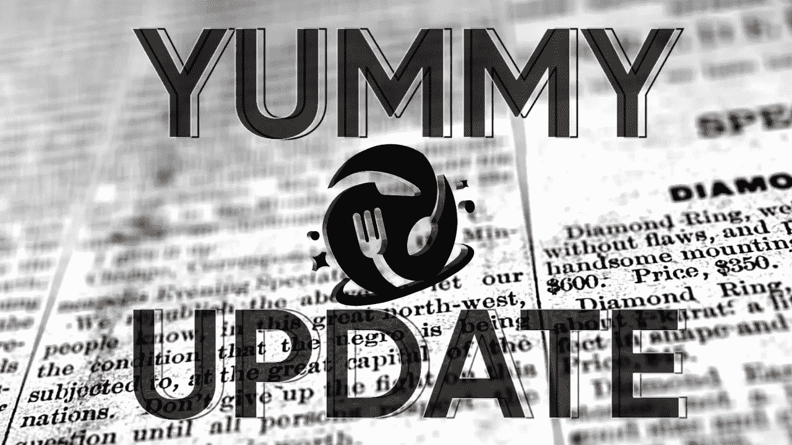
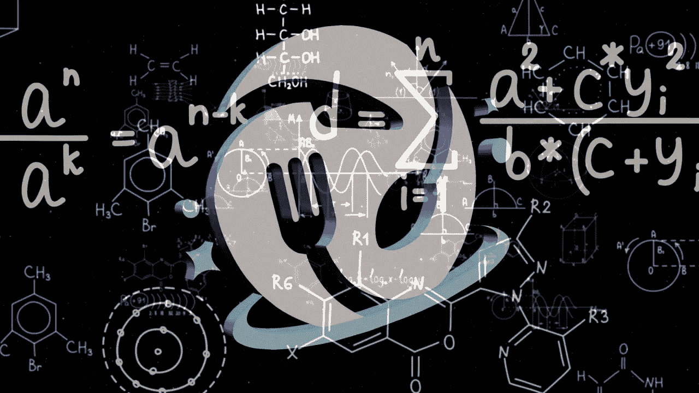
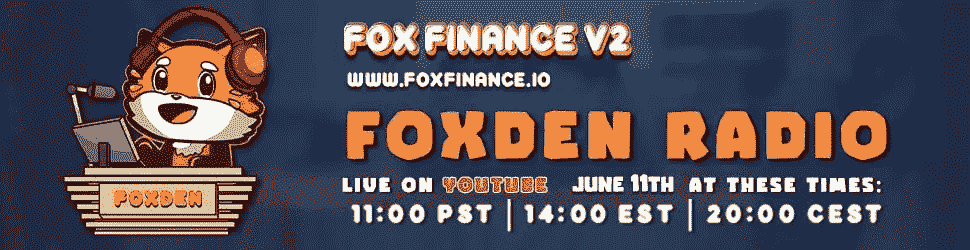
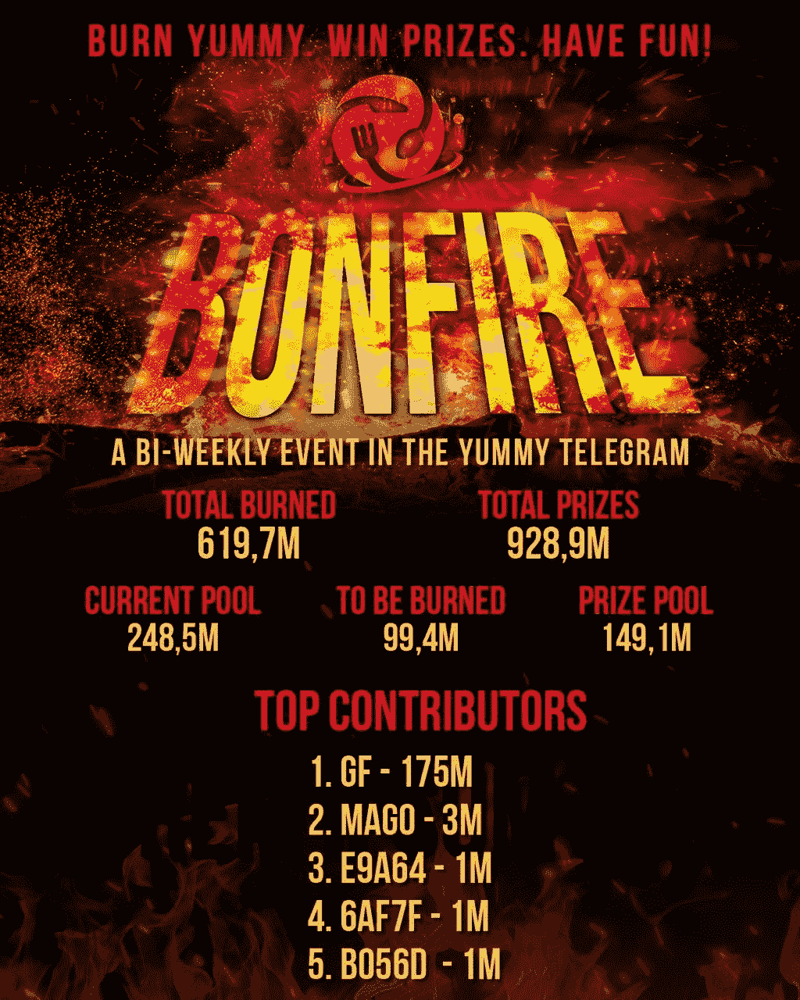

# 美味更新— 04

> 原文：<https://medium.com/coinmonks/yummy-update-04-342a3c8af7ae?source=collection_archive---------14----------------------->

亲爱的社区:

我们很高兴再次见到大家！距离上次更新已经过去了几个星期，我们分享的更新少了一些，但现在是时候发布新的了！

此版本:

*   新闻更新
*   新美味教程
*   不和谐服务器修复
*   美味 VC AMA
*   煤渣公告(保存)
*   乔·福特做客福克斯登电台
*   美味的统计
*   YUSD 统计
*   打桩平台统计
*   增长基金统计
*   第五届篝火活动结果
*   第六届篝火活动结果

🔸**新闻更新**🔸

首先，我真诚地希望每个人身体健康，精神饱满。最近的市场行为非常残酷，大大小小的项目每天都在减少。也就是说，我们在 Yummy 正在尽最大努力保持我们的头在水面上，我们相对处于一个非常好的状态。我们的象征性价格下降了一些，因为有一些抛售，显然 BNB 反射有其影响。我们已经决定在这个阶段继续积累 GF，并且不把太多的本金用于回购。我们认为从长远来看，这对我们大家都更有利。

机构群体对 YUSD 暂时不挂钩以及没有添加 LP 表示了一些关注。让我说，我们完全打算在不久的将来将 YUSD 与 LP 挂钩👍🏼👍🏼

我们的首席执行官 Joe Foot 在我们的 TG 房间里多次提到，世界经济正处于一种非常独特且有些令人担忧的状态。到处都可以看到许多危险信号，一种新形式的衰退极有可能出现。尽管如此，我们对美味和煤渣的使命不会改变。事实上，我们比以往任何时候都更加努力地挖掘，以利用和抓住摆在我们面前的所有机会，尤其是在这个阶段。

在本文撰写之时，每 BNB 的价格约为 225 美元。乔·富特今天用 GF 的资金买了价值 65，000 美元的 BNB，他设立了更多的进场点。如果 BNB 跌破 200 美元，我们很可能会把我们整个 GF 撤资到 BNB。作为美味团队，我们真的相信 BNB 有潜力和能力度过最艰难的风暴，并最终脱颖而出。如果你投资了美味，你也就自动投资了 BNB👍🏼👍🏼

🔸新美味教程🔸

我们已经发布了另一个赌注教程，叫做“购买 Yummy/YUSD/NFTs”。这个教程一步一步地解释了购买 Yummy、YUSD 和 NFT 的过程。这篇文章也被分享到了 [Coinmonks](https://medium.com/coinmonks) 上。

这里是赌注教程[文章](/coinmonks/yummy-tutorials-buying-yummy-yusd-nfts-5f58b402e50a)的直接链接。

🔸不和谐服务器修复🔸

我们最近发现我们的 [Discord 服务器](https://discord.gg/d9CskaKYs6)没有让新人通过验证过程。我们已经修复了这个问题，更新了邀请链接，我们现在正在清理和更新整个服务器，使其更加美味。

🔸美味 VC AMA🔸

首席执行官乔·富特在 5 月 27 日举办了一次社区 AMA。本次风险投资的主题是:

1)纵观美国股票市场

2)美国房地产的独特趋势和 Tricon Residential 等公司的主要角色

3)避险(即买入美元美元)与买入 BNB，以及为什么 BNB 可能比人们想象的恢复得更快、持有得更好

4)为什么 Yummy 的定位优于大多数项目

5)为什么无论发行量有多大，尤斯·佩格都不会遭遇 UST 的命运

6)一些其他杂项材料

完整的录音将被上传到我们的 TG 房间，可以在任何时候收听👍🏼

🔸煤渣公告(保存)🔸

对于我们的 Cinder 项目，我们设法公开了与拯救世界项目(SAVE)的合作关系。我们将指导他们迁移到 V2，并帮助他们继续和管理项目。这一合作关系的完整技术细节尚未发布，但基本上我们为 SAVE 迁移到 V2 创建了一个自定义交换。它们将继续存在于我们的生态系统中，我们非常热烈地欢迎它们🤝🏼

这里有一个关于迁移的[文章](https://savetheworldtoken.medium.com/save-the-world-v2-a66da0e92325) SAVE 的链接。

🔸乔·福特做客福克斯登电台🔸

乔·富特在福克斯登广播节目中客串了一次。视频可在[这里](https://www.youtube.com/watch?v=c1CtWTqe3Zs)找到。

🔸美味的统计🔸

价格:0.000003812 美元

总供应量:4.059 亿

流通供应量:363399285823

市值:1385278 美元

燃烧总量:594，098，090，230

🔸YUSD 统计🔸

价格:0.5707 美元

总供应量:75 万

流通供应量:447，288

市值:255267 美元

🔸打桩平台统计🔸

美味-美味总赌注:59，444，673，367 美味

YUSD-Yummy 总赌注:401，926 YUSD

**金库:**
好吃好吃 90 天总赌注:95，076，593，220 好吃

**合作伙伴:** Yummy-矿石总赌注:27,170,224,609 Yummy

美味-上升总赌注:23，689，471，407 美味

上升-美味总赌注:58，328，763 上升

Yummy-FOXV2 总赌注:19170544130**Yummy**

**总赌注:15，895，151**

****下注总额:**
224，551，506，733 Yummy→＄855，990**

**401，926 美元→229.379 美元**

**上涨 58，328，763 美元→22，153 美元**

**15，895，151 福克斯 v2→23，540 美元**

**TVL:1131062 美元**

**🔸增长基金统计🔸**

**净资产:897507 美元**

**回购总额:**411，529 美元****

****🔸第五届篝火活动结果🔸****

****篝火画现在完成了🔥🔥****

****获胜者是****

****0x 68 fc 07339 B2 f 0854 e 408 ba FBD 38 cf 87 C5 c 62 c 0 BC****

****祝贺获胜者****

****奖池:****

****147504702 好吃****

****烧毁:****

****98,336,468****

********

****🔸第六届篝火活动结果🔸****

****篝火画现在完成了🔥🔥****

****获胜者是****

****0x FBE BF 99 ee 1 f 12 e 555 f 7 ea 24 b 8 e 9182 f 362 B2 E0 d 1****

****祝贺获胜者****

****奖池:****

****149，145，001 美味****

****烧毁:****

****99,430,000****

********

****更新到此结束。一如既往地保持安全，在这些市场中保持头脑冷静。不要让它使你气馁或失去动力！****

****Yummy 团队会一直努力下去！💪🏼****

****我们祝大家本周休息愉快，请继续关注更多内容👍🏼👍🏼****

****最好的，****

****美味团队****

> ****加入 Coinmonks [电报频道](https://t.me/coincodecap)和 [Youtube 频道](https://www.youtube.com/c/coinmonks/videos)了解加密交易和投资****

# ****另外，阅读****

*   ****[隐翅虫替代品](/coinmonks/cryptohopper-alternatives-d67287b16d27) | [HitBTC 审查](/coinmonks/hitbtc-review-c5143c5d53c2)****
*   ****[CBET 评论](https://coincodecap.com/cbet-casino-review) | [库科恩 vs 比特币基地](https://coincodecap.com/kucoin-vs-coinbase)****
*   ****[Fold App 审核](https://coincodecap.com/fold-app-review) | [Kucoin 交易机器人](/coinmonks/kucoin-trading-bot-automate-your-trades-8cf0ca2138e0) | [Probit 审核](https://coincodecap.com/probit-review)****
*   ****[如何匿名购买比特币](https://coincodecap.com/buy-bitcoin-anonymously) | [比特币现金钱包](https://coincodecap.com/bitcoin-cash-wallets)****
*   ****[币安 vs FTX](https://coincodecap.com/binance-vs-ftx) | [最佳(SOL)索拉纳钱包](https://coincodecap.com/solana-wallets)****
*   ****[比诺莫评论](https://coincodecap.com/binomo-review) | [斯多葛派 vs 3Commas vs TradeSanta](https://coincodecap.com/stoic-vs-3commas-vs-tradesanta)****