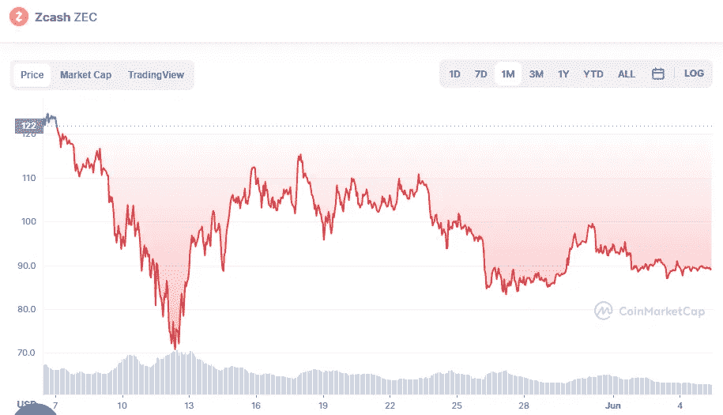

# 6 月 5 日现金价格分析

> 原文：<https://medium.com/coinmonks/zcash-price-analyse-5th-of-june-19fe13214dbe?source=collection_archive---------25----------------------->

Source photo [Zcash price today, ZEC to USD live, marketcap and chart | CoinMarketCap](https://coinmarketcap.com/currencies/zcash/)

在撰写本文时，Zcash 价格研究显示，多头一直试图突破 90.5 美元的阻力位，但到目前为止没有成功。价格现在处于 89.56 美元附近的盘整阶段，预计这一阶段将持续几个小时，直到市场趋势确立。

上升趋势已经被穿过信号线的 MACD 线所确认。正在移动…