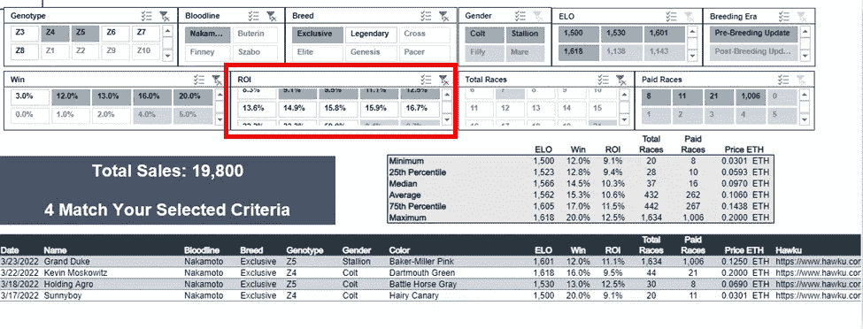

# ZED Run:常见的购买错误#3:不应用百分点

> 原文：<https://medium.com/coinmonks/zed-run-common-purchasing-mistake-3-not-applying-percentiles-789577a45f4c?source=collection_archive---------6----------------------->

这是一系列文章中的第三篇，研究我在市场上看到的关于支付价格的常见失误。在这个系列中，我剖析了这些错误，并展示了为什么不关注价格会严重损害你的马厩的盈利能力。

如果你错过了我的第一篇关于如何评估一匹马的文章，我推荐你在这里阅读第一篇。

如果你错过了这个系列中分解买马时最常见错误的第一篇文章，你可以在这里阅读。

如果你错过了本系列的第二篇文章，解释报告的投资回报率是一个欺骗的指标，可能会扼杀你的回报，你可以在这里阅读。

对于那些被追上的，让我们投入进去吧！

# 错误 3:没有使用百分位数来评估价格和性能

目前，当你在游戏中购买一匹马时，确定支付价格的常见方法是在 Hawku 中筛选你正在搜索的特定类型的马的搜索结果，然后将这些马的价格与网站“销售”部分中出售的价格进行比较。虽然这是一个很好的第一步，但目前公布的价格数据并没有提供足够的细节来准确评估某匹马在价格谱上的位置。

例如，浏览销售列表并不允许您按最小值、最大值和百分位数列出支付的全部价格，也不允许您快速更改销售过滤器，以便您可以动态调整您的标准，以便更好地将您正在评估的马的价格与所有类似马的销售进行比较。

这就是为什么我在我的网站上建立了 [***交易筛选程序***](https://rainierracingco.com/market-data)*。这篇文章将简要介绍如何利用筛选工具，以及在评估一匹马的标价时应该问自己什么问题。*

*** [## 加密交易机器人——21 款最佳免费加密交易机器人

### 2022 年币安、比特币基地、库币和其他密码交易所的最佳密码交易机器人。Pionex，Bitsgap…

medium.com](/coinmonks/crypto-trading-bot-c2ffce8acb2a) 

# 交易筛选员

Transaction Screener 将 Hawku marketplace 上发生的销售情况进行汇总，并以表格的形式展示出来，这样您就可以快速评估市场上支付的价格。该工具允许您通过血统、品种、基因型(Z#)、性别、ELO 排名、胜率和投资回报率%、总比赛数(免费和付费)以及育种年代(更新前或更新后)进行筛选。这个筛选程序每天都会更新，通知会在 Twitter 上发布。

在屏幕的顶部，您可以看到符合您的筛选标准的马的最低价格、第 25 百分位价格、中值价格、平均值价格、第 75 百分位价格和最高价格。此外，筛选程序还提供了 ELO、胜率百分比、投资回报率百分比、总比赛数和付费比赛数，这些都是你在每个价位上应该期待的。

# 我如何使用交易筛选程序？

交易筛选程序旨在通过回答以下问题来帮助您评估您为一匹马支付的价格是否公平:“为了愿意支付这个价格，我需要相信什么是真的？”如果你买了一匹定价在第 75 百分位的马，你就含蓄地声明你相信这匹马将胜过 75%的具有相似遗传和比赛能力的马。如果你以平均价格买了一匹具有平均比赛数据的马，你就同意这匹马很可能是平均的，并且定价正确。

通过过滤掉不符合你正在评估的马的标准的马，你可以更准确地了解买家实际支付的价格，以及你期望与特定价格点相关联的高水平比赛统计数据。

你正在寻找的马要么是相当有价值的，他们有比赛统计完善其标价，或有高于平均水平的比赛统计销售低于平均水平的价格。

例如，如果您发现一匹赛马统计数据为 75%的马以平均销售价格出售，您可以得出该马被低估的结论。相反，如果你发现一匹赛马的平均价格是 75%，你可以断定这匹马被高估了。

让我们深入一个更具体的例子，看看如何让交易筛选为您工作，并改善您的购买决策。

# 示例:评估中本聪母马

让我们说，你有兴趣为你的马厩购买一些中本独家母马，因为你计划繁殖和销售具有最高纯度血统的马驹，并通过从种马仓库中购买中本 Genesis 种马的种马套来保持独家级别。你前往 [Hawku](https://www.hawku.com/zed) ，看到这三匹母马刚刚上市:

这些母马是 Z4-5，参赛，价格从 0.037 ETH-0.099 ETH 不等。这是一个广泛的价格范围，所以现在让我们利用交易筛选来看看这些价格与过去几个月的销售价格相比如何。

# 初始标准:过滤血统和品种

交易筛选过程的第一步是筛选血统和品种，因为这些是任何马的价格的主要驱动因素。

这个初始屏幕向我们显示，在 73 场比赛中，共有 1，584 场 Nakamoto 独家交易，平均销售价格为 0.0683 ETH，赢率为 7.3%，投资回报率为 0.4%(14 场已付费)。将这些统计数据与我们上面的母马进行比较，我们看到，根据价格和比赛统计数据,*晨步*和*太阳火*可能被高估，而 *Swick Flick* 可能被略微低估。

我们现在想添加另一层标准，以进一步细化支付的价格，并更准确地了解我们愿意支付的价格。

# 次要标准:基因型

下一级标准是筛选过高或过低的基因型，从而在价格范围的两端都产生结果。过滤掉 Z4-Z5，我们现在得到以下结果:

我们现在得到了 1，003 笔涉及 Z4-Z5 Nakamoto 独家配件的交易，平均销售价格为 0.0708 ETH，赢率为 7.4%，投资回报率为 0.4%，横跨 65 场比赛(13 场已付费)。鉴于这一新信息，我们开始认为 *Morning Step* 可能被略微高估，而 *Swick Flick* 和 *SOL FIRE* 可能被适当定价，甚至被略微低估。

我们现在应该过滤掉任何未评级的马，并将我们的比赛和获胜%阈值提高到至少 20 场比赛，其中 4%与最低比赛马( *Swick Flick* )和最低获胜马( *SOL FIRE* )匹配。

# 第三标准:种族数据

加上至少 20 场胜率大于 4%的比赛的标准，我们得到以下结果:

有 446 笔交易涉及符合我们标准的马匹，平均价格为 0.0745 ETH，在 130 场比赛中，赢率为 9.9%，投资回报率为 0.8%(28 场已支付)。有了这些数据，我们可以确定 *Swick Flick* 的定价略高于第 25 百分位，其胜率为 5.0%，而第 25 百分位的胜率为 6.0%，价格为 0.0342 ETH。由于她的价格过高，我们要么出价低于第 25 个百分点，要么一起跳过这次购买。

鉴于*晨步*和 *SOL FIRE* 有两位数的投资回报率，我们应该增加另一层标准，看看其他正投资回报率的马卖多少钱。

# 附加标准:ROI 性别；ELO；等等。

剔除回报率为< 9.0% and > 13.0%的马，我们得到以下结果:

在 432 场比赛中，有四笔交易符合我们输入的所有标准，平均销售价格为 0.1060 ETH，赢率为 15.3%，投资回报率为 10.6%(262 场比赛已支付)。有了这些数据，我们可以得出结论,*早晨的步伐*被恰当地估价在中间值和平均价格之间，这正是她的比赛数据下降的地方。没有任何一匹马像 *SOL FIRE* 这样低的胜率，在这样多的比赛中，一匹胜率为 20%的马的最低价格是 0.0301 ETH。因此，我们可以断定 *SOL FIRE* 被高估，跳过这次购买或出价低至 0.03 ETH。

考虑到我们正在寻找以折扣价或公平价格出售的高性能马匹，以最大化我们的投资回报率，我们决定购买*晨步*并把她带进马厩。

# 总结想法

有几乎无限多的方法可以结合标准来筛选交易，并得出一匹马是否被低估，公平，或高估。上面这个说明性的例子是一个简单的例子，说明如何利用百分位数来确定你的特定目标马的价格范围。请记住，在其他条件相同的情况下，错误地支付较低的价格，以增加通过比赛或转售到市场上从马身上收回资金的机会。*对于给定的性能水平，较低的价格总是比花更多的钱买一匹相似的马更安全。使用百分位数来准确了解在给定价格点下你应该期望的性能水平，对于避免为最大化你的回报而支付过高是至关重要的。*

*请喜欢并关注[媒体](https://rainierracingco.medium.com/)、[推特](https://twitter.com/RainierRacingCo)、 [Instagram](https://www.instagram.com/rainier_racing_nft/?hl=en) 、[脸书](https://www.facebook.com/RainierRacingCo)，并查看我们的[网站](https://rainierracingco.com/)了解更多信息。*

*如果您对如何评估一匹马有疑问，或者对我们为您做的分析感兴趣，请通过[RainierRacingCo@gmail.com](mailto:RainierRacingCo@gmail.com)联系我们，我们将在 24 小时内回复您。*

# *定价和估价资源*

*雷尼尔赛车公司(Rainier Racing co .)—查看我们的市场数据，阅读我们的 ZED Run 市场报告。*

*[Hawku](https://www.hawku.com/zed) —用于查找新的列表，筛选类似的交易，并查看比赛统计数据。*

*[了解你的马](https://knowyourhorses.com/)——*深入了解你的马和其他马厩主人的地方。**

**Zed Ranks——粗略估计一匹马价值的好地方。**

**查看你的马在游戏中与其他马的排名统计。**

**[ZED Run](https://zed.run/) —游戏！**

> **加入 Coinmonks [电报频道](https://t.me/coincodecap)和 [Youtube 频道](https://www.youtube.com/c/coinmonks/videos)了解加密交易和投资**

# **另外，阅读**

*   **[印度最佳 P2P 加密交易所](https://coincodecap.com/p2p-crypto-exchanges-in-india) | [柴犬钱包](https://coincodecap.com/baby-shiba-inu-wallets)**
*   **[八大加密附属计划](https://coincodecap.com/crypto-affiliate-programs) | [eToro vs 比特币基地](https://coincodecap.com/etoro-vs-coinbase)**
*   **[最佳以太坊钱包](https://coincodecap.com/best-ethereum-wallets) | [电报上的加密货币机器人](https://coincodecap.com/telegram-crypto-bots)**
*   **[交易杠杆代币的最佳交易所](https://coincodecap.com/leveraged-token-exchanges)**
*   **[最佳加密分析或链上数据](https://coincodecap.com/blockchain-analytics) | [Bexplus 评论](https://coincodecap.com/bexplus-review)***