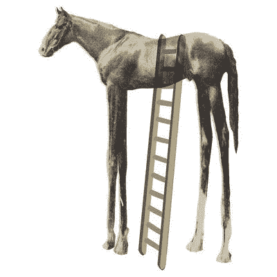
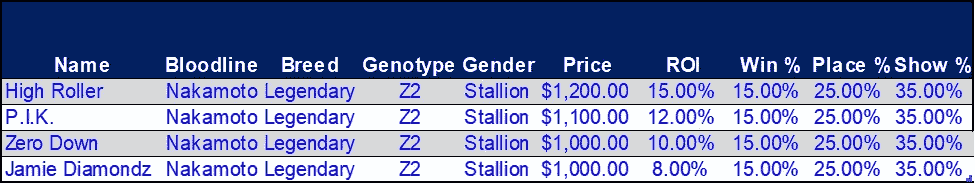
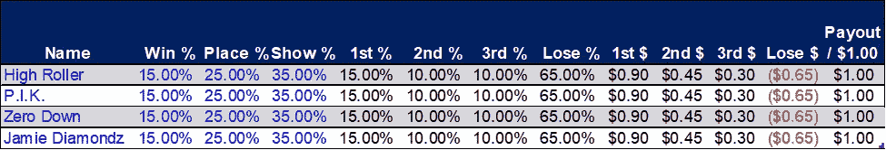
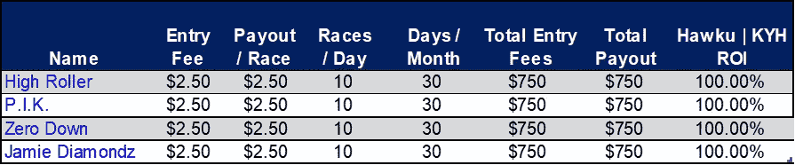
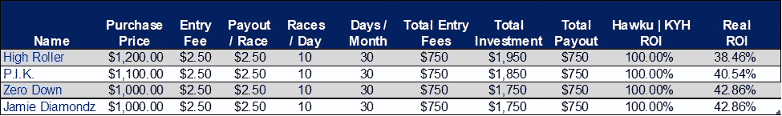
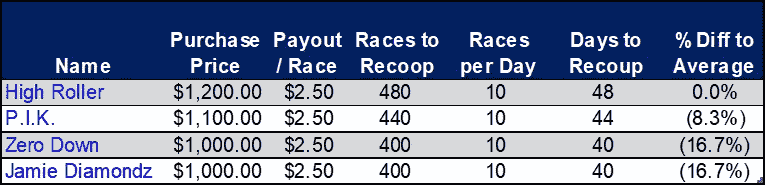
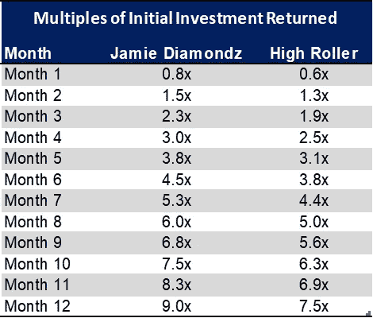

# ZED 运行购买错误#2:高投资回报率的马

> 原文：<https://medium.com/coinmonks/zed-run-purchase-error-2-high-roi-horses-4a3aa3b34208?source=collection_archive---------22----------------------->

# 简介和概述

The High ROI Horse

这是一系列文章中的第二篇，研究我在市场上看到的关于支付价格的常见失误。在这个系列中，我剖析了这些错误，并展示了为什么不关注价格会严重损害你的马厩的盈利能力。

如果你错过了我的第一篇关于如何评估一匹马的文章，我推荐你在这里阅读第一篇。

如果你错过了这个系列中分解买马时最常见错误的第一篇文章，你可以在这里阅读。

对于那些被追上的，让我们投入进去吧！

# 错误 2:更高的投资回报率=更好的回报

另一个常见的重复出现在 ZED 讨论中，“我只寻找高投资回报率的马。”我对这句话的理解是，如果一个人在 Hawku 上看到一匹 10%投资回报率的马和一匹 8%投资回报率的马，他们会倾向于购买投资回报率更高的马，认为这样可以更快地收回投资。我将分析这种思路，尽管直觉上是正确的，但在深度挖掘你的预期回报时，它是如何失败的。

让我首先说，我们都想要高投资回报率的马，应该错误地购买那些更高的投资回报率。然而，仅仅根据 Hawku 和 Know Your Horses 上的信息来购买高投资回报率的马是有很大缺陷的。这些系统只根据投入的入场费来报告投资回报率，而不是包括马匹成本在内的总投资。一匹马的真实投资回报率需要考虑它的购买价格、总入场费和总利润。公式是这样的:**% ROI =[总利润]/([收购价格]+[总入场费])**

这种计算使我们能够得出游戏中任何一匹马的真实投资回报率，即使是现在市场上常见的“∞ %”马，加上免费的带奖金的每日锦标赛。对于那些正在评估自己饲养的马的人，你可以用[饲养成本]代替[购买价格]来得出真正的投资回报率。

让我们来看一个实际的例子。假设你想买下面的一匹马:

Example horses.

请注意，这些马之间的唯一区别是它们的价格点和它们报告的 ROIs，后者只考虑了它们的入场费。这些价格足够接近，许多买家会选择支付额外的 200 美元购买*豪赌*，因为他们认为更高的投资回报率将使他们获得资金的速度几乎是购买*杰米·戴蒙德的两倍。*但是*、*如果不进一步分析这些信息，我们无法确定*高辊*是更好的选择。

为了确定我们多快能收回投资，我们首先需要确定这些马的预计现金流。我们通过确定每匹马每场比赛的预计支出来做到这一点。您在我的[上一篇文章](https://rainierracingco.medium.com/zed-run-why-the-focus-on-price-55cf39f5cc7)中详细阅读了如何做到这一点，所以我将在这里展示输出，而不是让您经历每一步。

知道我们只有在下注 1-3 时才能赢钱，我们需要确定我们期望在这三个位置上多长时间赢一次，以及我们多长时间输一次，然后乘以每一次的奖金；目前，第一名的报名费是 6 倍，第二名是 3 倍，第三名是 2 倍，其他任何职位都没有报名费。

为了简单起见，如果我们假设 1.00 美元的入场费，我们知道每第一个位置我们会得到 6.00 美元，每第二个位置 3.00 美元，每第三个位置 2.00 美元，第三个位置以下的每个位置都会失去我们的入场费。将这些奖金乘以其预期概率，得出每场比赛的预期奖金:

Show — Place = 3rd %; Place — Win = 2nd %; Win = 1st %; 1 — Show = Lose %

这种水平的分析告诉我们，从统计上看，每匹马都将产生相同数量的长期奖金。在这个例子中，我们看到，我们投入比赛的每一美元，我们都可以期望得到一美元的回报，即报名费的 100%回报。惊人的！这些马绝对物有所值，但哪匹马的收益最高呢？

让我们来看一个假设的月，在 30 天内每天 10 次以 2.50 美元的价格比赛这些马，看看 Hawku 和 KYH 的回报如何:

Reported ROIs are the same since the projected payouts are the same.

因此，在这里，我们再次看到，这些马预计将提供相同数额的投资回报率的基础上，他们的报名费。这是有道理的，因为每一美元的报名费的预期回报是一美元，每匹马都有 100%的投资回报率。

现在，这是马开始区分自己作为投资的地方。如果我们现在考虑马的购买价格，我们开始看到回报的差异:

ROI % = [Total Profit] / ([Purchase Price] + [Total Entry Fees])

考虑到马的购买价格，我们现在看到*豪赌*产生最低的投资回报率，而*零首付*和*杰米·戴蒙兹*提供相同的投资回报率。为什么会这样呢？这是因为在划分您的总利润时，将*高赌注*的较高成本考虑在内会增加分母的大小(即较大的分母=相同利润的较小百分比)。由于*零首付*和 *Jamie Diamondz* 的成本相同，它们的总分母相同，因此它们提供了相同的实际 ROI。

好，现在你看到这些马的月回报率只有 2-4%的差异，那又怎样？那么，如果你购买了 *Zero Down* 或 *Jamie Diamondz* 比购买 *High Roller:* 要快 17%

Here again, we see that discipline in purchase price leads to higher ROIs and faster returns of capital.

好吧，如果我买了那匹便宜的马，我可以提前 8 天收回我的钱，那么一周对我来说算什么？好吧，如果你打算继续玩这个游戏，那么它会有很大的不同:

By Month 4 you’ve tripled your money, a full month ahead of “*High Roller”. By Month 10, you’ve achieved the same return that would take a full year with “High Roller”.*

到第四个月结束时，你可以看到你对杰米·戴蒙德的投资已经获得了 3 倍的回报，而对 T2 的投资只有 2.5 倍。在一整年中发挥他们的统计数据，你用*杰米·戴蒙兹*获得了 9 倍的投资，相比之下用*更高的滚筒获得了 7.5 倍。*现在想象一下，每当你的钱翻倍，你就把它给另一匹与杰米·戴蒙兹*相当的马，那么……你会看到这些倍数的回报。*

# 总结想法

希望这篇文章进一步强调了这一点:在购买任何一匹给定口径的马时，你支付的价格是关键因素。正如我们在这里看到的，当你考虑到他们的购买价格时，除了他们报告的 ROIs 之外，马在每个级别上都是一样的，产生了非常不同的回报。在预计现金流相同的情况下，错误地支付较低的价格，以增加通过比赛或转售到市场上收回资金的机会。对于给定的性能水平，较低的价格总是比花更多的钱买一匹相似的马更安全。

请喜欢并关注[媒体](https://rainierracingco.medium.com/)、[推特](https://twitter.com/RainierRacingCo)、 [Instagram](https://www.instagram.com/rainier_racing_nft/?hl=en) 、[脸书](https://www.facebook.com/RainierRacingCo)，并查看我们的[网站](https://rainierracingco.com/)了解更多信息。

如果您对如何评估一匹马有疑问，或者对我们为您做的分析感兴趣，请通过[RainierRacingCo@gmail.com](mailto:RainierRacingCo@gmail.com)联系我们，我们将在 24 小时内回复您。

# 定价和估价资源

雷尼尔赛车公司(Rainier Racing co .)—查看我们的市场数据，阅读我们的 ZED Run 市场报告。使用我们的[交易筛选工具](https://rainierracingco.com/market-data)来获得一个给定血统、品种、基因型和比赛数据的价格。

[Hawku](https://www.hawku.com/zed) —用于查找新的列表，筛选类似的交易，并查看比赛统计数据。

[了解你的马](https://knowyourhorses.com/)——*深入了解你的马和其他马厩主人的地方。*

*Zed Ranks——粗略估计一匹马价值的好地方。*

*查看你的马在游戏中与其他马的排名统计。*

*[ZED Run](https://zed.run/) —游戏！*

> *加入 Coinmonks [电报频道](https://t.me/coincodecap)和 [Youtube 频道](https://www.youtube.com/c/coinmonks/videos)了解加密交易和投资*

# *另外，阅读*

*   *[3 商业评论](/coinmonks/3commas-review-an-excellent-crypto-trading-bot-2020-1313a58bec92) | [Pionex 评论](https://coincodecap.com/pionex-review-exchange-with-crypto-trading-bot) | [Coinrule 评论](/coinmonks/coinrule-review-2021-a-beginner-friendly-crypto-trading-bot-daf0504848ba)*
*   *[莱杰 vs n rave](/coinmonks/ledger-vs-ngrave-zero-7e40f0c1d694)|[莱杰 nano s vs x](/coinmonks/ledger-nano-s-vs-x-battery-hardware-price-storage-59a6663fe3b0) | [币安评论](/coinmonks/binance-review-ee10d3bf3b6e)*
*   *[Bybit Exchange 审查](/coinmonks/bybit-exchange-review-dbd570019b71) | [Bityard 审查](https://coincodecap.com/bityard-reivew) | [Jet-Bot 审查](https://coincodecap.com/jet-bot-review)*
*   *[3 commas vs crypto hopper](/coinmonks/3commas-vs-pionex-vs-cryptohopper-best-crypto-bot-6a98d2baa203)|[赚取加密利息](/coinmonks/earn-crypto-interest-b10b810fdda3)*
*   *最好的比特币[硬件钱包](/coinmonks/hardware-wallets-dfa1211730c6) | [BitBox02 回顾](/coinmonks/bitbox02-review-your-swiss-bitcoin-hardware-wallet-c36c88fff29)*