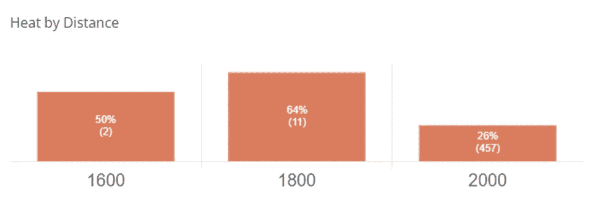

# 什么是马驹交换？

> 原文：<https://medium.com/coinmonks/zed-run-what-is-a-foal-swap-d4815d1d652d?source=collection_archive---------30----------------------->

UUU ZED Run Horse

消息传出去了！下一场 [**幸运少女**](https://docs.google.com/document/d/1MC8HWX0wnYS0adXOmgTyL1-lSlXzC7uuJc6cXOtaRac/edit) **将于 5 月 29 日至 6 月 2 日举行，也将与 ZED Run Maiden 锦标赛同时举行。**

首次锦标赛的形式是专为未评级的马匹设计的，以测试他们在为期一周的活动中的能力，并赢得数千美元的奖金。

**对于那些拥有未评级马匹的人来说，这是一个在为期一周的资格赛中赢得以太坊的绝佳机会。**

**那么，如何获得一匹未评级的马呢？有几个选项给你:**

**1)直接关闭** [**购买未评级的 Hawku**](https://www.hawku.com/zed?races_max=0) **(过滤器包含在链接中)**

在你的马厩里，让一匹公马和任何一匹母马交配

**3)进行一次马驹交换**

如果你更喜欢视觉学习，你可以观看 YouTube 视频[中与本文类似的信息，并使用我们的](https://youtu.be/iypH5I_gCcI)[马驹交换计算器](https://rainierracingco.com/foal-swap-calculator)引导你。

# 什么是马驹交换？

马驹交换是指一匹公马的主人(种马主人)与一匹母马的主人(母马主人)预先达成协议，在配种后取走后代。母马主人将进入[种马棚](https://zed.run/stud)，找到种马，并支付费用进行繁殖和生产后代。

种马主人将获得种马费的一部分，剩余部分将作为赛车奖金池的一部分归 ZED Run 所有。种马所有者将向母马所有者提供该种马费用的回扣，此外还有优先回报，以补偿母马所有者放弃后代。

# 为什么小马驹会互换？

进行马驹交换有几个原因和好处:

对于螺柱所有者:

a.你有一匹高质量的种马，但你的马厩里没有母马，你可以与第三方配种，并接收你的种马的后代。

b.你有一匹种马，但没有相应的母马有重叠的距离偏好或差异，那么你可以找到一个更合适的伴侣，并产生比你通过内部繁殖更好的后代。

c.与在公开市场购买相比，你对后代的质量有更深的了解，对价格也有更大的控制。

对母马主人来说:

a.在支付种马费之前，你有一个保证出售你的后代。

b.你将获得种马费的全额退款和保证回报。

c.出售小马驹后，可以通过谈判获得额外的奖励，如后代赢得的利润分成，以提供额外的收入。

# 如何构建交易

为了让这笔交易对双方都有意义，需要进行一些研究和计算。你需要知道你特定血统、品种和基因型的新马驹的各种市场价格；特定种马的最低种马费；以及你将把你的马留在种马场多长时间，以决定你将从 ZED 那里得到多少种马费。

幸运的是，雷尼尔赛车公司已经完成了繁重的工作，并在网上推出了一款[马驹交换计算器](https://rainierracingco.com/foal-swap-calculator)。使用此工具，您可以筛选您的育种安排将产生的特定新马驹的销售，然后比较各种回扣、优先退货和种马场的天数将如何影响交易的价值。

现在，让我们用一个实际的例子来演练一下如何设置驹交换。

# 父母

对于这个例子，我将预排育种[质量](https://www.hawku.com/horse/379942)，我的 Z2 中本传奇小马，与[针](https://www.hawku.com/horse/8618)，Z4 中本传奇母马。

Z2 Nakamoto Legendary Colt

Z4 Nakamoto Legendary Mare

这个品种背后的逻辑是，我自己的马厩里没有一匹母马有类似的比赛距离偏好或基础能力，因此我将与我在 I 级(最高级别)中一直与之比赛的母马进行繁殖。

正如你在上面的统计摘要中所看到的，他们有相当的胜率/名次/展示率，热度，并且非常有利可图。此外，这两匹马都是中距离专家，在 1600 米-2000 米的距离上跑得最好，正如下面它们的发热率所示。

Quality: Heat Rate at Mid-Distance

Needle: Heat Rate at Mid-Distance

此外，马匹具有互补的比赛品质，这在育种 2.0 算法中表现得很好。例如，质量有很高的基础能力，但变化很小，正如他的 C1 1600 米排名图中的严重左倾所示，90%的 C1 热率和 90%的 1600 米热率:

Quality: High Base Ability, Low Variance

另一方面，Needle 的基本能力略低，但其位置图的自然 U 形和她在 C1 2000 米的首选距离内的较低发热率显示出明显较高的方差 a:

Needle: Lower Base Ability, High Variance

通过将这两匹马繁殖在一起，我们的目标是产生一个专门从事中距离比赛的后代，并能持续赢得每天的比赛，因为这是目前游戏中最弱的竞争领域，并提供了实现每天支付的最高概率。通过结合质量的高基础能力和针的高方差，我们应该有一个胜利的组合！

# 后代

ZED Run 育种算法将决定我们后代的实际比赛能力，但我们可以提前计算一些事情，以确定马驹的市场价值。

小马驹价值的关键驱动因素是它的血统、品种和基因型。ZED 为我们提供了确定这些特征所需的信息，如下所示。

在我们的例子中，我们是用一个中本聪繁殖一个中本聪，所以因此会产生一个中本聪的后代:

Bloodline Generation in Breeding

传奇性的雄性与传奇性的雌性交配将产生独一无二的小马驹:

Breed Generation in Breeding

最后，基因型将通过将双亲的基因型加在一起来确定。在我们的例子中，这将是一个 **Z2 + Z4 = Z6** 。

所以我们的后代将会是 **Z6 中本聪**。然后，我们可以将这些信息输入到[马驹交换计算器](https://rainierracingco.com/foal-swap-calculator)中，以筛选该类型的所有未评级马匹的销售。

# 配种费

我们需要输入计算器的下一条信息是配种费。我强烈建议对公马使用最低配种费，因为这将减少双方的总成本，从而增加后代的价值。

要找到最少的种马费，最简单的方法就是把你的种马放进种马仓，但是不要把它放进种马仓。这可以让你看到你的特定马匹所需的最低配种费是多少:

Minimum Stud Fee for Z2 Nakamoto Legendary as of 5/24/2022

这里的**最低要求费用是 0.0783 ETH** 。我们将把这个数字输入到计算器中的“学费”项下。

# 螺柱持续时间

接下来，我们需要设定学习期的持续时间。这很重要，因为你养你的马的时间越长，你收到的种马费就越多。根据持续时间分配给螺柱所有者的当前百分比为:

Stud Fee Allocation as of 5/24/2022

**如果你能负担得起让你的马远离赛马场最长的时间，7 天，我强烈建议你这样做，以保持最大的种马费。一旦你给母马主人提供种马费折扣，这有助于降低后代的总成本。目前，如果你把你的马留在种马棚 7 天，你将得到 56%的种马费。**

有了所有这些信息，我们现在可以去驹交换计算器，看看我们应该如何构建驹交换，以便它对马的所有者都有财务意义。

# 马驹交换计算器

在计算器中，第一步是输入配种费、根据持续时间分配给主人的配种费百分比、母马主人的首选回报以及配种费折扣。**我建议将市场价格选择器设置为“中值”**，因为这将是 50%的马匹低于或高于的价格。这意味着，从母马所有者的角度来看，他们有 50%的机会以高于这个价格的价格出售，有 50%的机会最终不得不以低于这个价格的价格出售。**考虑到无法在公开市场上以高于中间价的价格出售这匹小马的风险，以此作为构建交易的起点是合理的。**此外，大多数**母马所有者会期望种马费的全额回扣，所以我会把 100%作为初始假设**，以及 20%的优先回报。一旦我们筛选出我们的品种将产生的特定后代，我们将改变首选回报。

输入 0.0783 ETH 种马费，56%分配给种马所有者，为期 7 天，初始回报和回扣假设为 20%和 100%，我们将看到以下结果:

Starting Assumptions

接下来，我们将筛选特定的未评级后代，以了解在 Hawku 市场中支付的价格范围。我们将在“Total Races”选择器中选择“0 ”,然后过滤我们的特定基因型、血统和品种，然后选择“Colt”和“Filly”作为性别，因为这匹马也将是无标记的。

我们为 Z6 Nakamoto 独占后代设计的屏幕如下:

Screen for Unraced, Unbred Z6 Nakamoto Exclusive Sales

运行筛选程序后，您将获得从最低到最高支付价格的一系列值:

Range of Prices Paid for UUU Z6 Nakamoto Exclusive Foals

由于我们正在评估中值价格，计算器会自动将该值带入计算中。如果您想根据其他值评估驹交换，您也可以从下拉菜单中选择这些值。

给定我们对返利和首选回报百分比的初始假设，我们得到以下输出:

Deal Structure 1: 100% Rebate & 20% Preferred Return

这向我们表明，目前安排的交易对母马所有者没有意义。他们可以**在公开市场上出售一匹相似的马驹，并期望从他们的配种费中获得 45%的回报，相比之下，他们从马驹交换中获得 20%的回报**。这对种马主人来说是一笔大买卖，因为与在公开市场上以中间价购买相比，他们在这种互换安排中节省了 0.0199 ETH。

**为了使这笔交易在中间价上有意义，母马所有者收到的首选回报*必须至少与母马所有者以中间价***出售给公开市场的预期回报相匹配。将我们的“首选回报”假设更新为 45.39%，我们得到以下输出:

Deal Structure 2: 100% Rebate & 45.4% Preferred Return

在这种交易结构下，100%的回扣+ 45.4%的优先回报，我们看到**母马所有者应该对将马驹出售给种马所有者漠不关心，而不是以中间价格在公开市场上出售**。他们的净*利润将完全相同，就好像他们在二级马厩里用自己的种马繁殖母马，以获得种马费的 56%折扣，然后以中间价格出售。* **对于种马主人来说，他们应该对收到这匹小马驹和在公开市场上以中间价购买一匹无关紧要。**对种马主人来说*总成本是一样的*。

计算器还在底部用简单的英语总结了交易:

Deal Structure & Transaction Summary

这些假设可以改变，退货和回扣可以协商，直到交易对双方都有意义。

# 总结想法

如果马厩里只有公马，马厩主人不应该觉得自己为马厩生产优质后代的能力受到限制。通过*接触 ZED Run 社区*你可以找到一个和你的种马完全匹配的人，并协商一个马驹交换。

**做你的研究，使用计算器，了解你的数字！**不要为小马驹支付过高的价格，也不要进行对你没有好处的交易。

**通过使用计算器，你可以很容易地看出一笔交易是否有意义，以及如何调整才能让你得到最划算的交易！**

请喜欢并关注[媒体](https://rainierracingco.medium.com/)、[推特](https://twitter.com/RainierRacingCo)、 [Instagram](https://www.instagram.com/rainier_racing_nft/?hl=en) 、[脸书](https://www.facebook.com/RainierRacingCo)，并查看我们的[网站](https://rainierracingco.com/)了解更多信息。

如果您对如何评估一匹马有疑问，或者对我们为您做的分析感兴趣，请通过[RainierRacingCo@gmail.com](mailto:RainierRacingCo@gmail.com)联系我们，我们将在 24 小时内回复您。

# 定价和估价资源

雷尼尔赛车公司(Rainier Racing co .)—查看我们的市场数据，阅读我们的 ZED Run 市场报告。

[Hawku](https://www.hawku.com/zed) —用于查找新的列表，筛选类似的交易，以及查看比赛统计数据。

[了解你的马](https://knowyourhorses.com/)——*深入了解你的马和其他马厩主人的地方。*

*[Zed 排名](https://zedranks.com/check)——粗略估计一匹马价值的好地方。*

*查看你的马在游戏中与其他马的排名统计。*

*[ZED Run](https://zed.run/) —游戏！*

> *加入 Coinmonks [电报频道](https://t.me/coincodecap)和 [Youtube 频道](https://www.youtube.com/c/coinmonks/videos)了解加密交易和投资*

# *另外，阅读*

*   *[CoinDCX 评论](/coinmonks/coindcx-review-8444db3621a2) | [加密保证金交易交易所](https://coincodecap.com/crypto-margin-trading-exchanges)*
*   *[红狗赌场评论](https://coincodecap.com/red-dog-casino-review) | [Swyftx 评论](https://coincodecap.com/swyftx-review) | [CoinGate 评论](https://coincodecap.com/coingate-review)*
*   *[Bookmap 评论](https://coincodecap.com/bookmap-review-2021-best-trading-software) | [美国 5 大最佳加密交易所](https://coincodecap.com/crypto-exchange-usa)*
*   *[如何在 FTX 交易所交易期货](https://coincodecap.com/ftx-futures-trading) | [OKEx vs 币安](https://coincodecap.com/okex-vs-binance)*
*   *[CoinLoan 审核](https://coincodecap.com/coinloan-review) | [YouHodler 审核](/coinmonks/youhodler-4-easy-ways-to-make-money-98969b9689f2) | [BlockFi 审核](https://coincodecap.com/blockfi-review)*
*   *[XT.COM 评论](https://coincodecap.com/profittradingapp-for-binance)币安评论 |*