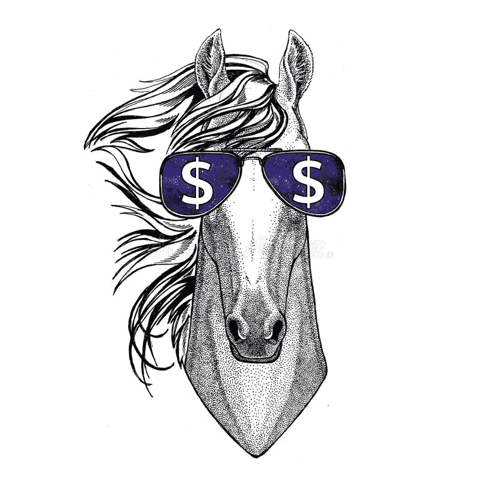
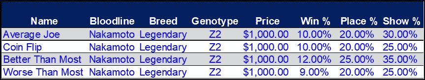
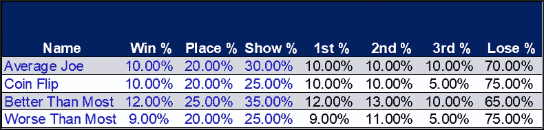
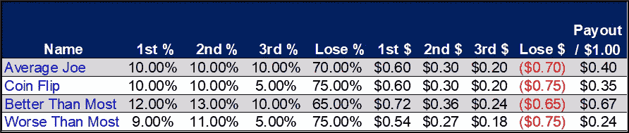
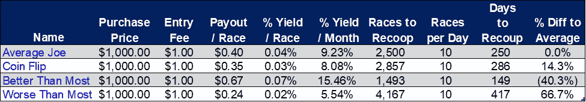
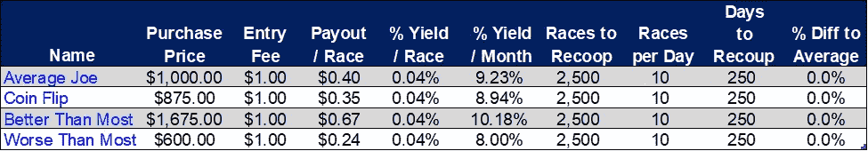

# ZED Run:为什么关注价格？

> 原文：<https://medium.com/coinmonks/zed-run-why-the-focus-on-price-55cf39f5cc7?source=collection_archive---------7----------------------->

**简介:价格即风险**

关于我发布的定价和估价材料，一个常见的问题是某种形式的“为什么这么多研究只是为了算出一个价格？难道一匹马不值得有人愿意出的价钱吗？此外，0.05–0.10 ETH 的差异真的会影响我的回报吗？”答案是，虽然“价值”等于“某人愿意支付的价格”的模型很容易理解，但当考虑购买一项能够以现金流和价格升值的形式向你回报资本(即你的钱)的资产时，这不是一个足够复杂的答案。

鉴于 ZED Run 是一个基于概率的固有风险游戏，也是一个我们都在试图破解的神秘算法，你需要小心选择你的数字纯种马，特别要密切关注这匹马为你提供资本回报的能力。那么，你为一匹马支付的价格，就成了降低损失大部分或全部投资风险的主要手段。当涉及到比赛表现或一匹马的后代投票率时，我们无法控制骰子的随机投掷，但是，我们可以控制的一件事是价格。

在接下来的几篇文章中，我们将看看我在市场上看到的一些常见的价格失误。我将剖析这些错误，并说明为什么不关注价格会严重损害你的马厩的盈利能力。

如果你错过了我的第一篇关于如何评估一匹马的文章，我推荐你在这里阅读第一篇。

对于已经发起的，就来深扎一下吧！

# 错误 1:相同的血统和品种=相同的价格

**我们在 ZED Run 中看到的最常见的定价趋势之一是，人们愿意为相同血统和品种的马支付相同的价格，而不管它的统计数据如何**。你会在 Discord 频道听到各种按血统和品种划分的“底价”，暗示这些马不管它们赚钱的能力如何，都值一些最低值。这是一个严重的错误，对你的回报影响最大。获胜/名次/展示百分比的细微差异会对你创造回报的能力产生巨大影响。

让我们假设您有一套 Z2 Nakamoto 传奇马，您正在考虑购买，每匹都以 1，000 美元(~0.4 ETH)的假设平均价格列出，统计数据如下:

Average, Median, 75th Percentile, and 45th Percentile Nakamoto Stats (Rounded)

*平均乔*拥有这一行马的平均统计数据；*抛硬币*有中等属性(即抛硬币，一匹马的属性会比这更好或更差)；*比大多数*表现更好，表现在第 80 个百分点；比大多数更糟糕的是*处于第 45 个百分点。*

知道我们只有在下注 1-3 时才能赢钱，我们需要确定我们期望在这三个位置上多长时间赢一次，以及我们多长时间输一次，然后乘以每一次的奖金；目前，第一名的报名费是 6 倍，第二名是 3 倍，第三名是 2 倍，其他任何职位都没有报名费。

要做到这一点，我们只需从 Show %中减去 Place %,就可以得到我们获得第三名的机会；从第%名赢得%有机会获得第二名；我们获得第一名的机会等于我们的胜率%。从 100%中减去我们的表演%得到我们失败的百分比。

Show — Place = 3rd %; Place — Win = 2nd %; Win = 1st %; 1 — Show = Lose %

现在，为了简单起见，如果我们假设 1.00 美元的入场费，我们知道每第一个位置我们会得到 6.00 美元，每第二个位置 3.00 美元，每第三个位置 2.00 美元，第三个位置以下的每个位置都会失去我们的入场费。将这些奖金乘以其预期概率，得出每场比赛的预期奖金:

Ex: $6 x 10% = $0.6; $3 x 10% = $0.3; $2 x 10% = $0.2; ($1) x 70% = ($0.7)

在上表中，我们看到每匹马都预计会提供长期回报，因为它们的支出是正的，但是，请注意支出的巨大差异。每匹马的统计数据只有几个百分点的差异，但这些微小的差异会导致预期支出的巨大差异。

考虑到马的成本为 1，000 美元，加上参加比赛所需的报名费，我们得到下表来确定收回投资所需的产量和比赛次数:

假设由于疲劳，我们每天可以跑大约 10 场比赛，我们可以看到在这两者之间收回我们的钱所需的时间的巨大差异。以 1000 美元的购买价格，平均来说**，我们需要 250 天(约 8 个月)才能从普通 Z2 Nakamoto Legendary** 收回初始投资。然而，如果我们在评估这匹马时偷懒，**我们可能需要长达 417 天的时间(比平均时间长 67%)**才能收回我们的资金。另一方面，如果我们从容不迫，对我们的潜在购买进行彻底的尽职调查，**我们可能最终会得到一匹比平均水平更好的马，与平均水平相比，它将在一半的时间内收回我们的投资**(在上面的例子中快了 40%)。

# 总结想法

上面的例子应该足以让你停下来，认真考虑你愿意为任何一匹马支付的价格。当务之急是，你真的要深入到一匹马的统计数据中，评估是否有一个合理的预期，你可以把你的钱拿回来。

要真正理解价格是控制投资损失风险的首要方法，请参见下表，该表显示了您可以为每匹马支付的价格，并且仍然期望达到收回投资的平均天数:

Price is the #1 way to control for performance risk!

通过简单地减少对比大多数更糟糕的*抛硬币*和*的出价，你仍然可以实现略低于 10%的月收益率，并在与普通马相同的时间内从马身上收回你的钱。相反，你可以为*支付比大多数*高 67%的利息，但仍能获得 10%的月收益率，并在 8 个月内收回投资。*

现在，对于那些熟悉 ZED Run 的人来说，我们知道这个分析只是评估一匹马的价格的冰山一角。每匹马可能有一个特定的距离或赛道表面，它喜欢在那里它会超越其整体统计。我建议真正深入到一匹马的比赛历史中，并按级别评估每段距离和每个“比赛漏斗”的统计数据，以找出如何才能实现最高的投资回报。

请喜欢并关注[媒体](https://rainierracingco.medium.com/)、[推特](https://twitter.com/RainierRacingCo)、 [Instagram](https://www.instagram.com/rainier_racing_nft/?hl=en) 、[脸书](https://www.facebook.com/RainierRacingCo)，并查看我们的[网站](https://rainierracingco.com)了解更多信息。

如果您对如何评估一匹马有疑问，或者对我们为您做的分析感兴趣，请通过[RainierRacingCo@gmail.com](mailto:RainierRacingCo@gmail.com)联系我们，我们将在 24 小时内回复您。

# 定价和估价资源

[雷尼尔赛车公司](https://rainierracingco.com) —查看我们的市场数据，阅读我们的 ZED Run 市场报告。

Hawku——用于寻找新的列表，筛选类似的交易，并查看比赛统计数据。

[了解你的马](https://knowyourhorses.com)—*深入了解你的马和其他马厩主人的地方。*

*Zed Ranks——粗略估计一匹马价值的好地方。*

*[StackedNaks](https://www.stackednaks.com/) —查看你的马在游戏中与其他马的排名统计。*

*[ZED Run](https://zed.run/)——游戏！*

> *加入 Coinmonks [电报频道](https://t.me/coincodecap)和 [Youtube 频道](https://www.youtube.com/c/coinmonks/videos)了解加密交易和投资*

# *另外，阅读*

*   *[印度的加密交易所](/coinmonks/bitcoin-exchange-in-india-7f1fe79715c9) | [比特币储蓄账户](/coinmonks/bitcoin-savings-account-e65b13f92451)*
*   *[OKEx vs KuCoin](https://coincodecap.com/okex-kucoin) | [摄氏替代品](https://coincodecap.com/celsius-alternatives) | [如何购买 VeChain](https://coincodecap.com/buy-vechain)*
*   *[币安期货交易](https://coincodecap.com/binance-futures-trading)|[3 comas vs Mudrex vs eToro](https://coincodecap.com/mudrex-3commas-etoro)*
*   *[如何购买 Monero](https://coincodecap.com/buy-monero) | [IDEX 评论](https://coincodecap.com/idex-review) | [BitKan 交易机器人](https://coincodecap.com/bitkan-trading-bot)*
*   *[CoinDCX 评论](/coinmonks/coindcx-review-8444db3621a2) | [加密保证金交易交易所](https://coincodecap.com/crypto-margin-trading-exchanges)*