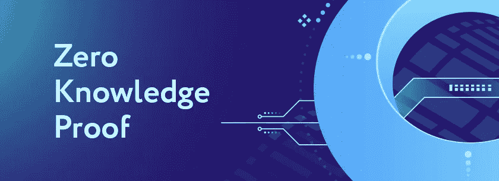
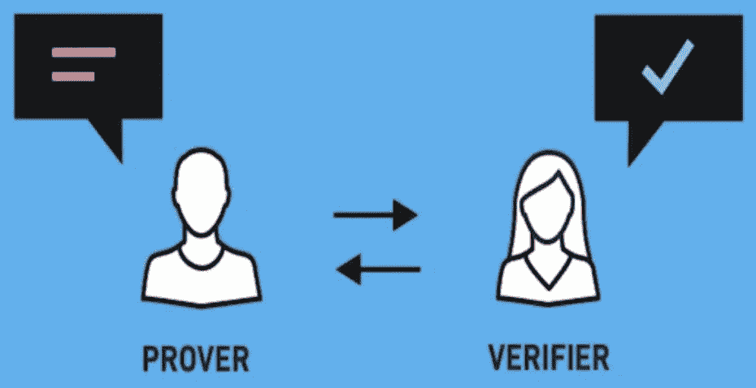
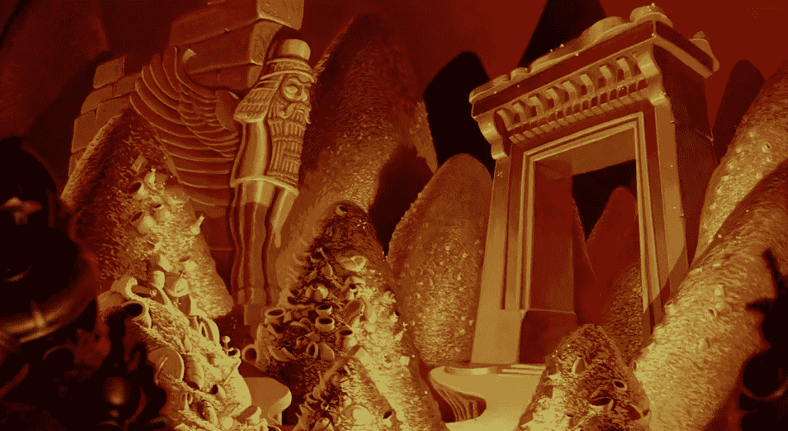
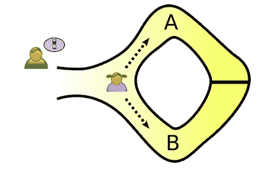
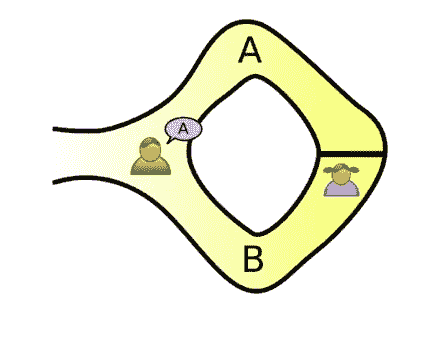
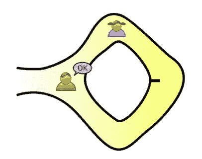
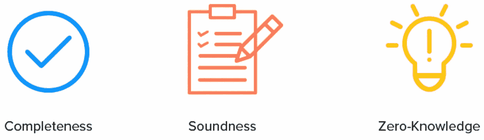
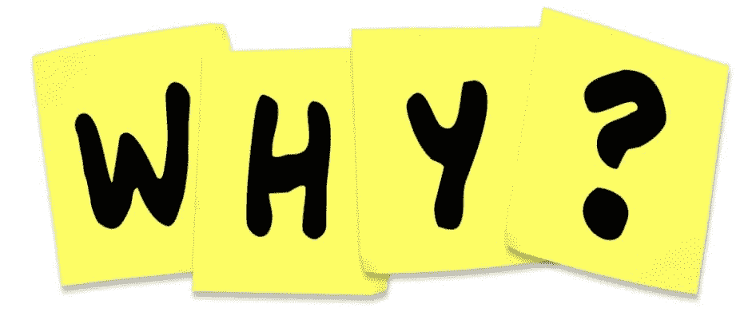

# 零知识证明(ZKP):证明它而不揭露它

> 原文：<https://medium.com/coinmonks/zero-knowledge-proof-proving-it-without-revealing-it-125ec1f4f32e?source=collection_archive---------24----------------------->

Photo: [EXBASE](https://exbase.io/en/wiki/zero-knowledge-proof), all right reserved.

谈到以太坊扩展解决方案，Web3 开发者有很多选择。你有第 1 层增强，比如以太坊 2.0，第 2 层链，比如乐观和 Arbitrum，以及侧链，比如 Polygon 或 xDai。我写了另一篇关于第二层类型的中型文章，你可以在这里找到。

在第 2 层以太坊扩展选项类别下，Web3 开发者可以在状态通道、乐观汇总或零知识(ZK)汇总之间进行选择。ZK-汇总作为以太坊的扩展选项越来越受欢迎，有可能大幅削减交易成本和时间。ZK 总结使用零知识证明，我们将在这篇文章中深入探讨。

## **什么是零知识证明？**

Photo: [Golden](https://golden.com/wiki/Zero-knowledge_proof-3GRZ5), all right reserved.

零知识证明是一种加密方法，用于在不显式公开已知信息的情况下证明某事已被确认。它使私有数据在整个交易过程中保持私有。零知识证明是间接证明，它允许你证明你知道一个秘密，而不用告诉任何人。你只需要证明你说的是实话。

> 证明者和验证者是零知识证明中最重要的两个角色。

证明者必须证明他或她知道这个秘密。验证者必须能够确定证明者是否在说谎。它之所以有效，是因为验证者要求证明者执行一些动作，而这些动作只有在证明者确信他或她知道秘密的情况下才能完成。如果证明者在猜测，验证者的测试将最终证明他或她的错误。如果秘密是已知的，证明者每次都会通过验证者的检验。让我们看一个例子来说明这个概念。

## **阿里巴巴洞穴示例**

展示零知识证明密码术技术中使用的推理的最突出的零知识证明例子是阿里巴巴洞穴。在这个例子中，你必须假设两个角色，杰西卡和欧文。他们每个人都在寻求和结束自己在一个山洞里。他们来到两条不同路线的两个独立入口，A 和 b。在洞穴内，有另一扇门连接着两条路径。一方面，杰西卡知道打开门的密码，因此处于“证明者”的位置。另一方面，欧文想买代码，扮演‘验证者’。欧文想确定杰西卡说的关于知道开门密码的事是真的。为此，Jessica 必须向 Owen 证明她知道代码，而不实际透露代码中的内容。

此时，想一想零知识证明示例在这里如何工作是很重要的。首先，当杰西卡从 A 或 b 路进入时，欧文必须在洞外等候。

之后，在杰西卡进入洞穴后，欧文走近洞口，向她呼喊，恳求她从其中一条小径出去。

如果杰西卡知道开门的密码，那么她会打开门，从欧文要求的路径返回。当杰西卡不知道密码时，她可能不得不返回她选择进入的同一条路。另一方面，如果杰西卡通过另一边离开洞穴，那么欧文可以肯定杰西卡知道密码。

欧文可能认为杰西卡通过测试是因为她的运气。在这种情况下，很明显，交易有 50%的概率双方选择相同的课程。尽管如此，如果相同的交易重复几次，杰西卡在没有密码的情况下通过与欧文相同的路径离开的几率会大大降低。因此，如果杰西卡不知道密码，她通过欧文选择的路径离开洞穴的可能性微乎其微。最后，这个 ZKP 的例子表明，杰西卡可以通过多次从她选择的路径逃离洞穴来证明她对欧文的陈述的真实性。

零知识特征在例子中是可见的，因为 Owen 不能学习任何关于代码的东西。欧文呆在山洞外面，因此他不可能知道密码。因此，杰西卡可以向欧文证明她知道这扇门的密码，而不必向他透露。

## **零知识证明的性质**

Photo: [Blockgeni](https://blockgeni.com/zero-knowledge-proof-role-in-the-blockchain-world/), all right reserved.

*   **零知识**
    如果陈述是真的，验证者将不会知道该陈述或被。这里的语句可以是绝对值，也可以是算法。
*   完整性如果陈述为真，那么一个诚实的验证者最终会被说服。
*   如果证明者不诚实，他们就不能说服验证者证明的完整性。

## **不同类型的零知识证明**

零知识证明主要有两种类型:

*   **交互式零知识证明:**在这种类型的 ZKPs 中，证明者和验证者要多次交互。验证者质疑证明者，证明者对这些质疑做出答复，直到验证者被说服。
*   **非交互式零知识证明:**这里，证明者交付的证明在任何时候只能被验证者验证一次。这种类型的 zkp 比交互式 zkp 需要更多的计算能力。

## **零知识证明的应用和用例**

零知识证明可用于在各种用例中保护数据隐私，例如:

*   **区块链:**零知识证明可以为公众区块链引入更多隐私。例如，加密货币 [Zcash](https://z.cash/technology/zksnarks/) 基于零知识简洁的非交互式知识论证(Zk-SNARKs)，这是一种零知识加密方法，我将在未来的媒体文章中处理。
*   **在线投票:** ZKPs 可以允许投票者匿名投票，并验证他们的投票是否包含在最终的计票中。
*   **认证:** ZKPs 可以用来认证用户，而不需要交换密码等秘密信息。

## **为什么我们需要零知识证明？**

每天，我们都被推到必须放弃隐私的境地，因为大多数网站都要求我们暴露个人信息。即使我们都自由地参与这些活动，这些服务中的许多已经变得不可或缺，让我们在如何处理隐私问题上没有选择。作为一种文化，我们几乎被剥夺了对如何使用我们的数据的任何决策控制。

近年来，隐私的缺乏引发了一场辩论，即如何才能确保两方或多方之间的信息共享保持在最低水平。ZKPs 的使用开辟了更大独立性的可能性。

## 参考

⁃ ***什么是零知识证明？***—2020 年 5 月 12 日—马特·赫西—([https://decrypt . co/resources/zero-knowledge-proof-explained-learn-guide](https://decrypt.co/resources/zero-knowledge-proofs-explained-learn-guide))

⁃ ***零知识总结***—2022 年 5 月 23 日—科温·史密斯—([https://ethereum.org/en/developers/docs/scaling/zk-rollups/](https://ethereum.org/en/developers/docs/scaling/zk-rollups/))

⁃ ***零知识证明:斯塔克斯 vs 斯纳克斯*** —马蒂森·阿舍、库根·布伦南—2021 年 5 月 18 日—([https://consensys . net/blog/区块链-explained/零知识证明-斯塔克斯-vs-斯纳克斯/](https://consensys.net/blog/blockchain-explained/zero-knowledge-proofs-starks-vs-snarks/) )

⁃ ***零知识证明:如何工作&2022 年应用***—2022 年 4 月 10 日—杰姆·迪尔梅甘尼—([https://research.aimultiple.com/zero-knowledge-proofs/](https://research.aimultiple.com/zero-knowledge-proofs/))

⁃ ***零知识证明***—2022 年 5 月 11 日—geeks forgeeks—([https://www.geeksforgeeks.org/zero-knowledge-proof/](https://www.geeksforgeeks.org/zero-knowledge-proof/))

⁃ ***基本面:什么是零知识证明？***—2022 年 3 月 8 日—亚历克斯·bączkowski—([https://alephzero . org/blog/fundamentals-zero-knowledge-proof/](https://alephzero.org/blog/fundamentals-zero-knowledge-proofs/))

> 加入 Coinmonks [电报频道](https://t.me/coincodecap)和 [Youtube 频道](https://www.youtube.com/c/coinmonks/videos)了解加密交易和投资

# 另外，阅读

*   [3 商业评论](/coinmonks/3commas-review-an-excellent-crypto-trading-bot-2020-1313a58bec92) | [Pionex 评论](https://coincodecap.com/pionex-review-exchange-with-crypto-trading-bot) | [Coinrule 评论](/coinmonks/coinrule-review-2021-a-beginner-friendly-crypto-trading-bot-daf0504848ba)
*   [莱杰 vs n rave](/coinmonks/ledger-vs-ngrave-zero-7e40f0c1d694)|[莱杰 nano s vs x](/coinmonks/ledger-nano-s-vs-x-battery-hardware-price-storage-59a6663fe3b0) | [币安评论](/coinmonks/binance-review-ee10d3bf3b6e)
*   [加密交易机器人](/coinmonks/crypto-trading-bot-c2ffce8acb2a) | [Bingbon 评论](https://coincodecap.com/bingbon-review)
*   [Bybit Exchange 审查](/coinmonks/bybit-exchange-review-dbd570019b71) | [Bityard 审查](https://coincodecap.com/bityard-reivew) | [Jet-Bot 审查](https://coincodecap.com/jet-bot-review)
*   [3 commas vs crypto hopper](/coinmonks/3commas-vs-pionex-vs-cryptohopper-best-crypto-bot-6a98d2baa203)|[赚取加密利息](/coinmonks/earn-crypto-interest-b10b810fdda3)