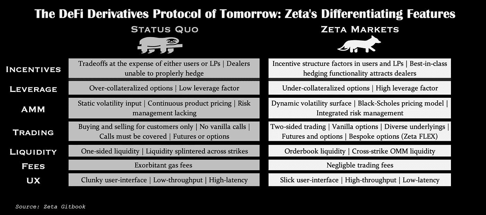
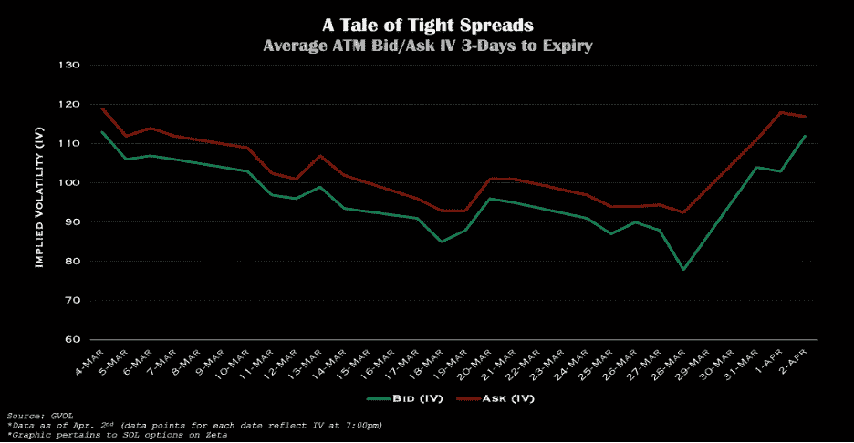
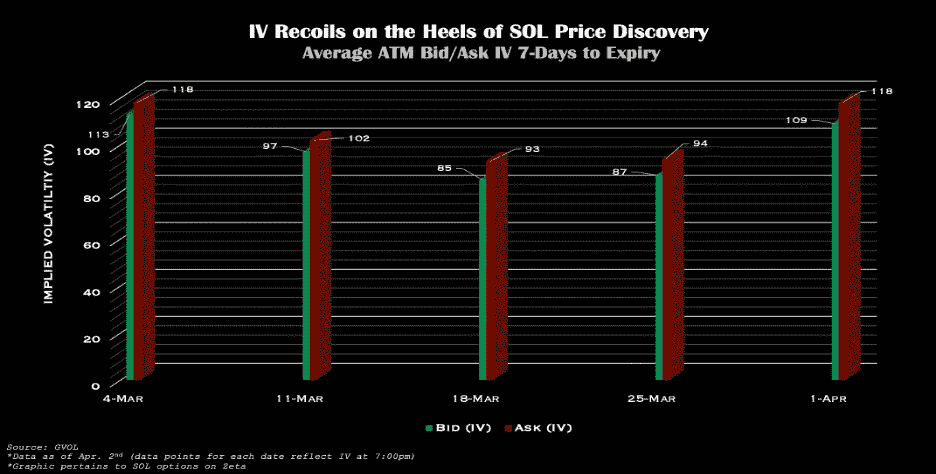
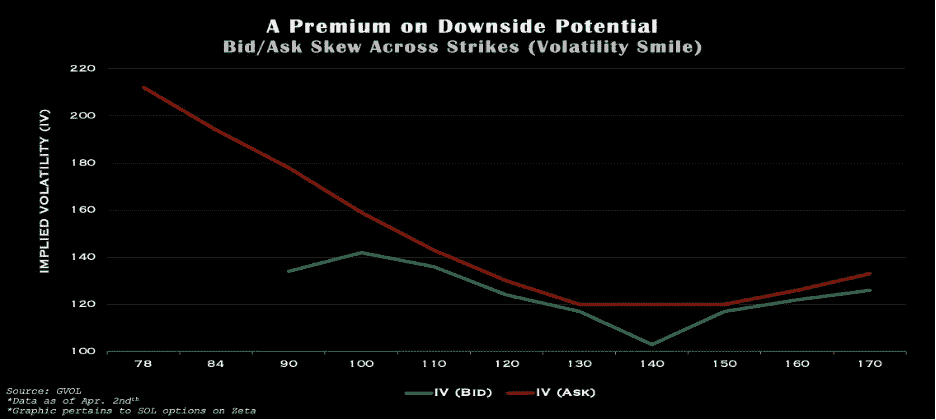
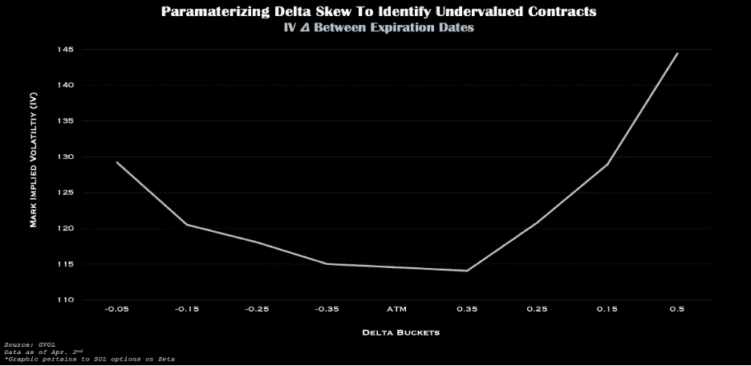
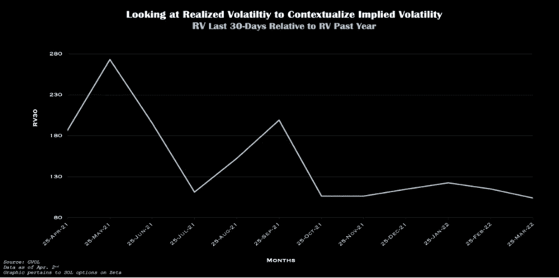
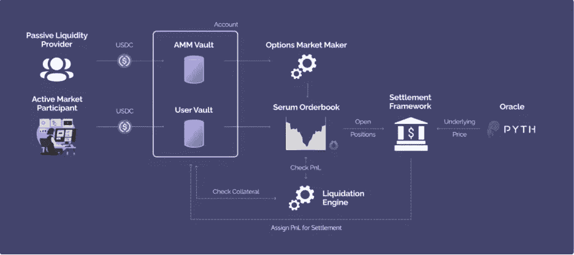
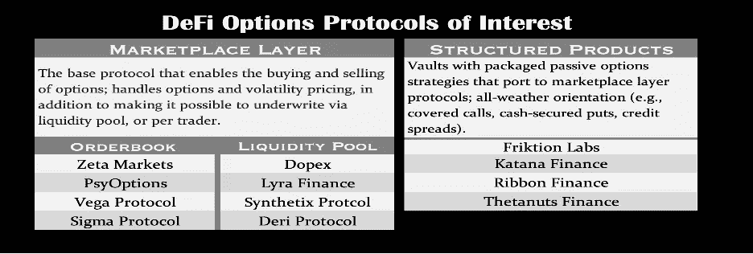

# 泽塔市场:DeFi 衍生品的巨变

> 原文：<https://medium.com/coinmonks/zeta-markets-a-sea-change-in-defi-derivatives-b00f53c73e5e?source=collection_archive---------4----------------------->

2022 年 4 月 3 日定义

## 关键**外卖**

*   由于大多数区块链的基本限制，DeFi 协议倾向于依赖潜在价格预测，这使得及时的抵押品跟踪成为不可能。反过来，过度抵押和隔离保证金也是这个领域的通病。就衍生品而言，这否定了其受欢迎的真正原因——资本效率。从这个角度来看，过度抵押的衍生品类似于一条湿毛巾。略好于没有毛巾，但没有人的首选。由于索拉纳的 400 毫秒交易时段，泽塔的保证金体系结构用抵押不足的交叉保证金衍生品重新武装了交易者。
*   大多数 DeFi 衍生产品协议都考虑了交易商的需求，以及他们在做市、提供流动性和刺激市场增长中所扮演的不可或缺的角色。为了充分激励参与协议，交易商需要集成的 delta 对冲工具，以资本高效的方式管理其风险。新奇的是，Zeta 通过在他们的平台上调整期货和期权合约的到期时间，为交易商提供了这一功能。因为交易商创造市场，提高流动性，并有助于市场的健康，所以任何吸引他们的行动都是协议繁荣能力的上游。Zeta 对这一市场动态的认识使他们在期权启用协议中处于领先地位。
*   为了提供高度流动的无缝交易体验，Zeta 充分利用了 Solana 无与伦比的吞吐量、Serum 的可组合链上中央限价订单簿(CLOB)和匹配引擎、Pyth Network 的高频价格 oracle 以及他们自己的期权 AMM (OMM)。
*   除了在基础层释放 Zeta 的超高速外，Solana 的历史证明节点同步方法降低了 MEV 提前运行的风险，使 Zeta 比基于以太坊的 DeFi 衍生协议更具抗攻击性，从而打破了机构交易者的主要准入壁垒。
*   在加密市场，期权交易量是现货交易量的 1/50。在美国股市，期权交易量经常超过现货交易量。有许多因素加剧了这种差异，但其中最突出的是相对缺乏机构实体。金融机构珍视衍生品，因为衍生品让它们能够更高效地完成使命。与现货股票相比，它们提供了不对称的杠杆倍数和最大损失比率、更高的流动性以及更有效的风险管理。像 Zeta 这样提供 CeFi 级体验的协议将使从 CeFi 到 DeFi 的机构过渡变得平稳。关键基础设施的开发，如 HXRO Network——Solana 生态系统中基于风险的应用的分散流动性、风险和保证金原语——也应有助于增加机构对 DeFi 衍生品市场的参与。HXRO 将整合 Civic(一家获得许可的 DeFi 身份验证服务提供商)，这将消除阻碍机构参与的另一个障碍。另一家拥有 500 多家机构交易对手的机构流动性提供商 Paradigm(与投资公司无关)在单一渠道上提供多交易商自动 RFQ(询价)功能。像 HXRO 和 Paradigm 这样的网络将加快机构的加入过程，因为它们旨在与经纪人和交易商使用的现有订单管理系统相结合。
*   在强大的产品专注的指导下，Zeta 正在开拓 DeFi 衍生品，并致力于为用户提供管理风险、投机和微调投资策略的工具。在 2022 年的 Q1，衍生品(主要是 perps)约占 3 万亿美元，或加密市场交易量的 60%。
*   期权是金融工具的瑞士军刀——对预期黑天鹅事件、顶部爆炸或横向漂移的交易者同样有用。此外，方向中立的交易者可以通过全天候期权收益策略获得可观的收益。Zeta 目前支持 SOL 合同的现金结算欧洲期权和到期期货，但更多的基础资产、永久期货、多抵押品保证金和激励计划已在近期路线图中，而永久期权可能会在未来进一步发展。

## 背景

易用性和集成的教育工具是金融应用程序采用的主要催化剂。Robinhood 和 Tastyworks 等 TradFi 公司也相应地进行了投资。Robinhood 针对移动设备进行了全面优化，为用户提供了简单易用的体验。Tastyworks 提供了大量现代化的教育资源，使散户更容易掌握复杂的期权策略。

意识到这一动态，Zeta 明智地采用了移动优先的方法，并为他们的平台配备了丰富的教育资源——如果用户不了解他们的机制，他们就不会使用期权和期货。在移动信息时代，智能手机实际上是大多数个人的附属品。与忽略前端开发和用户偏好的协议相比，基于这一点构建用户界面的 DeFi 协议将享有实质性优势。

泽塔优先考虑可及性和简单性，同时不降低产品供应。这将对他们的 TAM 产生显著的扩张效应。期权最大限度地降低了与股票所有权相关的风险，是一种无价的投资组合管理工具。如果这在股票市场是真的，那么在加密市场更是如此。作为一种资产类别，数字资产的交易更像大宗商品，而非股票，通常会对最细微的刺激做出反应，这使得衍生品变得更加有用。

由于其块拥塞，以太坊基础层根本不是用于 DeFi 衍生协议的计算上可行的基础。其结果是，更便宜、性能更高的 L2 解决方案在以太坊上蓬勃发展。StarkEx、Arbitrum 和乐观主义为 dYdX、MCDEX、Dopex 和 Lyra 等协议打开了大门，它们可以提供 L1 同行(如 Hegic、Opyn)无法提供的功能。

相对于以太坊，乐观汇总显著提高了吞吐量，同时受益于以太坊软件的高度兼容性和可重用性。但是，它们需要 oracle 数据的链上发布，因此价格反馈更新的频率受到结算层的阻塞时间的限制，在以太坊上最少为 12.5 秒。此外，在用户可以提取资金之前，乐观汇总需要经过七天的争议期(T1)，以允许发布欺诈证据。这两个限制尤其降低了交易应用程序的乐观汇总的实用性。

在波动性加剧期间，高延迟的 oracle 更新可以使抵押率与现实脱钩，而长达一周的提款延迟是一种排斥。基于 StarkEx 的 dYdX 展示了 ZK 汇总相对于针对特定交易应用的乐观汇总的优越性。生成并在链上验证清晰的证明(批量交易)。这实现了实时 oracle 更新和天然气成本的规模经济(即，随着交易的批量化，STARK proofs 以对数方式增长，因此用户成本随着批量的增加而下降)。这与以太坊基础层的情况正好相反，交易量的增加会导致用户成本的增加。

长期来看，StarkEx 最大的弱点可能是其封闭(缺乏可组合性)的性质，由于流动性集中，这是迄今为止的一个特征。StarkEx 的外向姐妹 L2 解决方案 StarkNet 是可组合的，但尚未托管一个现场 DeFi 衍生品部署。ZKX(一个游戏化的永久掉期交易所，目前处于秘密模式)将由 StarkNet 提供支持，但尚未宣布提供期权交易的计划。StarkNet 为寻求可组合性和规模的 DeFi 衍生品协议提供了一个有趣的价值主张，值得与 ZKX 和其他基于 StarkNet 的交易应用保持同步。

为了最大限度地增加价值，DeFi 衍生产品协议需要将自己塑造成端到端的金融产品。Vega 协议是另一个新兴的 DeFi 衍生协议，旨在做到这一点。它是使用 Tendermint Core 构建的模块化区块链，理论吞吐量为 10k TPS，具有低延迟价格馈送(1 秒 oracle 更新)。和 Zeta 一样，Vega 也不打算在产品供应上吝啬。期权、期货、perps 和利率互换预计将于 2022 年在 Vega 的 mainnet 上上线。

Solana 的垂直扩展方法使其能够随着硬件的进步而扩展，而不需要将流量从基础层转移或分割的解决方案。L2s、分片、侧链、子网和其他扩展解决方案为生态系统添加了移动部分，其中每一种都有自己的一套权衡。区块链是广播网络。因此，通量一直是 DeFi 方案追求超越其指数级更快的 CeFi 类似物的限制因素。索拉纳目前实现的 TPS 比其他任何区块链都多，而且差距很大。2，265，大约比其当前容量低两个数量级。

普通的利害关系证明(PoS)区块链协议依靠时间戳块来确保验证顺序发生，但是不可避免的网络差异(例如，时钟漂移和延迟差异)使得时间戳不精确，因此网络延长块时间以防止块的乱序。为了避免这种命运，Solana 实施了其新颖的历史证明(PoH)节点同步工具来增强其 PoS 一致性，从而实现了无与伦比的性能——400 毫秒的阻塞时间和 50k TPS 的理论容量，65k TPS 似乎很容易实现。

简而言之，PoH 需要预先分配的领导者节点以定义的间隔用证明对块进行时间戳标记，几乎消除了块之间的延迟。然而，该团队已经制定了具体的[计划](https://docs.solana.com/introduction)来将吞吐量提高到理论上限 710k TPS，这将缩小 Solana 和集中式数据库之间的差距。天生的高性能链是分散式衍生应用程序(如 Zeta)的最佳基础，这些应用程序需要即时的可伸缩性和性能。自然地，这使得 Solana 成为部署 Serum 的理想链——一个链上中央限价订单簿(CLOB)和匹配引擎，旨在解决以太坊生态系统中发现的高气体成本、缓慢交易和流动性碎片。一个高性能的订单簿是任何金融系统不可或缺的，Solana 的血清的到来解决了这一现实。

## Zeta 上的 SOL 选项

交易者可以使用定价模型来推断期权合约 IV 的公允价值，然后将他们推断的公允价值 IV 与买价/卖价 IV 进行比较，以得出偏差。如果向右倾斜(高买价/卖价 IVs)，做市商可能正在累积，推高买价/卖价 IVs，阻止散户购买。如果相反(低买价/卖价 IVs)，做市商可能会卖出，压低买价/卖价 IVs，鼓励散户买入。如果出价/要价 IV 价差扩大(低出价 IV/高要价 IV)怎么办？在这种情况下，需要关闭市场，然后再打开。这通常预示着高波动性制度，做市商基本上是出去吃午饭，而不是想买或卖。相反，买入/卖出 IV 价差的收紧表明做市商正在积极买入和卖出(即，以成交量为食)。在撰写本文时，Zeta 上的 24 小时交易量为 804，279 美元，OI 为 14，613。交易量是衡量交易所增长的最重要的指标，因此随着时间的推移，看到这种趋势上升肯定是一个积极的信号。

由于 SOL 在 3 月中旬保持相当稳定，SOL 合约到期后 7 天的平均 ATM IV 稳步下降。SOL 从 3 月 15 日的 84.48 美元的日内高点上涨到 4 月 2 日的 142.95 美元的日内高点，涨幅为 69%。随着 IV 进入 3 月中旬，对买家来说，期权看起来很便宜。此后，保费随着 IV 的增加而飙升，增加了卖方的利润潜力。泽塔上的紧密利差可以归功于泽塔的 CLOB 和动态 OMM 共同维持流动性的功效。

观察泽塔即将推出的激励计划(如代币发行)对利差、交易量和投资回报率的影响将会很有意思。通常情况下，令牌的发布会刺激流量和 OI 激增，因为令牌会激励网络参与。在 dYdX 的案例中，交易量和活跃用户都在他们的令牌推出后飙升，dYdX 的令牌费也是如此。dYdX 的交易量在推出代币的一个月内增长了 25 倍。泽塔的激励计划可能会有类似的效果。

从逻辑上来说，波动速度越是向下，波动速度就越快。市场在总体上产生正漂移，而修正往往是迅速的。额外的溢价包含在 OTM 看跌期权中——相对于与 ATM 罢工等距的 OTM 看涨期权——因为由于上述下行速度，看跌期权罢工赚钱的可能性更大。此外，看跌期权通常将更多的出价视为其在投资组合对冲中效用的函数，这导致了上面看到的波动微笑。

IV 处于 ATM 罢工的低谷，随着罢工进一步向 OTM 方向推进而上升。与保险公司以高于预期支出的价格出售保险一样，期权卖方倾向于以高于其预期支出的价格出售期权。相同行权期内不同到期日期权的曲线 IV 被称为波动率期限结构(例如，期货溢价、现货溢价、平盘、驼峰)。这些曲线描绘了市场预期的未来波动性。

毫无疑问，Delta 是管理投资组合风险的最重要的晴雨表。这是对期权对基础资产价格波动的反应度的测量，在本例中是 SOL。Delta 桶可用于评估波动面(到期时间、执行价格和 IV ),并通过偏斜查明高估或低估的合约。Delta 归零法通常用于抵消市场双向波动的风险，使投资者能够锚定其投资组合，同时从其 delta 中性策略中获利，这些策略依赖于 theta 衰减和/或 IV 波动。

日历传播是一个流行的三角洲中立策略的主要例子，一旦引入额外的到期和罢工，就可以在 Zeta 上执行。目前，SOL 的交易价格约为 138 美元，4/8 是唯一的到期日。在有 5/8 合约和 138 美元成交的情况下，交易者可以通过卖出短期 ATM 看涨期权(SOL $138 4/8)和买入长期 ATM 看涨期权(SOL $138 5/8)来执行日历差价，导致两个合约之间的差额的净借方(也是最大损失)。长期期权具有更高的 vega(波动敏感性)，因此如果 SOL 价格上涨，5/8 看涨期权的升值幅度将超过 4/8 看涨期权。同样有利的是，卖出的 4/8 看涨期权可能会一文不值地到期，让交易者将该合约的溢价收入囊中，而 5/8 合约仍保持其价值。

目前在该平台上，可以执行信用和借记利差，并且在 IV 较高时特别有用。垂直价差的一种形式——看涨期权信用价差——包括卖出和买入期限相同的看涨期权，但卖出的看涨期权具有较低的行权价。这种策略现在就可以在 Zeta 上执行，利用高 IV 买入 4/8 $160 的 SOL 看涨期权，同时卖出 4/8 $150 的 SOL 看涨期权，产生的净信用等于两个合约之间的差价。如果 SOL 在到期时以低于空头执行价的价格交易，将产生最大利润，而最大损失是两次执行之间的差价，减去收到的初始信用。

波动率偏态可用于构建风险缓和、半市场中性的策略，如 strips 和 straps。条带是一种市场中性的看跌策略，通过购买一个自动柜员机看涨期权和两个自动柜员机看跌期权来构建，而条带是一种市场中性的看涨策略，通过购买一个自动柜员机看跌期权和两个自动柜员机看涨期权来构建。如果波动性偏斜表明看跌期权相对于看涨期权被低估，那么条带就变得更具成本效益，而如果波动性偏斜表明看涨期权相对于看跌期权被低估，那么条带就变得更具成本效益。当 IV 相对于历史波动性较低时，条带和带子看起来最有吸引力，因为它们涉及购买多份合同，当 IV 较低时，所有这些合同的成本都较低。

历史波动性，也称为已实现波动性，表明基础在过去是如何变化的。隐含波动率是市场对未来将实现的波动率的最佳估计。期权交易者可以利用历史波动率为市场报价的隐含波动率增色。隐含波动率必须推断，因为它不是直接可见的。自 1990 年以来，在美国股票市场上，IV 有 83%的时间被高估了。在低波动状态下，由于正漂移，上涨在统计上更有可能。因为 IV 往往意味着恢复，历史波动性是非常有用的。实际波动率和隐含波动率之间的差异被称为方差溢价，它证明了 IV 往往会随着时间的推移超过 RV。

## 泽塔市场:幕后

**Solana x Serum x Pyth =规模化性能**

Capsulation of Zeta Markets’ Schematics

Zeta-Serum 上的交易活动的支点几乎消除了用户的交易费用和滑点，同时促进了流动性、价格发现、紧密的价差和灵活性(例如，能够下达市价订单和限价订单)。纳斯达克(NASDAQ)等主要 TradFi 交易所理所当然地依赖 CLOBs，因为它们提供了所有交易执行模式中最高程度的透明度和资本效率。此外，Serum 的订单簿是分散的和可组合的，通过将流动性集中在一个位置，所有基于 Solana 的应用程序都可以访问它。

oracles 能够发布价格反馈数据的频率由构建它们的基础层的阻塞时间决定。假设以太坊上的最小平均阻塞时间为 12.5 秒，其 oracles(如 Chainlink)无法为其应用程序提供实时市场数据。随着到期日的临近，资产价格往往会变得越来越不稳定，这使得实时价格反馈更新的需求变得更加重要。

Pyth Network 源于 Solana，能够每 400 毫秒(每天超过 20 万次)发布一次第一方市场数据，将现状提高了三个数量级以上。这确保了 Zeta 上保证金和清算流程的功能，保护用户和协议本身免受不利后果的影响。Pyth 采用了一种激励结构来使高保真数据的提供变得有价值。也就是说，pyt 将其产生的数据费用的 20%分配给机构实体，如高频交易和研究公司，这些公司将收集的数据作为其常规业务的一部分。目前参与的机构包括 Jump Trading、Galaxy Digital、Three Arrows Capital、Alameda Research、Susquehanna International、CMS、Genesis Global、LMAX 等等。随着参与的增加，Pyth 能够提供的数据的保真度也将增加。

Zeta FLEX 进一步丰富了 Zeta 的功能集，这是一种无需许可的拍卖协议，允许用户定制选项。用户将能够使用 FLEX 定制其期权合约的各个方面，包括执行、到期和行使形式(即美式对欧式)。FLEX 对结构化产品提供商特别有用，因为它允许他们将资产风险货币化。包括 Katana 和 Ribbon Finance 在内的著名结构化产品协议已经部署在 FLEX 上，每天总共结算近 3000 万美元的合同。结构性产品对 DeFi 投资者来说是非常宝贵的，他们希望利用期权的价值，而不必制定自己的策略。

Katana 和 Ribbon 都提供拱形收益生成策略，如出售备兑看涨期权和现金担保看跌期权。更好的是，收益率随着时间的推移而复利。Katana 的拱形备兑买入策略目前预计产生 92.79%的 APY。同样有希望的是——创收期权策略比产量农业策略更具可持续性，因为它们不依赖于流动性供应的潮汐性质。Friktion 是另一个新兴的原始公司，目前利用 Zeta 的期权和期货基础设施作为其宏观结构产品的结算层。结构化产品可以比赋予它们生命的市场层协议快得多。泽塔应该是主要受益者，因为结构化产品供应商将有充分的动机将他们的金库放在功能丰富的平台上。

总的来说，期权市场偏向于卖方，这要感谢猿类——尽管它们在一起很强大——倾向于高估短期数字上升，导致它们购买通常到期时毫无价值的无担保 OTM 看涨期权。期权的现金结算性质使得购买这种看涨期权更具吸引力，因为最大损失有明确的定义，不像期货那样通过实物交割结算或通过对冲合约的开立来结算。这是期权创收策略(如备兑买入期权、现金担保看跌期权、信用利差)可持续性的推动力。芝加哥商业交易所(CME)在 20 世纪 90 年代进行的一项研究显示，超过 75%的期权合同到期时一文不值，导致卖方获利。

## CeFi 到 DeFi:催化大逃亡

对于交易应用程序，一个基本链提供即时的规模，同时逐渐去中心化，看起来比一个逐步扩展链提供即时的去中心化更有吸引力。前一种组合优化了用户体验，这显然非常重要，德雷比特对 BTC 期权市场的统治和币安对 BTC 期货市场的统治突出了这一点。到目前为止，CeFi 交易所只是提供了一个更加优雅和高效的用户体验。衍生品不是一个 DeFi 应用程序，它将能够完全基于分散化和隐私津贴根除 CeFi 期权市场。DeFi 衍生品需要为用户提供动态体验，与 CeFi 目前提供的体验相媲美。

想象一下这样一个场景，一个外星期权交易者因其母星市场流动性不足而不情愿地来到地球。这样一个实体将无法满足 KYC 对地球的 CeFi 衍生品交易所的要求。反过来，他们会被送到 DeFi，面对一系列可供选择的协议。作为地球上的新人，这个实体不会受到意识形态的限制。因此，他们最有可能行使客观性，并把他们的才能带到 Zeta——最具性能和功能最丰富的 DeFi 衍生协议。

就像这个虚构的实体一样，许多 CeFi 衍生品老手并不效忠于任何特定的生态系统，他们也将涌向最适合他们需求的 DeFi 衍生品协议。CeFi 衍生产品向 DeFi 衍生产品的大规模迁移是不可避免的，这是由于承诺将交易对手风险降至最低，同时具备 CeFi caliber 功能，如高性能和可忽略的成本。

汽车购买者当然喜欢驾驶特斯拉 Model S Plaid 减少他们的碳足迹，但实际上，未来主义的驾驶舱和不到 2 秒的 0-60 英里/小时是推动汽车采用的原因。假设加密市场的采用动态将完全不同是不符合逻辑的。具有最吸引人的混合功能的 DeFi 衍生协议将会得到最大的一块馅饼，假设它所做的权衡是可接受的。如果目标是大规模采用，那么装备最好的连锁店似乎是一个明智的选择。Solana 在需要巨大规模的应用上有明显的优势，比如即时消息、视频流，当然还有衍生品交易。

## 结论

流动性挖掘和其他增长黑客措施有效地吸引了新用户，但用户保留将仅来自真正的功能，如并行的期权和期货、交易对多样性、深度流动性、丰富的杠杆和优雅的用户界面。提供这些特征的协议将提供在 DeFi 中从未见过的投资组合增强策略的程度。

没有一个期权交易者想被一个有三个按钮的用户界面所限制，他们也不想使用一个笨重、过于复杂的用户界面。齐塔人的愿景是在这两个极端之间找到一个快乐的中间点。分散化和隐私本身不足以促使 CeFi 期权交易商大规模迁移到 DeFi 期权协议——这种保证将需要 CeFi caliber 性能和卓越的用户体验的支持。

相对于 DeFi 期货市场而言，DeFi 期权市场正处于萌芽阶段，尽管受到疲弱的宏观经济背景的影响，DeFi 期货市场仍在加速发展。全球 GDP 目前约为 100 万亿美元，接近全球 TradFi 衍生品市场规模的十分之一。当考虑到 TradFi 衍生品市场的监管有多么严格时，这种并列就更加不和谐了——除了国内隔离，不利于流动性。

DeFi 衍生协议在单独使用协议令牌时有很大的优势，但随着传统资产逐渐迁移到区块链，它们迟早会蚕食传统协议。DeFi 选项在第几局？我想说，第一个棒球刚刚诞生，这项运动的创始人正在戴上手套。几乎可以为任何基础产品创建合同，如期货、杠杆化证券、波动指数和散列证券。这方面的创新将为 DeFi 衍生品创造无数的使用案例，并允许参与者强化其风险管理策略。例如，期货期权允许交易者获得与直接购买期货合同类似的上行风险敞口，但杠杆系数要高得多(即最低的初始保证金要求)。

在 TradFi 中，杠杆和反向杠杆产品的交易期权显著提高了资本效率。例如，美国创新股和$LABD (Direxion Daily S&P 生物技术公司 Bear 3x 股)之间的相关系数接近-1，因此在产品的资金需求或接近资金需求时买入，可以为努力应对通胀的科技股投资组合止血带。你的投资组合只包括密码朋克和无聊的猩猩？也许一个 3 倍的 NFT 熊指数(假设)的接近赚钱的看涨期权会让你用最少的资本支出实现平衡。

FTX 已经在提供 187 种杠杆代币，而随着像 Levana 这样的协议(由德尔福数字孵化的资产杠杆协议)继续创新，DeFi 中类似功能产品的发行应该会加快。DeFi 衍生产品确实没有上限，因此很大一部分价值将在市场层面累积。因此，泽塔市场的机会之大难以估量，因为指数增长轨迹往往如此。

期权可以说是所有金融工具中最具表现力的，如果没有它们与期货一起蓬勃发展，理想情况下是在同一个平台上，DeFi 就无法达到倒数第二的形式。缩小来看，Zeta 仍然是一个羽翼未丰的协议，但他们的愿景和迄今为止的执行使他们与众不同。如果 Zeta 继续目前的趋势，他们很可能成为难以捉摸的教父 DeFi 衍生品协议 CeFi 衍生品交易员无法拒绝的协议。

> 加入 Coinmonks [电报频道](https://t.me/coincodecap)和 [Youtube 频道](https://www.youtube.com/c/coinmonks/videos)了解加密交易和投资

# 另外，阅读

*   [如何在 FTX 交易所交易期货](https://coincodecap.com/ftx-futures-trading) | [OKEx vs 币安](https://coincodecap.com/okex-vs-binance)
*   [CoinLoan 评论](https://coincodecap.com/coinloan-review) | [YouHodler 评论](/coinmonks/youhodler-4-easy-ways-to-make-money-98969b9689f2) | [BlockFi 评论](https://coincodecap.com/blockfi-review)
*   [XT.COM 评论](https://coincodecap.com/profittradingapp-for-binance)币安评论 |
*   [SmithBot 评论](https://coincodecap.com/smithbot-review) | [4 款最佳免费开源交易机器人](https://coincodecap.com/free-open-source-trading-bots)
*   [比特币基地僵尸程序](/coinmonks/coinbase-bots-ac6359e897f3) | [AscendEX 审查](/coinmonks/ascendex-review-53e829cf75fa) | [OKEx 交易僵尸程序](/coinmonks/okex-trading-bots-234920f61e60)