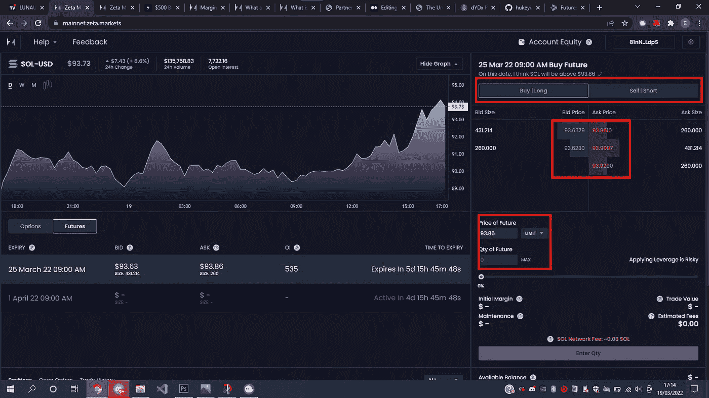

# 泽塔市场:深潜

> 原文：<https://medium.com/coinmonks/zeta-markets-deep-dive-1899b9a5fe5c?source=collection_archive---------8----------------------->

Solana 区块链上独一无二的 Defi 期货和期权指数

Zeta Markets, unique in all its ways (image from website)

加密货币都是去中心化的，让我们个人控制我们的资产，让任何第三方都无法限制或扣押我们的资产。处于风口浪尖的是 **Defi** (去中心化交易所)，它拥有一个由应用程序、好处和有趣功能组成的丰富而富有价值的生态系统。

Defi is the future (image from [https://cloudfront-us-east-1.images.arcpublishing.com/coindesk/4ZQ2CFQ6GFFJVAQQP2F5PLP7MA.jpg](https://cloudfront-us-east-1.images.arcpublishing.com/coindesk/4ZQ2CFQ6GFFJVAQQP2F5PLP7MA.jpg))

从借贷到**收益农业**，从高 APY **赌注**协议到**保证金交易**，DeFi 最终转变为私人投资者、机构、秘密风投和零售商最受欢迎的解决方案之一。几乎每天都有如此多的新的、可供选择的价值主张被构建出来，DeFi 必将成为 21 世纪金融的典型颠覆者。

然而，当人们试图弄清楚为什么看似分散的资产绝大多数在集中的交易所交易时，这总是一个谜。这在衍生品交易所(期货和期权)甚至更为普遍，根据 Crypto compare 的数据，这个市场在加密领域的交易量超过 57%。

Top 10 crypto derivates exchanges ([https://coinmarketcap.com/rankings/exchanges/dex/](https://coinmarketcap.com/rankings/exchanges/dex/))

Puzzling puzzle ([https://media.istockphoto.com/photos/big-idea-concept-picture-id1337478632?k=20&m=1337478632&s=612x612&w=0&h=0yaZsxFD7Kep-DyxMeUi-X_HR8Z7UpPMPzayAm2rmco=](https://media.istockphoto.com/photos/big-idea-concept-picture-id1337478632?k=20&m=1337478632&s=612x612&w=0&h=0yaZsxFD7Kep-DyxMeUi-X_HR8Z7UpPMPzayAm2rmco=))

人们倾向于认为这是因为没有真正的分散期权和保证金交易，如果有，将需要难以置信的脑力来有效地使用和运营。

嗯，直到泽塔市场开放了它的协议，改变了一切。

嗨，我叫山姆，我是你们今天的导游。在这篇文章中，我将

*   给你所有你需要知道的关于泽塔市场的信息，
*   我还将带你了解在泽塔市场交易期权和期货的过程。
*   将 Zeta markets 与其他 Defi dapps 进行比较
*   与你分享我的一些关于与泽塔市场交易的顶级技巧。

# 泽塔市场:

## 简介:

Zeta 是建立在区块链基础上的分散式衍生品交易协议。它为衍生品交易提供了流动性、非托管、抵押不足的渠道。

该协议允许用户通过其分散交易所(DEX)根据他们对加密资产未来价格的预测下达超快速订单并下注，最终将外汇和股票等传统市场中常见的交易工具引入区块链环境。

虽然表面上看起来像任何其他借贷协议，但 Zeta 实际上正试图将 DeFi 带到 Solana 的下一个合乎逻辑的步骤，因为 Solana 的生态系统仍然缺乏先进的保证金交易工具。

Built different

在我们深入研究 Zeta 之前，让我们先来看看导数和它们是什么；

## 什么是衍生品？

> 衍生品是一种合同或产品，其价值来源于基础资产的价格。这些资产的例子包括货币、汇率、商品、股票和利率。
> 
> 这种合同的买方和卖方直接反对对未来交易价格的预测。为了赚取利润，双方对基础资产的未来价值下注。

如果这看起来有点拗口，这里有一个例子。

想象一个农民，主要专注于种植小麦。小麦价格一年到头都在波动，这取决于当前的供求关系。由于农民种植小麦，他们在整个生长季节都致力于此，这给他们带来了很大的风险，因为当收获季节到来时，小麦价格会下跌。

*为了适应这些风险，农民将卖出他预测收获量的小麦期货合约，随着收获时间的临近，农民将根据小麦的价格平仓获利或亏损。*

*如果小麦价格低于预期价格，平仓头寸会获利，最终抵消出售小麦的损失。*

*如果小麦价格高于预期价格，平仓头寸会产生亏损，最终会被出售小麦产生的利润所抵消。*

通过这种方式，无论小麦价格如何，农民总能获得可预测的收入。这是衍生品如何用于对冲未来价格的典型例子。

其他加密衍生工具可以是以下类型，取决于合同的条件:

*   **期货**:交易双方在未来某一特定的价格和日期买入或卖出一项标的资产。
*   **期权:**一方有在约定的未来日期和价格买入或卖出标的资产的选择权。
*   **永续合约**:与期货或期权不同，永续合约没有到期日或结算日。

衍生品市场每年都在变得越来越大。根据 Tokeninsight 的加密货币衍生品交易所行业[报告](https://tokeninsight.medium.com/2020-q3-cryptocurrency-derivatives-exchange-industry-report-196ca8bb68b3)，根据 42 家交易所(全部集中)的数据，2020 年第三季度加密货币衍生品市场的交易量为 2.7 万亿美元

Market share of derivatives market (source: Tokeninsight)

现在我们已经有了所有我们需要的关于衍生产品的信息，让我们更深入地了解泽塔。

# 背景:

泽塔由连续创业家和亿万富翁 Bhavin 创立，他的动力来自于通过技术引领的创新解决问题的热情。

Bhavin 建立了 Zeta，这个项目后来成为 solana 上的第一个衍生品交易平台，与顶级投资者合作，在撰写本文时筹集了总计 850 万美元的种子资金和私人销售。

该公司目前有三个正式总部，分别位于[纽约](https://www.crunchbase.com/search/organizations/field/organizations/location_identifiers/newyork-argyll-and-bute)、[阿盖尔和布特](https://www.crunchbase.com/search/organizations/field/organizations/location_identifiers/argyll-and-bute-united-kingdom)、[英国](https://www.crunchbase.com/search/organizations/field/organizations/location_identifiers/united-kingdom)，员工人数不详。

最近的合作伙伴包括 Ribbon(针对索拉纳区块链的结构化市场)、Exotic Markets(针对 [DeFi Options Vaults](https://qcpcapital.medium.com/an-explanation-of-defi-options-vaults-dovs-22d7f0d0c09f) (DOVs))和 Pattern(作为专门的做市商)。

# 开始使用:

## 网页和用户界面:

泽塔网页有一个直观的移动和桌面友好，易于使用和用户友好的设计，使其成为交易的最佳选择。

通过访问[网站](https://zeta.markets/)，给用户几个精心设计的选项供选择。

*   交易会将您带到交易平台，您可以在那里出价
*   白皮书将带您进入 github 帐户，

*   如果您希望了解更多关于团队和项目的信息，请点击“关于和了解”

单击“开始”并接受下一页的条款和条件。

最吸引人的是显示标的资产(在本例中为 SOL)过去价格的图表。在撰写本文时，除了 Sol 之外，无法查看其他资产。

如果您更喜欢以烛台模式查看此图表，您可以单击每月时间段切换旁边的烛台图标，标记为“M”。

默认情况下，图表显示在每日时间段内。改变这一点的开关位于价格显示下方，标记为“D”表示每日，“W”表示每周，“M”表示每月。

图表下方有两个按钮，用于选择你想交易的衍生品类型，以及你想在该衍生品类别中持有的头寸类型。

*   期权和期货
*   买入并卖出

屏幕右侧有两个额外的开关；

*   购买和
*   出售

通过将这些与期货或期权切换相结合，用户可以决定

*   买卖期货
*   买入或卖出期权，看涨或看跌期权(在设定到期日之后)

如果你对这些产品感到困惑，不要担心，它们将在下面讨论。

# 泽塔市场的产品/特点:

泽塔市场目前只提供两种类型的衍生品**期货和期权**，但计划在未来包括更多。

## 什么是选项:

对于初学者和专业人士来说，选项都是令人困惑的；然而，这是一个尽可能简单地分解它的尝试。

> Investopedia 将期权定义为“衍生品合约，赋予买方在合约到期时或到期前以固定价格购买或出售固定数量基础资产的权利，但没有义务。”这意味着期权允许市场参与者在没有大量潜在风险的情况下对资产的未来价格进行投机。

**期权合约有两种类型:**

*   **看涨期权**:这些期权给予市场参与者权利，但没有义务**在未来某个时间以特定价格**购买一项资产。当参与者认为标的资产的价格在未来会上涨时，他们会使用这种期权类型。
*   看跌期权:这些期权给予市场参与者在未来某个时间以特定价格出售资产的权利，但没有义务。当参与者认为基础资产的价格在未来会**下降**时，他们会使用这种期权类型。

这里有一个现实生活中的例子

假设你以 120 美元的执行价格购买了一个看涨期权，它将在 30 天后到期。拥有这种看涨期权将允许你在未来 30 天内的任何时候以 120 美元购买股票(未交割资产)，无论股票走向如何，如果股票价格上涨到 135 美元，你仍然拥有一种看涨期权，允许你以 120 美元购买股票。

现在，假设你以 120 美元的价格购买了一个在未来 30 天内到期的看跌期权，而不是看涨期权，这将允许你在未来 30 天内的任何时候以 120 美元的价格出售股票，无论股票价格如何。这很酷，因为如果价格下跌到每股 100 美元，你拥有一个看跌期权，允许你以 120 美元出售上述股票。

现在你脑子里的问题可能是，为什么有人会想买期权，为了有效地向你解释，让我先向你解释，为什么有人会想买看跌期权。

假设你刚买了一辆梦想中的车，一辆新的法拉利，你需要保险以防发生车祸，所以你去找你的经纪人为你的新车买了一份保险。

现在，假设你不是一个汽车发烧友，而是一个投资者，你刚刚以 125 美元的价格购买了 100 股特斯拉股票，那么你的总投资将是 125，000 美元，如果价格变为零，这将是你的总风险。

类似于我们为我们的新法拉利购买保险的方式，我们可以通过以一定的成本(比如 500 美元)购买看跌期权合同来为我们的新投资购买保险

但是谁卖给我们看跌期权，答案是任何愿意承担我们新投资风险的个人，就像保险经纪人一样。

这是期权交易的基础。投资者通过付钱给别人来承担投资风险，就像保险经纪人一样。

如何开始在 Zeta 上交易期权？

现在你知道什么是选项，让我们看看 Zeta 如何帮助你开始。

在 Zeta 上入门极其容易，因为它是去中心化的。你不需要创建一个帐户或记住密码。你只需要一个像 Phantom 这样的分散式 SPL 钱包，就万事俱备了。([这里的](https://phantom.app/help/installing-phantom)是一个指南链接，显示如何开始创建一个虚拟钱包)

下载并设置好钱包后，只需按照以下步骤开始交易。

**第一步:**前往泽塔市场交易终端。你可以在这里找到[。](https://mainnet.zeta.markets/)

**第二步**:点击右上角的“选择钱包”。

**第三步**:自动检测您安装的钱包。要使用其他钱包，请选择“更多选项”选项卡以查看更多钱包选项。

**第四步**:从下拉菜单中选择“选项”。

**第五步:**

假设你认为 SOL 的价格会在 2022 年 3 月 25 日之前上涨。

选择“Call ”,并将到期日设置为 3 月 25 日

现在，你可以开始设定你的执行价格。您可以通过单击任何给定的价格来实现这一点，在本例中，我选择了$ 96；这意味着我认为 Sol 的价格将在 2022 年 3 月 25 日之前涨到 96 美元。

就像右手边的交易面板上写的那样

**第六步:**

填写您的交易详情。这些包括你想购买期权的价格，以及你想购买的合约数量。

第七步:

使用杠杆滑块调整您希望冒险的金额

完成后，您可以点击“购买”。你被录取了。您刚刚购买了您的第一份期权合约！

您可以从底部的选项卡查看和管理您的头寸和未结订单。

营销团队已经提供了有用的资源作为期权交易的指南；您可以在下面查看:

[https://www.youtube.com/watch?v=E2PVl4olA6s&t=168s](https://www.youtube.com/watch?v=E2PVl4olA6s&t=168s)

在我们看期货交易之前。泽塔提供的另一个产品，这是期权交易的优势，对投资者很有用。

## **期权交易的优势:**

T21 期权可能给投资者带来四大优势(排名不分先后):

*   它们可以提高成本效益
*   它们可能比股票风险小
*   它们有可能带来更高的回报率
*   他们提供了许多战略选择

有了这样的优势，你可以看到那些已经使用期权一段时间的人是如何不知道如何解释期权不受欢迎的。

investopedia 的一篇好文章深入探讨了这些优势，可能值得多花一分钟阅读。

[https://www . investopedia . com/articles/option investor/06/options 4 advantages . ASP #:~:text = For % 20 speciators % 2C % 20 options % 20 can % 20 offer，盈利% 20 under % 20 any % 20 market % 20 scenario](https://www.investopedia.com/articles/optioninvestor/06/options4advantages.asp#:~:text=For%20speculators%2C%20options%20can%20offer,profitable%20under%20any%20market%20scenario)。

## 期权交易的缺点:

就像其他任何东西一样，期权交易也有它的缺点；我会在这里列出一些，这样你就可以做出最好的决定。

*   期权让卖家面临无限/放大的损失
*   证明投资论点的时间有限。
*   要在期权交易中获利，需要大量的知识，这同样适用于其他形式的交易

# ZETA 的期货交易:

## 什么是期货？：

> 根据 Investopedia 的说法，期货合约是在未来特定时间以预定价格购买或出售特定商品资产或证券的法律协议。期货合同在质量和数量上都是标准化的，以促进在 T2 期货交易所的交易。

当期货合约到期时，期货合约的买方承担购买和接收标的资产的义务。期货合同的卖方承担了在到期日提供和交付标的资产的义务。

如果你是一个普通的交易者，关键是期货交易本质上是借钱对特定的加密资产或资产对的价格运动进行更大的押注，例如 BTC-美元。

## 期货交易的优势:

#1 成本效益:期货合约不需要你向卖方支付任何预付款。这与期权形成了直接对比，在期权中，你必须在合约发行时向卖方支付溢价。

#2 抗时间性:时间的流逝不会对期货合约产生负面影响，因为交易只能在所述日期执行。所以，无论你何时买入或卖出，对合约的估值都没有太大影响。

#3 规模:由于期货市场有点老且大，期货往往持有更多数量的基础资产。期权合同的情况并非如此，在期权合同中，可以处理较小的资产单位。

#4 高流动性:与期权相比，期货市场要大得多。这使得它们具有高度的流动性和可访问性。

#5 税收优惠:未来的交易通常是税收优惠的。与期权交易者，甚至股票交易者相比，期货交易者倾向于享受税收优惠。

现在你已经知道了什么是期货交易以及如何充分利用期货交易，让我们看看泽塔是如何报道你的。

## 如何在 Zeta 上交易期货:

下面的指南与我们之前看的如何交易期权的指南非常相似。然而，为了那些需要它的人的目的，这里是你需要知道的全部。

对于其他人，请转到第 4 步继续。

**第一步:**前往齐塔人网站，可以在这个[链接](https://mainnet.zeta.markets/)找到。

**第二步**:点击右上角的“选择钱包”。

**第三步**:自动检测您安装的钱包。要使用其他钱包，请选择“更多选项”选项卡以查看更多钱包选项。

连接钱包后，系统会提示您通过钱包向交易终端付款。

**第四步:**

点击图表下方开关中的期货，选择我们选择的类似图片的合约

**第五步:**

根据到期日期选择了您想要的合同后，下一步是购买或出售，并在下图所示的框中选择价格和数量。

价格也可以从订单中选择，而不是手动输入。

**第六步:**

使用杠杆滑块，你可以调整你愿意在交易中承担的风险。

**第七步:**

接下来要做的是进入你的交易，但在此之前，你需要知道的重要参数是:

*   **初始余量**；也就是进入交易所需的股本数量
*   **贸易值**；对应于初始毛利乘以数量
*   **维护值**；你的账户被清算的金额

最后，您可以在下面的选项卡中执行并监控您的头寸。

如果你更喜欢视觉，这里有一个来自 Zeta Markets 的资源链接

[https://www.youtube.com/watch?v=diGw897Nk54](https://www.youtube.com/watch?v=diGw897Nk54)

现在我们已经看到了什么是 Zeta，它提供什么产品，如何交易这些产品，现在是时候看看是什么使 Zeta 不同于其他 Defi 衍生协议，如 DxDy 等等。

*   **良好的设计和可伸缩性:Zeta** 利用了 Solana 区块链，事务时间为每秒 65000 个事务，终结时间为 13 秒。Thia 使 Zeta 市场变得高效且可扩展。
*   **卓越的流动性:Zeta** 将利用 Serum 的订单基础设施，为所有期权市场提供最有效的价格发现和交易基础设施。这将允许所有市场参与者**提供流动性**，并通过这样做为所有参与者获得最佳价格。
*   **期权做市商:**OMM 可以被认为是一个公共做市商，它可以在订单薄的情况下提供流动性。
*   **在抵押条件下:** DeFi 期权平台目前要求交易者对他们的头寸进行全额或超额抵押，主要是通过提供比可交易资产更多的资产。有了 Zeta，通过结合两个关键因素，抵押成为可能。

a)有效的标记定价，允许 Zeta 了解每个用户在每个时间点的附带风险。

b)高效的清算系统:允许 Zeta 有效地介入并平仓任何具有不良风险的头寸，从而允许平台长期运行。

这里有一张图片突出了泽塔的力量。

Zeta, built different ([https://zetamarkets.gitbook.io/zeta/what-is-zeta/what-makes-us-different](https://zetamarkets.gitbook.io/zeta/what-is-zeta/what-makes-us-different))

## 路线图和社区:

该团队似乎正在以光速前进，主网已经启动。

在 2022 年第二季度，我们将期待永久期货交易的发布。

正如你在下面看到的，泽塔市场有一个强大的社区，在 [discord](https://discord.gg/ZMFHsWpZCH) 上有超过 14，000 名成员，在 [twitter](https://twitter.com/ZetaMarkets) 上有 27，000 名关注者。

还要特别感谢 TRyanAir#4132 回答了我关于 discord 的所有问题

感谢您阅读本指南！我希望它有帮助。

如果你想了解更多关于 Zeta 和他们正在建造的令人惊叹的平台，你可以通过下面的链接查看:

**网址:**[**https://zeta.markets/**](https://zeta.markets/) **平台:**[**https://mainnet.zeta.markets/**](https://mainnet.zeta.markets/) **文档:**[**https://zetamarkets.gitbook.io/zeta/**](https://zetamarkets.gitbook.io/zeta/) **中:**[**https://medium.com/@zetamarkets**](/@zetamarkets)

**Youtube:**[【https://www.youtube.com/channel/UCxP8z1kOZY6-G4hqzKV9jag】T42](https://www.youtube.com/channel/UCxP8z1kOZY6-G4hqzKV9jag)

参考资料:

 [## 嗨，我们是泽塔

### Zeta (ζ)是首要的低抵押 DeFi 衍生工具平台，提供流动性衍生工具交易给…

zetamarkets.gitbook.io](https://zetamarkets.gitbook.io/zeta/)  [## ζ-介质

### 阅读媒体上来自泽塔的文字。齐塔人正在进行支付、自助餐厅、礼物和奖励的数字化、快速化、包容性和…

medium.com](/@ZetaBlog)  [## 泽塔市场

### 欢迎来到泽塔市场 YouTube 频道！Zeta (ζ)是首要的低抵押 DeFi 期货和期权…

www.youtube.com](https://www.youtube.com/channel/UCxP8z1kOZY6-G4hqzKV9jag)  [## 期权如何为买卖双方服务

### 期权一词指的是基于股票等基础证券价值的金融工具。安…

www.investopedia.com](https://www.investopedia.com/terms/o/option.asp) 

> 加入 Coinmonks [电报频道](https://t.me/coincodecap)和 [Youtube 频道](https://www.youtube.com/c/coinmonks/videos)了解加密交易和投资

# 另外，阅读

*   [Bitsgap 审核](/coinmonks/bitsgap-review-a-crypto-trading-bot-that-makes-easy-money-a5d88a336df2) | [Quadency 审核](/coinmonks/quadency-review-a-crypto-trading-automation-platform-3068eaa374e1) | [Bitbns 审核](/coinmonks/bitbns-review-38256a07e161)
*   [加密复制交易平台](/coinmonks/top-10-crypto-copy-trading-platforms-for-beginners-d0c37c7d698c) | [Coinmama 审核](/coinmonks/coinmama-review-ace5641bde6e)
*   [印度的加密交易所](/coinmonks/bitcoin-exchange-in-india-7f1fe79715c9) | [比特币储蓄账户](/coinmonks/bitcoin-savings-account-e65b13f92451)
*   [OKEx vs KuCoin](https://coincodecap.com/okex-kucoin) | [摄氏替代品](https://coincodecap.com/celsius-alternatives) | [如何购买 VeChain](https://coincodecap.com/buy-vechain)
*   [币安期货交易](https://coincodecap.com/binance-futures-trading)|[3 commas vs Mudrex vs eToro](https://coincodecap.com/mudrex-3commas-etoro)