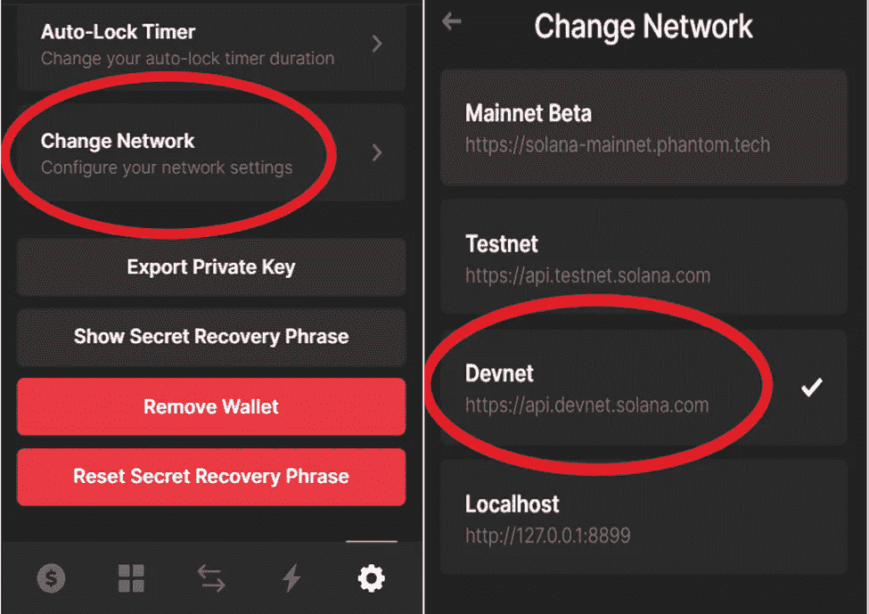

# 泽塔市场:深潜

> 原文：<https://medium.com/coinmonks/zeta-markets-deep-dive-42d32ae0b49?source=collection_archive---------20----------------------->

> Zeta Markets 是第一个建立在索拉纳区块链基础上的无抵押分散金融(DeFi)衍生品平台。目前，Zeta 的平台允许你交易 Solana 期权和期货。

Zeta(希腊符号:**-ζ**)这个名字是一个有趣的游戏，抓住了期权交易的本质，利用了诸如 delta、gamma、theta、vega 等术语。对于某些指标。

从本质上讲，Zeta 是一个分散式交易所(DEX ),它通过将传统金融(TradFi)衍生品交易功能引入 DeFi，释放了 DEX 上衍生品交易的力量，而不是像 Uniswap 这样相对不太复杂的常规现货交易。

**什么是衍生品？为什么要交易衍生品？**

衍生工具是一种合同，T4 从基础资产中获得其价值。因此，这个术语。

交易衍生产品的主要原因是对冲特定资产的价格波动，投机资产的方向性运动或给持有的资产带来杠杆作用。衍生品交易的魅力在于，即使市场下跌或横向交易，它也允许市场参与。

在熊市期间，大多数散户投资者对股票或加密货币市场失去兴趣；然而，更聪明的散户投资者和机构会留下来，转向衍生品平台，以实现回报最大化。

两种最受欢迎的衍生品合约是:

1.期货:双方在未来某个日期以商定的价格购买和交付资产的协议。举个例子:以 BTC 为例，假设一个名叫戴夫的交易员决定在 11 月 1 日至 12 月 1 日的合约期内交易比特币月度期货。戴夫在任何时候以 40，000 美元(比特币购买时的价格)买入比特币期货合约，然后在 12 月 1 日之前以 50，000 美元卖出合约(如果比特币的现货价格在此期间上涨了那么多)，他将看到 10，000 美元的现金利润。

2.期权:期权就像期货合同，唯一的区别是它是购买资产的“期权”而不是义务。例如:戴夫认为下个月 BTC 的价格会上涨。戴夫可以购买一个看涨期权，让他们有权在到期前或到期时以 40，000 美元购买 BTC。如果 BTC 在到期前涨到 50，000 美元，戴夫现在可以行使他们的期权，买入 BTC，获利 10，000 美元，或者干脆卖出期权，因为 10，000 美元的利润将一直计入期权合约的价格。

泽塔有什么不同之处？

泽塔创造了一个资本效率更高的市场，允许你用你的钱做更多的事情。在交易衍生品时，用户需要提供抵押品。继续上面的例子，当戴夫购买期货合约，比特币的价格下降到 30，000 美元，而不是上升。在这一点上，交易所需要知道你对这 10，000 美元是有效的，这样他们就不会最终亏损，并把这笔钱作为抵押。

由于加密市场如此不稳定，平台通常会超额抵押以防范价格波动。然而，Zeta 利用一种独特的算法，允许协议抵押不足的交易，并仍然确保他们不赔钱。

**开始使用 Zeta 平台**

泽塔允许新手“假”交易市场，以适应期权和期货用户界面/UX。它还能让你在投入并损失一些真钱之前制定交易策略。不管你是一个经验丰富的期权和期货交易者，还是一个完全的初学者，我都强烈推荐这个！

第一步:去 https://devnet.zeta.markets/

第二步:连接你的 Solana 钱包

步骤 3:将您的网络从 Mainnet Beta 版更改为 DevNet

点击右下角的齿轮图标，滚动到**换网**，点击 **Devnet**

第四步:空投你自己索尔和 USDC

点击查看泽塔网站上的入职流程。点击屏幕信息下方的**下一个**。

点击**获得 1 索尔**，然后点击**获得 10，000 USDC**

第五步:将 USDC 存入泽塔平台并批准交易

第六步:祝贺你！你现在已经进入泽塔维了

点击并浏览界面。也许开一些期权和期货交易好玩！

**Zeta 平台上的交易选项**

说到交易期权，你有四个选择:(见下图注释)

1A。买入看涨期权:渴望 SOL。最大损失=期权价值；风险/回报:低

1B。买入看跌期权:做空 SOL。最大损失=期权价值；风险/回报:低

2A。卖出看涨期权:渴望 SOL。最大损失=无限制；风险/回报:高

2B。卖出看跌期权:做空 SOL。最大损耗= SOL 变为零；风险/回报:高

如下图所示，这四个选项中的每一个都有不同的选择理由。

Options Trading Matrix; Source: [https://www.markettradersdaily.com/options-trading-101-pt-2-buying-and-selling-calls-and-puts/](https://www.markettradersdaily.com/options-trading-101-pt-2-buying-and-selling-calls-and-puts/)

接下来，您希望选择合同的到期日期(参见上图中的注释 3)。

目前，Zeta 只允许在一周内到期的期权和期货合约，而不是你通常在 Robinhood 等应用程序上交易期权时看到的，它允许你购买从当前日期起两年内到期的期权合约。鉴于加密的波动性，我认为这是泽塔市场管理风险的另一种方式，同时仍允许用户对头寸进行低抵押。这也保护用户在“黑天鹅”事件中不损失他们的钱。

接下来，你要为你的期权选择一个执行价格。(见上图注释 4)。执行价格是在到期时与 SOL 价格进行比较的价格，以确定您的交易是盈利还是亏损。

现在，让我们继续交易期权最漂亮的部分:期权费。我认为目前交易在 79.55 美元左右的 SOL 价格将在 2022 年 3 月 18 日低于 78 美元。所以，我想**买一个看跌**期权。

要在“现货交易”市场上做到这一点，我需要借 79.55 美元购买 1 索尔，然后在索尔跌破 78 美元时将其出售给市场，获得 1.55 美元的利润。然而，我需要借 7955 美元来买 100 索尔，这会变得很贵。然而，我可以用 200 美元以 2 美元的价格买入 100 份卖出期权，从而获得同样多的杠杆。如果你注意到，我为每个溶胶支付了 0.45 美元的“溢价”，因为如果价格达到 78 美元，我只能获利 1.55 美元。因此，我需要价格达到 77.55 美元才能实现盈亏平衡，然后低于这个价格才能盈利。总而言之，虽然风险较高的期权是一种在资本量较低的资产中获得超大价格变化敞口的好方法，这正是期权交易如此受欢迎的原因。

现在，需要记住的一些关键术语是:

**交易价值:**这是你正在购买的合约的价值。交易价值=期权价格*期权数量

**初始保证金:**这是你必须支付的交易金额**(注意，这比交易金额要少，因为泽塔启用了抵押不足交易)**

**维持保证金:**这是一旦头寸被填满，你必须在钱包里保留多少资金来维持头寸。

**在 Zeta 平台上交易期货**

交易期货和交易期权非常相似，唯一的关键区别是，对于未来，你只有两个选择:

1.购买期货预测溶胶将高于某一价格

2.卖出一个未来预测溶胶将低于某一价格

此外，与期权交易不同，你不必选择“执行价格”，期货是直接的，你只需要预测 SOL 的价格是低于还是高于当前价格(注意买卖价格与当前价格大致相同)。

现在，在这里你可以看到抵押不足的真正价值，以及初始和维持保证金的魔力开始发挥作用。抵押不足可以帮助你，因为你可以用比钱包里更少的钱进行更高价值的交易，即*利用你的交易*。

看上面的图片，我可以进行一笔价值约为 42，000 美元的交易，而我钱包中的可用余额为 9，000 美元。正如你所注意到的，初始保证金决定了可用资金的最大交易价值，而不是交易价值。

**泽塔交易经历**

如果你在 Zeta 上交易了期权，那么它的用户界面/UX 体验非常类似罗宾汉。它非常简单和直观。该团队似乎已经努力简化期权和期货交易的复杂世界，并将其引入更广泛的市场。

让我们看看我的交易是如何进行的。这是我从所有四种不同类型的期权交易中选择的四种期权交易。

在拍摄这张截屏时，SOL 的当前价格如下所示。

*SOL Price Chart as of March 16, 2022 (6:28PM ET)*

***持仓 1:以 78 美元的执行价买入看涨期权，即多头持仓***

这是我建仓时的一个“价内”选择。“价内”看涨期权是指市场价格高于执行价格的期权。当时 SOL 的价格略高于 78 美元。此后，市场大幅上涨，从 78 美元涨到 85 美元(涨幅 9%)。然而，你可以看到我的仓位有 73%的利润。这就是期权交易的美妙之处。简单地说，期权的价格或进场价格(此交易= 4.6333 美元)包含内在价值和外在价值。内在价值是我通过行使期权获得的价值，即以 78 美元买入 SOL，以 85 美元卖出，或 9%的收益。外在价值取决于市场因素，在这种情况下，是由于市场对这种看涨期权的需求。

***持仓 2:以 90 美元的执行价格卖出看涨期权，即空头持仓***

这笔交易与第一笔交易的时间差不多，当时 SOL 的价格是 78 美元。从那时起，溶胶的价格已经上升，这应该贬值我的立场。但是，我涨了 43%。这也主要是由期权的外在价值决定的。原因之一可能是，当我开仓时，SOL 在一个小的价格范围内横向交易，从那以后，双向波动都更大。这就是市场术语“隐含波动率”，它导致期权溢价的增加。

***持仓 3:以 84 美元的执行价买入一份看跌期权，即空头持仓***

同样，坐在 80%的利润基本上是由于同样的原因，如上所述。另一件要注意的事情是这个头寸和最后一个头寸的初始和维持保证金与交易值的对比。这两种头寸所需的保证金分别约为交易价值的 100 倍和 50 倍。这与泽塔的“抵押不足”相违背。我假设这是因为他们的算法对每种开仓的风险进行了定价，因为空头头寸本身风险更大，他们需要更高的交易保证金。

***头寸 4:以 90 美元的执行价格卖出一份看跌期权，即多头头寸***

目前这个头寸亏损了 45%。虽然 SOL 价格上涨，但这导致期权价格贬值。如果我猜的话，期权价格肯定会下降，因为它越来越接近合约的到期日。

继续我的期货交易，我打开了下面的一个空头头寸。

***头寸 5:卖出一份期货合约，即空头头寸***

正如你所看到的，这笔交易的进场价格是 83.72 美元，标记价格(买价和卖价的中点)是 86.74 美元。由于市场从 83.72 美元上涨到 85.95 美元，如上所示，这个位置是在 3.6%的损失。

我使用普通的限价单来触发所有这些头寸。但是，泽塔的平台允许额外的限价单类型，例如:

a.仅过账:仅过账订单设计为不在市场上立即执行，即作为市价订单执行。它将作为订单簿上的订单存在，但永远不会与订单簿上已经**的**订单相匹配。这是一种优化交易费用的方式，因为你只需支付所谓的“做市商”费用，而不是“接受者”费用，后者是使用普通限价单时需要支付的费用

b.填充或删除:这种类型的订单被指示立即全部执行(填充)，否则将被取消(删除)

**结论**

交易期权和期货一开始肯定会有点复杂。所以一旦你精通如何成功交易，并且在 Solana 的 devnet 上交易后有了一套策略，我就可以在 Solana mainnet 上交易了。我希望看到 Zeta Markets 增加的两件事显然是期权和更长期限的期货合同，另一件是将他们的市场扩展到 SOL 以外的资产。这两者都是团队正在研究的。在撰写本文时，齐塔人的 TVL(锁定的总价值)约为 3400 万美元，考虑到大约两个月前启动的协议，这确实是一个不错的数字。随着来自 Jump Capital & Solana Foundation 等公司的投资以及对加密资产的衍生品兴趣开始增长，Zeta Markets 似乎准备在 Solana 区块链的总 TVL 中占据更大的份额。

祝交易好运！

**参考文献**

*Zeta Markets git book；*

**导数；*[*https://www.investopedia.com/terms/d/derivative.asp*](https://www.investopedia.com/terms/d/derivative.asp)*

**什么是比特币和加密期货？初学者指南；*[*https://crypto potato . com/what-are-bit coin-and-crypto-futures-guide-for-初学者/*](https://cryptopotato.com/what-are-bitcoin-and-crypto-futures-guide-for-beginners/)*

**了解期权如何定价；*[*https://www . investopedia . com/articles/option investor/07/options _ beat _ market . ASP*](https://www.investopedia.com/articles/optioninvestor/07/options_beat_market.asp)*

**外在价值；*[*https://www.investopedia.com/terms/e/extrinsicvalue.asp*](https://www.investopedia.com/terms/e/extrinsicvalue.asp)*

**什么是仅邮寄订单？；*[https://www . delta . exchange/blog/support/what-are-post-only-orders/](https://www.delta.exchange/blog/support/what-are-post-only-orders/)*

> *加入 Coinmonks [电报频道](https://t.me/coincodecap)和 [Youtube 频道](https://www.youtube.com/c/coinmonks/videos)了解加密交易和投资*

# *另外，阅读*

*   *[如何在 Uniswap 上交换加密？](https://coincodecap.com/swap-crypto-on-uniswap) | [A-Ads 评论](https://coincodecap.com/a-ads-review)*
*   *[WazirX vs coin dcx vs bit bns](/coinmonks/wazirx-vs-coindcx-vs-bitbns-149f4f19a2f1)|[block fi vs coin loan vs Nexo](/coinmonks/blockfi-vs-coinloan-vs-nexo-cb624635230d)*
*   *[本地比特币审核](/coinmonks/localbitcoins-review-6cc001c6ed56) | [加密货币储蓄账户](https://coincodecap.com/cryptocurrency-savings-accounts)*
*   *[什么是融资融券交易](https://coincodecap.com/margin-trading) | [成本平均法](https://coincodecap.com/dca)*
*   *[维护卡审核](https://coincodecap.com/uphold-card-review) | [信任钱包 vs MetaMask](https://coincodecap.com/trust-wallet-vs-metamask)*