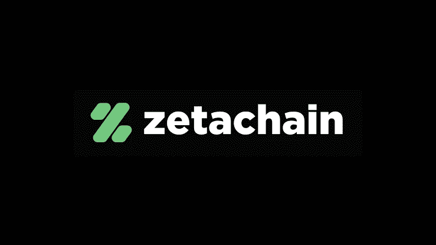
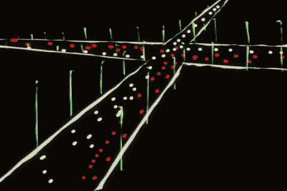
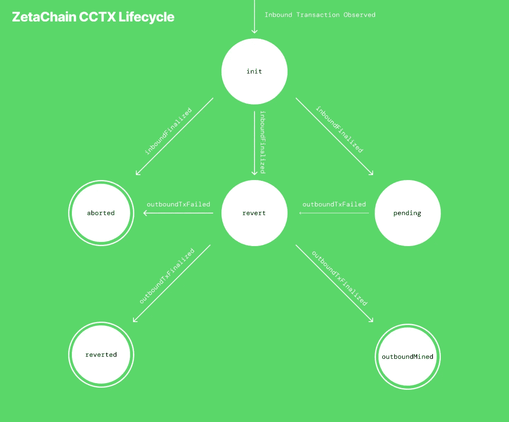
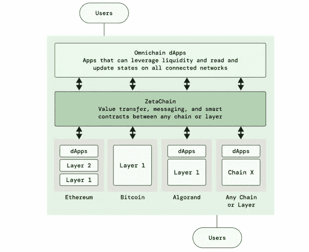
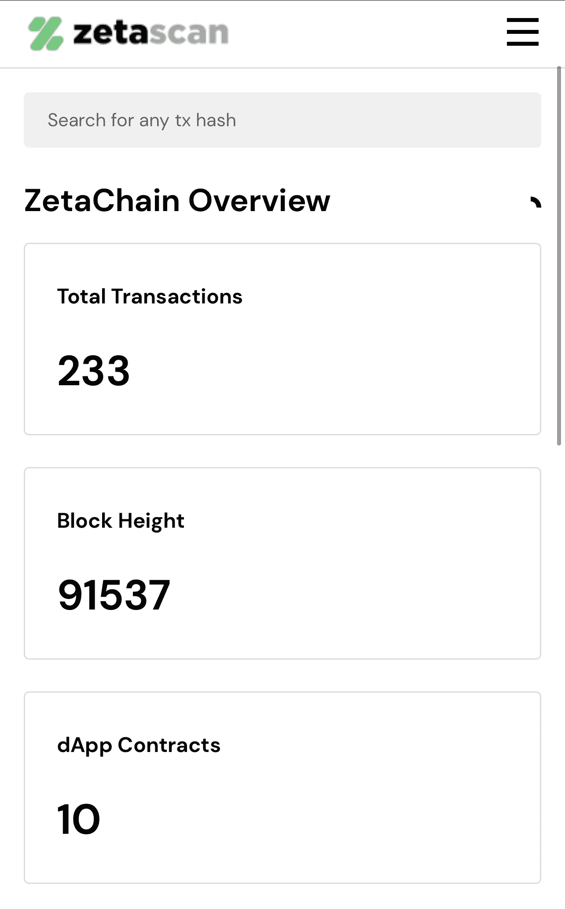
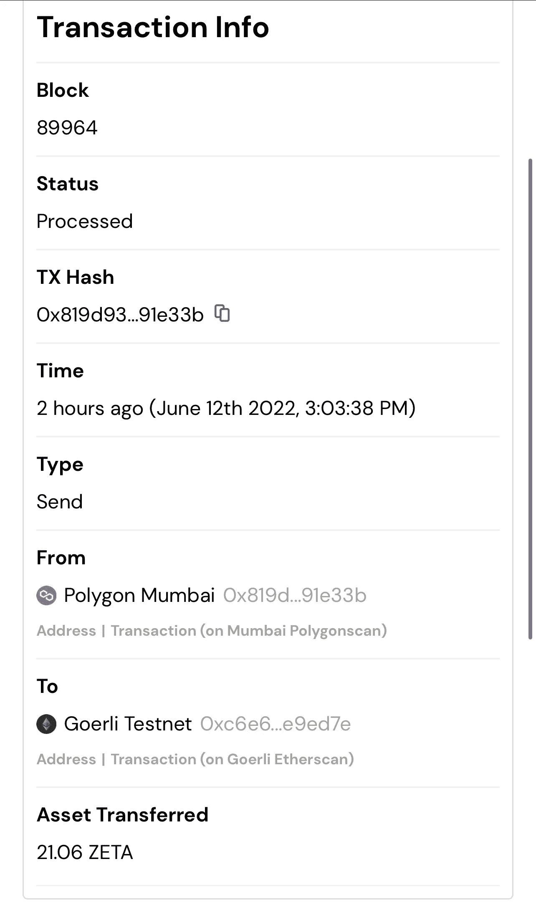

# ZetaChain:跨链互操作的高速公路

> 原文：<https://medium.com/coinmonks/zetachain-the-highway-of-cross-chain-interoperability-4b4582413aaa?source=collection_archive---------10----------------------->

ZetaChain: The future of Multichain

ZetaChain 的美丽可以通过将区块链想象成数据高速公路来描述。在这个类比中，ZetaChain 是实际的高速公路，这条高速公路上的多车道可以解释为各种网络链的最高功能互操作性。

The ZetaCain Highway

ZetaChain 不仅可以定义为一条具有预定义的设定数量车道的高速公路，还可以为每个应用及其相应的区块链提供一条用于数据交换的车道——一个区块链，作为一个没有任何速度限制、交通拥堵的数据网络，在任何给定的数据传输点，有问题的单个车道属于一个特定的驾驶员。这是一条赛道，其中一名用户是唯一一名烧毁车轮的超级跑车车手。如今，随着加密生态系统需求的不断增长，区块链必须能够扩展并提供更长的正常运行时间。尽管所有这些要求都需要额外的成本。这种成本就是区块链因为多项交易而超负荷运转，最终导致整体经济放缓。

ZetaChain CCTX (Cross-chain transaction)

ZetaChain 旨在向所有用户提供的可扩展性，使其成为在超高需求期间处理大量交易而不超载的首选。

## ZetaChain 是如何实现这一切的？

与其他区块链项目不同，ZetaChain 通过构建 Cosmos SDK 实现了其全链条工作机制。可能很少有人知道，但是宇宙是 0 层区块链。不，这不是一个打字错误，第 0 层区块链 bery 很大程度上存在，这些是区块链，允许在他们之上创建 nee 区块链。

Omnichain deployment if ZetaChain

与其他区块链不同，Cosmos 没有将自己的网络作为优先事项，而是帮助加速一个网络生态系统的工作机制，这些网络可以在彼此之间共享数据，而不是由一个单一的集中方推动事件。

## ZetaChain 的现状？

The ZetaChain Explorer

用户可以只通过 TX 散列来搜索任何交易的信息。由于 ZetaChain 是一个公共区块链，所有发生在 ZetaChain 上的信息都是公开的，用户可以很容易地看到执行了什么类型的交易(发送或接收)以及在谁之间(发送者-接收者)和跨越了什么链(多边形、以太坊等)…我在下面附上一个浏览器示例图像:

Actual screenshot of a transaction on ZetaChain Explorer

ZetaChain 最好的部分是交易费用是如何确定的结构框架。尽管 ZetaChain 旨在实现跨不同区块链的资产转移，但在与不同协议交互时，汽油费一直是一个问题。这对于与多个智能合同交互的用户来说是一个巨大的麻烦。

ZetaChain 使用户能够支付单一交易中的所有费用。因此，用户不必支付智能合同 mainnet 费用，然后再次与合同交互以支付煤气费，ZetaChain 通过将所有费用合二为一，使整个过程变得超级简单。

ZetaChain 的另一项服务是资产处理。通常，旨在实现跨链或互操作性的多种协议要求用户将他们的主要资产转换成包装版本。例如，wETH(包装以太坊)，但这些包装资产带来了巨大的合同漏洞问题，我们可以清楚地看到 stETH 对主以太网的依赖。ZetaChain 也解决了这个问题。

## 结论

目前 ZetaChain 正在他们的 Athens (testnet) Devnet 上运行，不久该项目将宣布他们的 ZetaChain Mainnet 的发布。开发者现在可以在雅典测试网上部署他们的 dApps。在撰写本文时，已经有 10 个 dApps 在 ZetaChain testnet 网络上运行。

总的来说，ZetaChain 有一个超级独特的主张，是的，它是唯一一个提供完全互操作智能合同的区块链。此外，ZetaChain 还支持与非智能合约链(如比特币和 Doge)的互操作性。

## 来源:

*   [https://docs.zetachain.com/learn/faq](https://docs.zetachain.com/learn/faq)
*   [推特](https://twitter.com/zetablockchain?s=21&t=1rr3nL2rWilXqyIKlfX1Uw)
*   [Zetachain 博客](https://blog.zetachain.com/zetachain-tech-upgrades-building-towards-omnichain-interoperability-fdc4837c97eb)

> 加入 Coinmonks [电报频道](https://t.me/coincodecap)和 [Youtube 频道](https://www.youtube.com/c/coinmonks/videos)了解加密交易和投资

# 另外，阅读

*   [Blockfi vs 比特币基地](https://coincodecap.com/blockfi-vs-coinbase) | [BitKan 点评](https://coincodecap.com/bitkan-review) | [Bexplus 点评](https://coincodecap.com/bexplus-review)
*   [南非的加密交易所](https://coincodecap.com/crypto-exchanges-in-south-africa) | [BitMEX 加密信号](https://coincodecap.com/bitmex-crypto-signals)
*   [MoonXBT 副本交易](https://coincodecap.com/moonxbt-copy-trading) | [阿联酋的加密钱包](https://coincodecap.com/crypto-wallets-in-uae)
*   [雷米塔诺评论](https://coincodecap.com/remitano-review)|[1 英寸协议指南](https://coincodecap.com/1inch)
*   [iTop VPN 审核](https://coincodecap.com/itop-vpn-review) | [曼陀罗交易所审核](https://coincodecap.com/mandala-exchange-review)
*   [40 个最佳电报频道](https://coincodecap.com/best-telegram-channels) | [喜美元评论](https://coincodecap.com/hi-dollar-review)