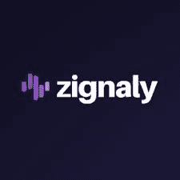

# 2022 年 Zignaly 评论:交易机器人和定价

> 原文：<https://medium.com/coinmonks/zignaly-review-for-2022-trading-bots-and-pricing-b08124dc2525?source=collection_archive---------11----------------------->

无论你是一个经验丰富的交易者还是一个刚刚开始冒险的交易者，你都可能遇到过**zig analy**及其平台。你可能会质疑交易机器人，或者更确切地说是 T2 zig naly T3 是否适合你。让我们深入了解一下 **Zignaly** 是什么，它是如何工作的，定价，以及它是否适合你。

**什么是 Zignaly**

关于 Zignaly，人们需要了解的第一件事是，它不是一种交换。它是一个交易机器人，能够连接许多不同的交易所，以便根据您之前为机器人设置的内容进行买卖。由于这是一个交易机器人，它将有利于你知道一点点如何交易机器人的工作，以及如何设置它们，使他们能够为你交易。如果你有兴趣找到一个交易加密货币的交易所，那么你会想继续四处看看。然而，如果你已经找到了这个页面，因为你正在寻找帮助你的交易自动化，并采取情绪化的情况下，那么 **Zignaly** 可能适合你。

【Zignaly 是如何工作的

正如我所说，齐格纳里不是一个交换。这是一个交易机器人，你必须设置，以便为你交易。在设置机器人为你交易之前，你需要掌握一些工作知识。然而，我们将跳转到主要的东西。当设置 Zignaly 时，你需要使用所谓的 API。一个 API 基本上能够与 Zignaly 机器人和你选择用来进行交易的交易所进行对话。

在您设置好 API 之后，Zignaly 就可以与您的交换平台进行对话了。一旦发生这种情况，你就可以自由地使用机器人进行交易。您需要选择一个机器人，并确保您使用的是基于您的输入的正确设置。

【Zignaly 的定价方式

Zignaly 目前可以免费使用。有几个不同的功能可以让用户体验到更多的功能。当你注册了 Zignaly，你就可以直接从 TradingView 或 Zignaly 平台上进行买卖。

**Zignaly 特性**

一旦你注册了 Zignaly，你就可以像其他交易所一样进行交易。进入交易并获得利润后，你可以扩展到其他领域，这样你就可以更有效地使用机器人。另外两个非常令人兴奋的特性是利润分享和信号提供。通过利润分享功能，作为交易者，您可以将一些资金存入 Zignals 的一个账户。然后，你可以寻找一个人谁是一个很好的利润百分比，并签署了你的帐户，这样做正是他们在做他们自己的帐户。所以，如果你在跟踪 GridbotGuru，而我有一笔交易赚了 3%的利润，那么你自己的账户也会从你注册的基金中赚 3%的利润。这项服务不收费，只有成功费。这意味着当你提高一个人总账户价值的 1%时，他们将获得一笔成功费。然而，在你再次提高总价值后，你只会得到另一笔成功费。换句话说，人们只有持续提高账户价值才能获得成功费，而不是每次交易。你也可以成为 Zignaly 的信号提供商。当你这样做，你可以创建自己的定制品牌和名称。人们可以在你下面注册，以便获得你的信号，有了这些，你也可以部署某些机器人和交易能力，以便实现利润最大化。

**zig naly 适合你吗**

当一个人在考虑是否注册 Zignaly 时，他们应该首先考虑自己是交易新手还是有经验的交易者。如果他们是交易新手，我会首先推荐其他交易机器人，但是如果他们给自己时间，他们可以学习如何使用 Zignaly 进行交易。第二是他们是否能够完全理解机器人是如何工作的，并能够正确使用它们。

YouTube 上的 grid bot Guru:[点击这里！](https://www.youtube.com/c/gridbotguru)

美国公民的 pionex:[点击这里！](https://pionex.us/en-US/sign/ref/RnIZeirs)

全球公民 pionex:[点击此处！](https://www.pionex.com/en-US/sign/ref/zVt0KmHU)

报名参加比特币基地:[点击这里！](https://www.coinbase.com/join/wyatt_h)

> 加入 Coinmonks [电报频道](https://t.me/coincodecap)和 [Youtube 频道](https://www.youtube.com/c/coinmonks/videos)了解加密交易和投资

# 另外，阅读

*   [从 WazirX 切换到 CoinDCX 的 5 个理由](https://coincodecap.com/reasons-to-switch-from-wazirx-to-coindcx)
*   [Unocoin 评论](https://coincodecap.com/unocoin-review) | [最佳加密赌注硬币](https://coincodecap.com/best-crypto-staking-coins)
*   [如何使用 MetaMask Wallet 获取 KCC 地址？](https://coincodecap.com/kcc-address-metamask)
*   [如何获得自己的。XYZ 领域？](https://coincodecap.com/xyz-domain)
*   [最佳加密交换平台](https://coincodecap.com/best-crypto-swap-platforms) | [最佳加密交易所](https://coincodecap.com/crypto-exchange)
*   [购买比特币印度](/coinmonks/buy-bitcoin-in-india-feb50ddfef94) | [Pionex 评论](/coinmonks/pionex-review-exchange-with-crypto-trading-bot-1e459d0191ea) | [加密交易机器人](/coinmonks/crypto-trading-bot-c2ffce8acb2a)