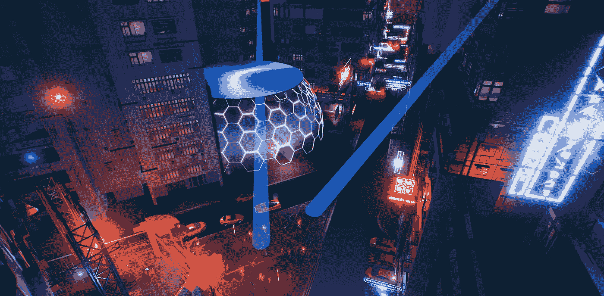
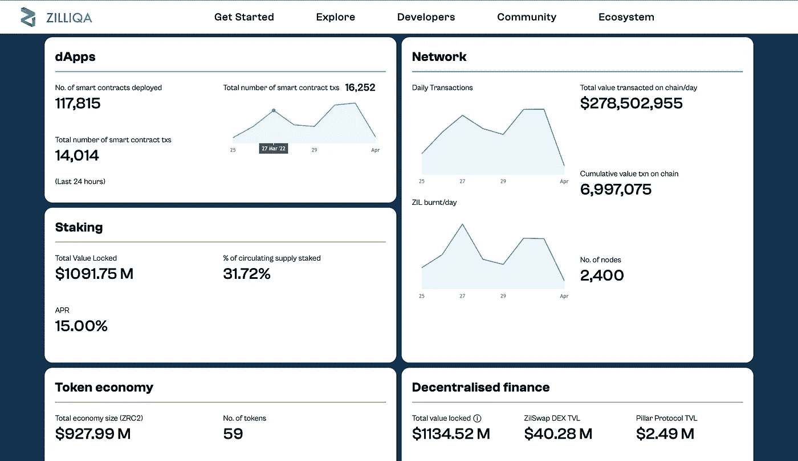

# Zilliqa 上周增长了 500%。是否被低估？

> 原文：<https://medium.com/coinmonks/zilliqa-grew-500-in-the-last-week-is-it-undervalued-83056949feac?source=collection_archive---------4----------------------->

*请注意，本文并非理财建议。

第一层智能合约平台 Zilliqa 的原生令牌 ZIL 价格上涨近 500%，从 0.045 美元上涨至 0.22 美元的高点。此后，这种代币已回落至 0.18 美元。价格的快速上涨是 Zilliqa 宣布推出元宇宙即服务(MaaS)平台 Metapolis 的结果，该平台计划于 4 月 2 日在迈阿密的一次 VIP 活动中推出。

截至 2022 年 4 月 1 日，Zilliqa 的市值约为 27 亿美元。作为其他元宇宙区块链的参考，分散的土地，沙盒和 Axie Infinity 的市值分别为 46 亿美元，38 亿美元和 37 亿美元。

有关 Zilliqa 的利好消息不断涌现，导致投资者蜂拥购买 ZIL 代币。这导致 ZIL 的交易量成为所有加密货币中的第三大，仅次于 ETH 和 BTC。因此，许多新投资者仍在判断 Zilliqa 是否被高估。因此，我们将尝试简单地分解 Zilliqa，并与其竞争对手进行比较。

**什么是 Zilliqa？**

Zilliqa 是类似以太坊、雪崩、索拉纳之类的一层智能合约平台。它的生态系统包括 dApps、DeFi、NFT 市场、游戏等等。ZIL 令牌用于为网络供电，允许参与者为产品和服务(NFT 等)付费。)并支付交易的燃气费。Zilliqa 的编程语言 Scilla 据说与以太坊的坚固性相比“设计安全”。为了在交易和智能合约上达成共识，Zilliqa 使用了工作证明和拜占庭容错机制的混合。它也有一个桩系统，以增加节点运营商的分布和增加去中心化。

Zilliqa 是第一个成功实施分片的区块链，在这里，区块链被分成更小的链，称为“分片”。这允许区块链并行处理多个事务，从而提高了区块链的可伸缩性。事实上，Zilliqa 每秒可以处理数千笔交易，而以太坊的速度是 15 笔。这使得 Zilliqa 声称，它已经解决了著名的安全性、去中心化和可扩展性的“区块链三难问题”。在其他竞争对手开始实施切分之前，切分叙事导致 Zilliqa 在 2017 年首次飙升，将投资者从 Zilliqa 拉走。

然而，开发团队并没有放弃 Zilliqa，并不断推出符合最新趋势的网络更新和改进。其中包括 DeFi、NFTs，当然还有 Metapolis。鉴于这些更新，显然 Zilliqa 从长远来看仍有很大的发展空间。

Zilliqa 项目由新加坡国立大学的一群研究人员于 2017 年创立。最初的团队成员包括董新树、贾、Amrit Kumar 和 Prateek Saxena。

**什么是 Metapolis？**

当然，我们必须看看即将到来的 Metapolis，Zilliqa 自己在快速发展的元宇宙的冒险。Metapolis 的目标是成为“所有人的元宇宙”，为任何人建立自己的虚拟世界提供数字基础设施和景观。这个 MaaS 概念是同类概念中的第一个，使得 Zilliqa 成为元宇宙繁荣领域的先锋。

大都市有潜力成为其他区块链生态系统的虚拟背景，包括 NFTs、GameFi 和 DeFi。Zilliqa 的通信主管 Aparna Narayanan 表示:“Metapolis 将允许概念丰富的定制设计穹顶作为城市的一部分，可以容纳品牌、艺术家、概念、游戏、电子商店、房地产或其他数字体验，为物理和数字世界提供一个新的参与层。Metapolis 看起来是自我维持的，包括互动层，如 NFTs、电子商务、即玩即赚、数字人体模型、广告牌等。”

A sneak preview of Metapolis released on Zilliqa’s Twitter account.

这个项目有巨大的潜力，因为它允许日常用户访问元宇宙(Meta Platforms，以前的脸书，正在其元宇宙风险投资中花费数十亿美元。有了 Metapolis，进入的门槛将会大大降低。最重要的是，这有可能使 Zilliqa 与其他流行的元宇宙区块链直接竞争，如分散的土地，沙盒和 Axie Infinity。Metapolis 的与众不同之处在于它为用户提供了创建他们自己的元宇宙的工具(想象一下在 Metapolis 内部建立 Axie Infinity)。许多人将大都市称为元宇宙项目的新 L1。因此，大都市可以变得和前面提到的元宇宙区块链一样大，如果不是更大的话，这是完全合理的。

Metapolis 建立在虚幻引擎、Unity 和 Nvidia Omniverse 之上。虚幻引擎用于流行游戏，如堡垒之夜，PUBG 和 Valorant。这意味着与现有的 Web 3.0 Metaverses 相比，3D 图形将是顶级的(据我所知，分散的土地没有使用虚幻引擎)。此外，Nvidia Omniverse 提供了开发者生态系统，旨在“让开发者更容易共享资产、对资产库进行排序、协作和部署 AI”。简而言之，图形将是惊人的。

Metapolis 从其客户渠道获得了 200 万美元的预发布收入，最近[宣布](https://twitter.com/zilliqa/status/1506674556349685768)与全球人才奖励应用 Agora 合作。这种合作关系允许用户将内容上传到 Agora 应用程序，然后进行投票。选定的内容将被添加到 Metapolis。

“我们对这一合作伙伴关系感到兴奋，因为我们不仅能够将创意带入元宇宙的生活，还能够为全球的创意人员提供开放的无国界访问，让他们在数字世界中保持联系。Agora、Zilliqa 和 Metapolis 之间的合作伙伴关系意味着我们处于 Web 3 创新的前沿，”Zilliqa 的元宇宙和不可替代令牌负责人桑德拉·贺楼说。

想象一下所有这些将对 ZIL 代币产生的影响。由于有如此多的用途，随着新用户希望成为这个生态系统的一部分，对 ZIL 的需求将会激增。

更多信息将会在 4 月 2 日的 Metapolis VIP 发布会上公布，但是现在，一切看起来都非常有希望。

**齐力卡生态系统的其余部分。**

虽然 Metapolis 被比作元宇宙的顶级项目，但 Zilliqa 是一个第一层智能合同平台。因此，Zilliqa 生态系统还有更多的东西。Zilliqa 拥有令人印象深刻的 2400 个参与节点和 560 万个地址(比 2020 年增长了 560%)。相比之下，Solana 只有大约 1500 个节点，而 Avalanche 有 1357 个节点。虽然 Zilliqa 确实有更多的参与节点，但它仍然远远不及其竞争对手拥有的钱包地址数量(以太坊有 1.92 亿)。值得注意的是，卡尔达诺有大约 350 万个钱包地址。Zilliqa 只有 36000 个活跃地址，而 Solana 有 70 万个，Avalanche 有 80 万个。很明显，Zilliqa 仍然不像它的同行那样受欢迎和被广泛采用。然而，这也意味着 Zilliqa 有未来发展的空间与其他区块链竞争。

Zilliqa 有许多 dApps 和智能合约。截至 2022 年 4 月 1 日，Zilliqa 的网站上运行着令人印象深刻的 192 个项目。最值得注意的是 XCAD，一个象征着 Youtuber 创造者的项目，市值 8300 万美元，LunarCrush 等等。Zilliqa 也有自己的 DeFi 景观和 NFT 市场。其中包括 Okimoto(一个去中心化的 NFT 市场)和 Zilswap(一个在 Zilliqa 上运行的完全连锁的去中心化的交易所)。

看看 Zilliqa 的 DeFi 景观，Zilliqa 目前的 TVL 价值约为 11 亿美元，尽管这将随着 ZIL token 从最近的泵中纠正过来而改变。ZIL 代币的总价值超过 10 亿美元，占 ZIL 代币总价值的 31.7%。当然，这并不像其竞争对手那样令人印象深刻，例如 Cardano 的 73.8%股份(价值 283.5 亿美元)或 Solana 的 75.81%股份(价值近 500 亿美元)。因此，投资者在比较 Zilliqa 及其竞争对手时，必须注意这些统计数据，以便做出明智的决策。这些统计数据可以在 https://www.zilliqa.com/ecosystem-statistics 的[上找到。](https://www.zilliqa.com/ecosystem-statistics)

Snapshot of Zilliqa’s ecosystem statistics

总的来说，Zilliqa 拥有一个运行良好且不断发展的生态系统，有发展的潜力。重点是，Zilliqa 不仅仅是 Metapolis，人们不应该仅仅把 Metapolis 作为 Zilliqa 唯一的价值来源。

**结论:**

Zilliqa 最近因 Metapolis 及其与 Agora 的伙伴关系的新闻而运行，引起了许多以前从未听说过 ZIL 令牌的人的注意。显而易见，大都市有潜力发展壮大，与分散土地和沙盒等其他元宇宙区块链竞争。然而，重要的是要认识到，Zilliqa 不同于这些区块链。这是一个智能合约平台，其生态系统超越了大都市。因此，重要的是不要仅仅将 Zilliqa 与其他仅基于 Metapolis 的元宇宙项目进行比较。

看看市值，Zilliqa 目前的市值为 27 亿美元，这将取决于 Metapolis 的表现。如果 Metapolis 最终与 Sandbox、Decentraland 和 Axie Infinity 不相上下，甚至更好，那么 Zilliqa 的市值至少会与这三家相当。截至目前，确定 Zilliqa 的元宇宙是否能与这些竞争还为时过早，但鉴于迄今为止已经发布的内容，我们有理由充满希望。然而，鉴于 Zilliqa 最近的表现，在进入一个位置之前保持谨慎是很重要的。

归根结底，Zilliqa 拥有坚实的技术、优秀的开发团队、不断发展的生态系统和巨大的潜力。因此，它将继续繁荣。

> 加入 Coinmonks [电报频道](https://t.me/coincodecap)和 [Youtube 频道](https://www.youtube.com/c/coinmonks/videos)了解加密交易和投资

# 另外，阅读

*   [印度的加密交易所](/coinmonks/bitcoin-exchange-in-india-7f1fe79715c9) | [比特币储蓄账户](/coinmonks/bitcoin-savings-account-e65b13f92451)
*   [OKEx vs KuCoin](https://coincodecap.com/okex-kucoin) | [摄氏替代品](https://coincodecap.com/celsius-alternatives) | [如何购买 VeChain](https://coincodecap.com/buy-vechain)
*   [币安期货交易](https://coincodecap.com/binance-futures-trading)|[3 comas vs Mudrex vs eToro](https://coincodecap.com/mudrex-3commas-etoro)
*   [如何购买 Monero](https://coincodecap.com/buy-monero) | [IDEX 评论](https://coincodecap.com/idex-review) | [BitKan 交易机器人](https://coincodecap.com/bitkan-trading-bot)
*   [CoinDCX 评论](/coinmonks/coindcx-review-8444db3621a2) | [加密保证金交易交易所](https://coincodecap.com/crypto-margin-trading-exchanges)
*   [红狗赌场评论](https://coincodecap.com/red-dog-casino-review) | [Swyftx 评论](https://coincodecap.com/swyftx-review) | [CoinGate 评论](https://coincodecap.com/coingate-review)