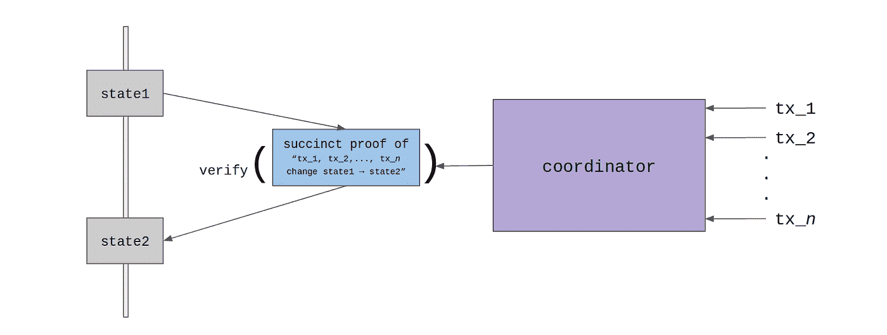
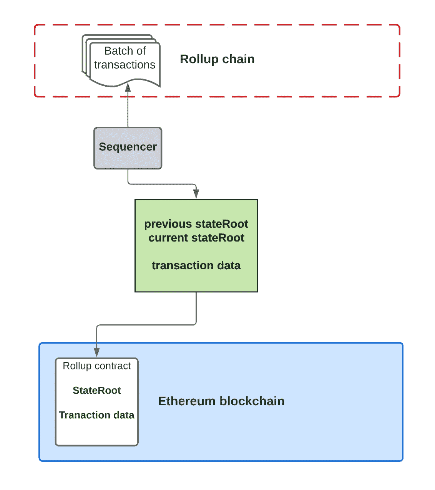
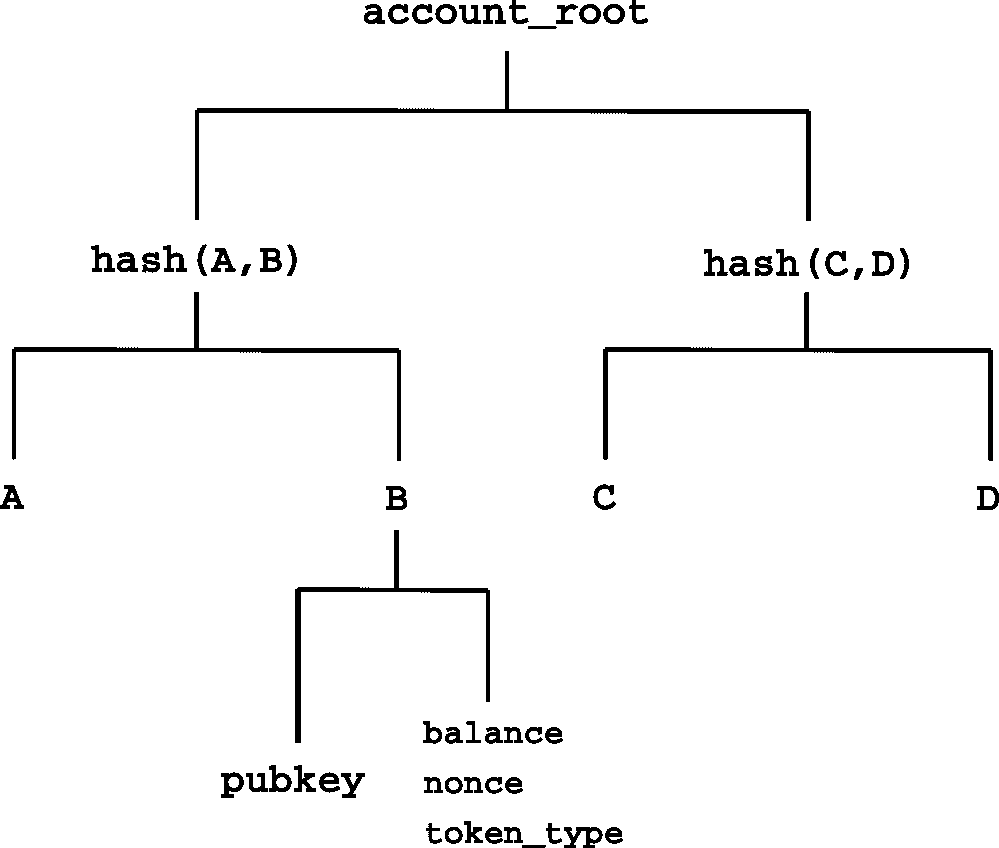
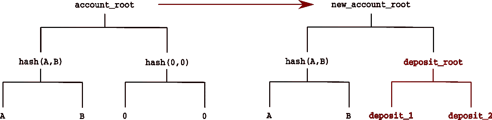

# ZK-比特币的累积

> 原文：<https://medium.com/coinmonks/zk-rollups-on-bitcoin-ce35869b940d?source=collection_archive---------0----------------------->

## 比以太坊更具可扩展性

ZK-Rollup 被认为是以太坊第二层扩展解决方案的圣杯。

> 总的来说，我自己的观点是，在短期内，乐观的汇总可能会在通用 EVM 计算中胜出，ZK 汇总可能会在简单的支付、交换和其他特定于应用程序的用例中胜出，但在中长期内，随着 ZK-斯纳克技术的改进，ZK 汇总将在所有用例中胜出。— [维塔利克](https://vitalik.ca/general/2021/01/05/rollup.html)

我们已经直接在比特币上实现了有史以来第一个 ZK 累积(ZKR)。此外，我们展示了为什么 ZKR 在比特币上比在以太坊上工作得更好。

# ZKR 如何在以太坊工作

其核心是，ZKR 利用了 ZK- ***S*** NARK 证明的简洁:验证某些计算是否正确完成比重新执行它要高效得多。不是处理链上的每个事务，而是首先将一个契约的多个事务发送给一个协调器(也称为定序器/继电器)，而不是矿工。协调器" ***滚动***"/将它们捆绑成单个事务。该事务包含一个简洁的证明，证明所有这些批处理事务都被忠实地处理，将合同从*状态 1* 更改为*状态 2* ，并发送给矿工。

[ZK Rollup](https://github.com/barryWhiteHat/roll_up_token)

由于所有繁重的事务处理都外包给了外部链，因此区块链可以在给定的时间间隔内处理更多的事务，从而进行扩展。zkSNARK 证明确保了链外状态转换的正确性，使得协调者不可能提交无效的状态转换。这使得 ZKR 成为一个有吸引力的 L2 可伸缩性解决方案，因为它允许在不牺牲 L1 安全性的情况下进行扩展，不像许多其他 L2 解决方案，如 [Plasma 和乐观汇总](https://www.preethikasireddy.com/post/a-normies-guide-to-rollups)。

## ZKR 代币

我们以令牌为例来演示如何使用 ZKR。

[Rollup on Ethereum](https://www.preethikasireddy.com/post/a-normies-guide-to-rollups)

主链上有一个 Rollup 契约，跟踪一个状态根。“州根”是 Merkle 树的根。树的每一片叶子都是一个帐户，由它的所有者的公钥或地址及其属性(如 balance)组成。

Accounts form a Merkle tree

在以下示例中，两笔存款被批量处理为一笔交易。

[State transition](https://github.com/barryWhiteHat/roll_up_token)

## 比特币上的 ZKR

我们已经在比特币上实现了 rollup 契约。它确保在处理完一批事务后，当前状态根被更新为正确的新根。

它跟踪的唯一状态是第 8 行中帐户树的根。在第 14 行验证有效性证明，使用我们之前的 [zk-SNARK 库](https://xiaohuiliu.medium.com/zk-snarks-on-bitcoin-239d96d182bd)。Root 在第 17 行被更新。第 5 行的验证密钥来自 zk-SNARK 的设置阶段。

## 生成 ZKR 证明

我们需要以 zk-SNARK 友好的方式编码我们的事务处理逻辑。一种流行的语言是 Circom。由于篇幅限制，我们在这里不涉及 Circom 语法，而是让读者去[Circom 官方网站](https://docs.circom.io/)了解更多。

处理单笔交易包括:

1.  检查发件人帐户是否在 merkle proof 树中
2.  验证发送者的签名
3.  更新发送方的余额并验证中间 merkle 根
4.  更新接收者的余额
5.  更新 merkle 根

我们可以重用现有的 rollup Circom 代码，如 [this](https://github.com/rollupnc/RollupNC_tutorial) 。

[rollup.circom](https://github.com/rollupnc/RollupNC_tutorial/blob/master/4_single_tx/sample_circuit.circom)

[这里](/coinmonks/hands-on-your-first-zk-application-70fe3a0c0d82)是上面代码的详细解释。

## 多重交易

rollup 的好处只有在多个事务一起进行批处理时才能体现出来。我们可以简单地在上面的代码上添加一个循环。只有当批中的所有交易都有效时，生成的凭证才有效。

[Process Multiple Transactions](https://github.com/therealyingtong/RollupNC/blob/cb706028bdd97cf454cb79e7725facf2499ee199/snark_circuit/multiple_tokens_transfer_and_withdraw.circom#L83)

# 摘要

ZKR 将交易数据存储在第 1 层(L1)的链上，以实现[数据可用性](https://blog.polygon.technology/the-data-availability-problem-6b74b619ffcc/)。L1 的存储成本限制了 ZKR 的可扩展性。因此，ZKR 在比特币上比在以太坊上工作得更好，因为前者的存储成本比后者便宜[个数量级。](https://xiaohuiliu.medium.com/bitcoin-vs-ethereum-smart-contracts-921e0a12b043)

另外，由于 zk-SNARK 是通用的，一旦在比特币上部署了 rollup 智能合约，那么很多现有的在其他区块链上设计的 ZKR 工具(比如 Circom 和 [ZoKrates](https://zokrates.github.io/) )都可以直接在比特币上重用。这意味着 ZKR 今天可以用来扩展比特币上的应用。

# 参考

[1][https://blog . matter-labs . io/optimistic-vs-ZK-roll up-deep-dive-ea 141 e 71 e 075](https://blog.matter-labs.io/optimistic-vs-zk-rollup-deep-dive-ea141e71e075)

[2][https://www . preethikasireddy . com/post/a-nor mies-guide-to-roll ups](https://www.preethikasireddy.com/post/a-normies-guide-to-rollups)

【3】[https://github.com/barryWhiteHat/roll_up_token](https://github.com/barryWhiteHat/roll_up_token)

[4][https://blog . matt-labs . io/opportunity-vs-ZK-roll-deep-dive-ea 141 e 71e 075](https://blog.matter-labs.io/optimistic-vs-zk-rollup-deep-dive-ea141e71e075)

> 加入 Coinmonks [电报频道](https://t.me/coincodecap)和 [Youtube 频道](https://www.youtube.com/c/coinmonks/videos)了解密码交易和投资

# 此外，请阅读

*   [阿联酋 5 家最佳加密交易所](https://coincodecap.com/best-crypto-exchanges-in-uae) | [简单互换回顾](https://coincodecap.com/simpleswap-review)
*   [7 种购买 Dogecoin 的最佳方式](https://coincodecap.com/ways-to-buy-dogecoin)|[zepay Review](https://coincodecap.com/zebpay-review)
*   [最佳期货交易信号](https://coincodecap.com/futures-trading-signals) | [流动性交易回顾](https://coincodecap.com/liquid-exchange-review)
*   [霍比密码交易信号](https://coincodecap.com/huobi-crypto-trading-signals) | [Swapzone Review](/coinmonks/swapzone-review-crypto-exchange-data-aggregator-e0ad78e55ed7)
*   [最佳密码交易机器人](/coinmonks/crypto-trading-bot-c2ffce8acb2a) | [购买索拉纳](https://coincodecap.com/buy-solana) | [出口审核](https://coincodecap.com/matrixport-review)